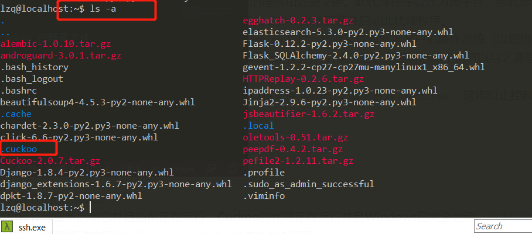
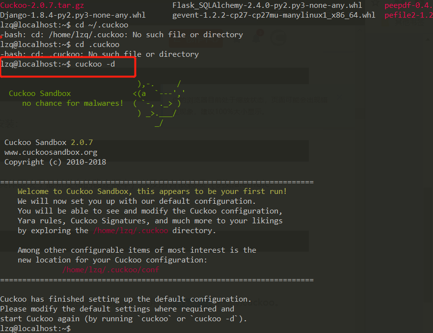
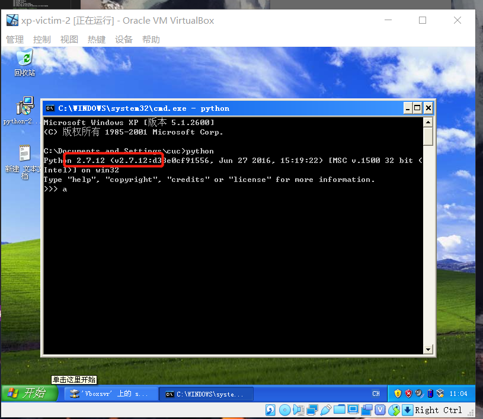
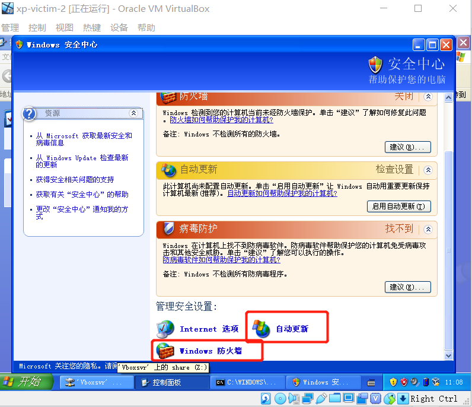
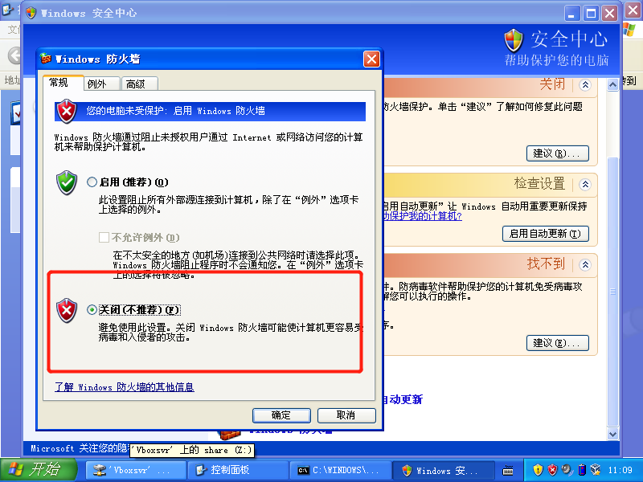
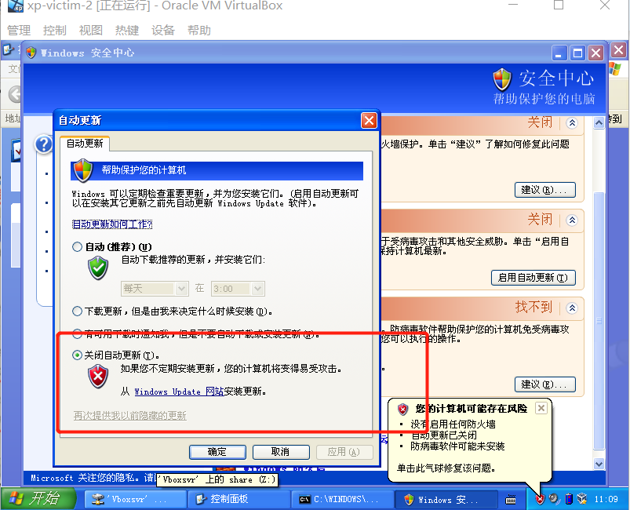
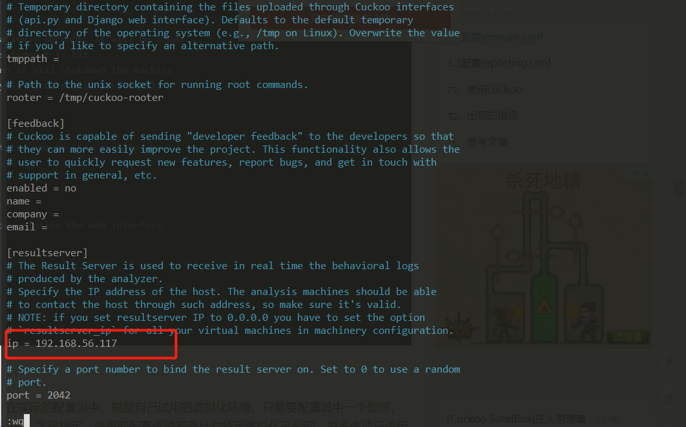
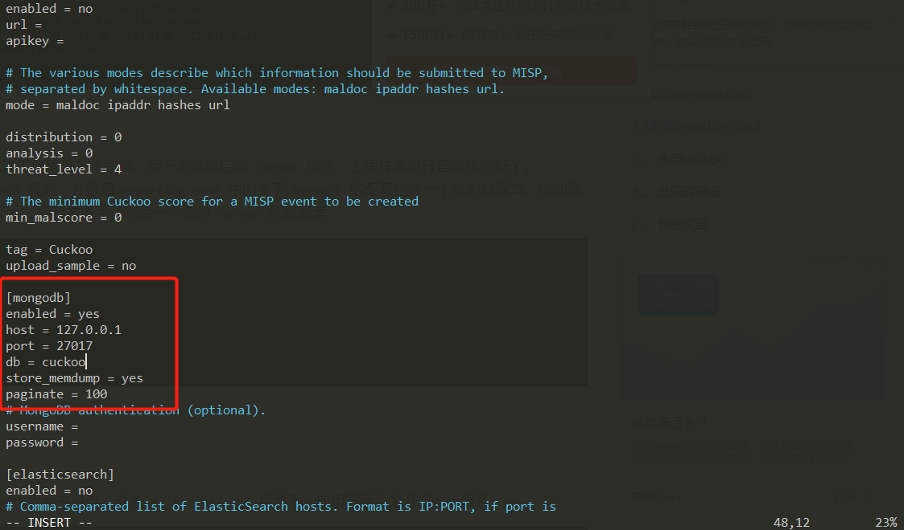
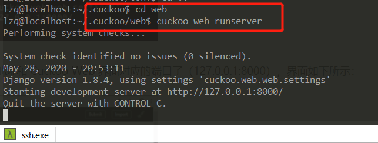

# CUCKOO
## 实验背景
* Ubuntu 16.04
* windows-xp
## 实验完成度
* [x] 安装cuckoo
* [x] 使用cuckoo
* [x] 任意找一个程序，在cuckoo中trace获取软件行为的基本数据
## 实验过程
### cuckoo环境准备
1. 安装python库
```
sudo apt-get install python python-pip python-dev libffi-dev libssl-dev
sudo apt-get install python-virtualenv python-setuptools
sudo apt-get install libjpeg-dev zlib1g-dev swig
```
2. 安装MongoDB               
为了使用基于Django的Web界面，需要使用MongoDB 
```
sudo apt install mongodb
```
3. 安装PostgreSQL              
为了使用PostgreSQL作为数据库（我们的推荐），还必须安装PostgreSQL：
```
sudo apt-get install postgresql libpq-dev
```
4. 安装tcpdump         
为了在执行期间转储恶意软件执行的网络活动，需要正确配置网络嗅探器以捕获流量并将其转储到文件中。
```bash
sudo apt-get install tcpdump apparmor-utils
sudo aa-disable /usr/sbin/tcpdump

# Tcpdump需要root权限，但由于不希望Cuckoo以root身份运行，因此必须为二进制文件设置特定的Linux功能：
sudo groupadd pcap
sudo useradd -m cuckoo
sudo passwd cuckoo
sudo usermod -a -G pcap cuckoo
sudo chgrp pcap /usr/sbin/tcpdump
sudo setcap cap_net_raw,cap_net_admin=eip /usr/sbin/tcpdump

# 可以使用以下命令验证上一个命令的结果：
getcap /usr/sbin/tcpdump
#结果： /usr/sbin/tcpdump = cap_net_admin,cap_net_raw+eip

sudo apt-get install libcap2-bin
```
5. 安装M2Crypto
目前M2Crypto只有在安装SWIG时才支持该库。在Ubuntu /类似Debian的系统上，可以按如下方式完成：
```bash
sudo apt-get install swig
# 如果SWIG系统中存在，可以M2Crypto按如下方式安装：
sudo pip install m2crypto==0.24.0
```
6. 安装guacd                     
guacd 是一项可选服务，为Cuckoo Web界面中的远程控制功能提供RDP，VNC和SSH转换层。没有它，遥控器将无法工作。0.9.9及更高版本可以使用，但我们建议安装最新版本。在Ubuntu 17.04机器上，以下命令将安装版本0.9.9-2：
```bash
sudo apt install libguac-client-rdp0 libguac-client-vnc0 libguac-client-ssh0 guacd

# 如果只需要RDP支持，则可以跳过libguac-client-vnc0和libguac-client-ssh0软件包的安装 。
# 如果使用的是较旧的发行版，或者只是想使用最新版本（我们的推荐），则以下内容0.9.14将从源代码构建最新版本（）：
sudo apt -y install libcairo2-dev libjpeg-turbo8-dev libpng-dev libossp-uuid-dev libfreerdp-dev
mkdir /tmp/guac-build && cd /tmp/guac-build
wget https://www.apache.org/dist/guacamole/0.9.14/source/guacamole-server-0.9.14.tar.gz
tar xvf guacamole-server-0.9.14.tar.gz && cd guacamole-server-0.9.14
./configure --with-init-dir=/etc/init.d
make && sudo make install && cd ..
sudo ldconfig
sudo /etc/init.d/guacd start

# 从源代码安装时，请确保没有libguac-从软件包管理器安装任何库的其他版本，否则您可能会遇到由于不兼容而导致guacd崩溃的问题。
# 请注意，还必须安装VirtualBox扩展包才能利用Guacamole公开的Cuckoo控制功能。
```

### cuckoo安装
1. 建议首先升级pip和setuptools库
```bash
sudo pip install -U pip setuptools
sudo pip install -U cuckoo
# 如果上面操作没有安装上cuckoo，可以选择下载cuckoo文件安装：
sudo pip download cuckoo
```
2. 最终会得到一个文件Cuckoo-2.0.7.tar.gz，`ls -a`查看会发现一个`.cuckoo`的隐藏文件            
                                      
3. `cuckoo -d`启动                    
                                      

### 创建客户机
1. 下载和Linux一样的32位的Python 2.7.12，进行安装和相关配置                                           
                                      
2. 记禁用“自动”功能。更新”或“检查更新”功能                      
* 开始->控制面板->安全中心                                      
                                      
                                      
                                      
3. 安装代理
* 在`.cook/agent`找到该agent.py文件。将此文件复制到客户机操作系统并运行它，代理将启动主机可以与之通信的小型API服务器。
4. Cuckoo的代理正在运行并且Windows已完全启动。后对虚拟机建立快照，然后修改快照名            
                                      

### 配置cuckoo
1. 配置文件的目录在`.cuckoo/conf$`下
2. 修改cuckoo.conf文件                   
* `[resultserver]` 的 ip和port，用于指定接收分析结果的服务器。该地址必须能够让客户机访问到                       
                                      
3. 修改reporting.conf文件                        
                              

### 使用cuckoo
1. 开启web服务
```bash
cd .cuckoo/web/
cuckoo web runserver
```
                                      
但是访问页面访问不了
                                      
                                        
                                      
                                      
                                      
                                      
                                      
                                      
                                      
                                      
                                      
                                      
                                      
                                        
## 实验问题
1. 安装cuckoo是时，报错
```bash
ERROR: Could not find a version that satisfies the requirement django==1.8.4 (from cuckoo) (from versions: none)
ERROR: No matching distribution found for django==1.8.4 (from cuckoo)
```
* `pip install selenium -i http://pypi.douban.com/simple/ --trusted-host pypi.douban.com`出现新错误`ReadTimeoutError: HTTPSConnectionPool(host='files.pythonhosted.org', port=443): Read timed out.`
* 太慢，换源`sudo pip install -i  https://pypi.tuna.tsinghua.edu.cn/simple -U cuckoo`
* 还是超时`pip install --default-timeout=1000 download cuckoo`
* 报错`ERROR: Package 'setuptools' requires a different Python: 2.7.12 not in '>=3.5'`
* `pip install --default-timeout=1000 download setuptools==999`会显示很多版本，选择不是那么新的版本`pip install setuptools==39.1.0`成功

2. 出现警告` WARNING: The script cuckoo is installed in '/home/lzq/.local/bin' which is not on PATH.`
* 将其写入环境
```bash
sudo vim ~/.bashrc
## add
export PATH=/home/lzq/.local/bin/:$PATH
##
source ~/.bashrc
```
                                      
                                      
                                      
                                      
                                      
                                      
                                      
                                      
                                      
                                      
                                      
                                        
## 实验结论
1. 客机需要禁止防火墙和自动更新的原因
* 最重要的事情之一是禁用Windows防火墙和自动更新。这背后的原因是Windows防火墙和自动更新可以在正常情况下影响恶意软件的行为，并且它们可以通过丢弃连接或包括不相关的请求来污染Cuckoo执行的网络分析。

2. Cuckoo依赖于几个主要的配置文件：
* cuckoo.conf：用于配置常规行为和分析选项。
* auxiliary.conf：用于启用和配置辅助模块。
* < machinery > .conf：配置虚拟机的配置文件（如果用的是vmware虚拟机，就是vmware.conf）。
* memory.conf：内存取证分析工具 的 配置。
* processing.conf：用于启用和配置处理模块。
* reporting.conf：用于启用或禁用报告格式。
* 要让Cuckoo工作，你至少应该编辑cuckoo.conf和 < machinery > .conf
## 参考资料
* [cuckoo](https://cuckoosandbox.org/)
* [Ubuntu16.04安装cuckoo sandbox](https://blog.csdn.net/root__user/article/details/89251386)
* [cuckoo官方安装手册](https://cuckoo.sh/docs/installation/index.html)
* [python windows下载](https://www.python.org/downloads/windows/)
* [VirtualBox 安装 XP 虚拟机与主机共享文件夹设置教程](https://wenku.baidu.com/view/94ce1f8cbceb19e8b8f6ba27.html)
* []()
* []()
* []()
* []()