# CUCKOO
## 恶意软件防御体系的建立
1. 最早，在蠕虫病毒流行的时代，大家就在考虑如何进行防御。那个时候互联网还没有我们今天这么发达。大家想出来的方案也是在低速网络条件下的方案。基本的结构就是单机的杀毒软件。
2. 杀毒软件的原理，最核心的是对系统中的所有文件进行全盘的扫描，将每个文件的静态特征，主要是文件类型、文件的hash值得数据与一个数据库中保存的信息进行对比。这个数据库中，主要保存的是一些已经发现的蠕虫病毒、恶意软件的hash值等静态特征。如果能匹配上，说明扫描到的文件是一个蠕虫病毒或者恶意软件。那么就进行删除。
3. 由于会不停的有恶意软件、蠕虫病毒出现。所以，开发杀毒软件的厂家，必须还需要进行一个工作就是病毒数据库的更新。把厂家们已经发现的恶意软件加入到病毒数据库中，并让已经安装在客户主机中的杀毒软件定期链接服务器，升级病毒数据库。这个机制，简单、容易实现，所以杀毒软件很早就被开发出来了。在杀毒软件的基础上，人们还开发出了入侵检测系统。把数据库和对数据的扫描做成一个单独的设备，这个设备安装在一个网络的入口处，所有进入这个网络的数据流量都和恶意数据的特征库进行比较，找出其中可能有问题的数据并拦截。
4. 但是这种基于静态特征的匹配和查杀机制，很明显有缺陷。
* 第一个缺陷，就是它的查杀是滞后的。杀毒软件能够查杀到的前提，是病毒的特征已经在数据库中。而这个数据库的特征是人为加入的。如果黑客们开发了一个新的蠕虫病毒或者什么攻击程序，杀毒软件是无法查杀的。只有当一个恶意软件已经流行开了，被杀毒软件厂家获得了样本，进行了逆向分析以后，才能确定其是否恶意，并提取其hash值等静态特征。
* 这里，一是获取新的攻击程序并不容易，二是从获得样本中进行软件的行为分析判断其是否恶意并不容易，需要有很多的逆向工程的工作。我们学过逆向工程的基本原理，知道这个工作需要有非常高的专业技能，同时有非常耗时间。三是恶意程序的源代码在黑客手里，他们要想进行变异，绕过杀毒软件的特征检测非常容易，只需略微进行修改，重新编译，hash就变了。
* 面对大规模变异的恶意软件，杀毒软件很可能疲于奔命。
5. 如何去改进
* 第一种，改进样本的获取渠道，原来杀毒软件厂家会在网络中容易被攻击的地方布置一些“陷阱”，如果恶意软件攻击进入了这些陷阱，杀毒软件厂家就获得了样本，这些陷阱就是早期的蜜罐。但是这种蜜罐只对蠕虫病毒等大规模流行的恶意软件有作用，对于一些定点的攻击很难获得样本。所以后来，有杀毒软件厂家基于黑白名单机制，开发了一种直接从用户主机和网络流量中获取大量样本的方法。把一些已知的可信的正常的软件加入到一个“白名单”中，就像发一个“良民证”一样，这些软件就不查了。对于已经在黑名单中的文件，全部无条件查杀。对于既不在白名单又不在黑名单中的新的样本，全部回传到服务器。这种改进方法，虽然解决了样本获取的问题，但是带来了新的问题，一是可能造成用户隐私泄露，造成用户的反感，甚至卸载防御软件，二是虽然解决了样本获取的问题，样本量却变得很大，是否能进行有效的分析变成了问题。这两个新的问题，尤其是第二个问题，有技术上的解决办法，就是自动化程序分析，这是一大块技术，我们后面讲。
* 第二种，改进思路，就是既然静态特征这么容易被绕过，那么有没有可能从软件行为上来分析，静态特征容易伪装，行为特征不容易伪装。黑客们再怎么修改源代码，他不可能把功能都修改了。比如蠕虫病毒，一定会去复制自己，把原有的良好程序修改后嵌入自己（比如熊猫烧香），或者进行网络的扫描，发现可利用的漏洞进入其他系统（比如冲击波病毒）。再比如，勒索软件一定会进行全盘加密、下载执行器一定会调用下载和执行相关的API。所以后来出现了一些分析软件行为特征的客户端防御软件，我们成为主机入侵防御（检测）系统。HIPS或者HIDS。
* 但是这种第二种改进思路，又出现了新问题，要想分析行为，必须劫持软件的运行过程。比如采用我之前讲过的hook技术，记录软件调用的系统API。但是这种技术，会造成系统运行效率的低下，系统变得很慢很卡；同时还会造成不稳定。这种牺牲了用户系统的性能和稳定性的技术，虽然防御效果比纯静态特征要好得多（也不是十分完美，有一些高级的攻击还是防不住），但是用户却并不喜欢。代价太大。
* 第三种改进思路，就是从源头上着手。蠕虫病毒也好、后门软件间谍程序、勒索软件，所有的有恶意软件，要想在目标系统中搞破坏，非法进入到目标系统，无非两条途径。一是利用漏洞，二是利用社工。其中漏洞是主要的途径，也是技术上可防御的途径。所以大家有纷纷开始加强堵漏洞。一是出现了漏洞数据库这样的东西，专门披露未知漏洞；二是大型的软件厂家，纷纷开发定期的漏洞补丁升级机制，最早最典型的就是微软。第三是加大软件发布前的安全测试工作。比如采用我们之前将的Fuzzing技术、符号执行技术，先进行自测。那么黑客发现新的位置漏洞的可能性就小一些。这种改进的效果比较好。发现的软件漏洞的数量越来越多，修补得越来越快，黑客发现新的未知漏洞的成本越来越高。这也形成了新的趋势，就是个人黑客越来越没有生存空间，蠕虫病毒等没有什么“经济价值”对攻击者没有什么回报的攻击越来越少。但是出现了勒索软件、APT攻击等新的方式，同时也意味着一旦被攻击，后果非常严重。
6. 今天我们的整体防御体系的架构，经过了多年发展，形成了这样的局面。第一，在客户端，轻量级的静态特征匹配为主杀毒软件并没有消失，还是广泛安装，操作系统自带了杀毒软件，比如Windows Defender等，国内360等装机量仍然非常巨大，但是他们都是轻量级的静态特征匹配为主。更重要的，在客户端，漏洞的补丁安装和管理更规范更及时，大多数用户由于各种惨痛经历，也积极打补丁。第二，形成了专业的位置样本分析系统，不在用户的客户端直接进行行为分析，而是由专业的系统进行样本的行为分析。这样，既能保证分析的准确性，又不影响用户主机的性能和稳定性。这个就是我们后面要讲的沙箱系统。专业的网络安全公司，都是大型的软件分析沙箱系统，用于分析新出现的样本，判定其是否恶意，并向客户端及时发布样本特征。
7. 以上的整个防御机制。分三大块，一是最核心的漏洞管理；二是大型的自动化的程序分析、沙箱和蜜罐系统；三是主机端的静态特征查杀。这三者相互关联，高度配合。但是呢，事情的发展总是曲折的。这个防御机制，虽然比一开始的杀毒要先进了不少，但是还是有防不住的情况。第一用户故意不打补丁、长期不升级软件等情况还是会形成漏洞。二是防不了社工，比如钓鱼和诈骗邮件等。比如给面试的考生发一个 "录屏软件.exe"这样的钓鱼攻击。诱骗用户主动运行。三是防御不了0day漏洞攻击。前两个，可能只能靠管理宣传和教育了。第三个，是安全研究人员研究的重点。
8. 围绕0day漏洞，也就是未知漏洞的挖掘和防御。攻击方和防御方，谁先挖出0day漏洞，谁就占有先手。0day漏洞的挖掘，我们之前也讲过一些了。主流的就是就是Fuzzing和符号执行。我讲了基本的原理。现在在安全研究界，围绕Fuzzing和符号执行玩出了很多新的花样，各种花式Fuzzing和符号执行，开发了若干的开源系统。但是万变不离其宗，基本原理是一样的。大家掌握了基本原理，以后有机会进入具体研究工作时，可以再学习。
## HIPS和沙箱中普遍采用的程序行为分析技术
1. 剖析软件，大约可以分为几个层次。从高到底，有系统级、模块级、函数级、基本块级和指令级。
* 什么是系统级呢？就是一个完整的软件。比如我们看Windows系统的任务管理器，就是一个有完整功能的软件系统的监视。
2. 我们都知道，一个完整的软件系统，通常是由若干模块组成的，通常会有一个主模块和若干其他功能模块。在Windows系统中，主模块是exe文件，其他功能模块是dll等文件。主模块通常是程序的入口。我们在Windows Sysinternals系列工具中的进程浏览器就可以看到模块级。模块内部的程序组织单元是函数。有内部函数和外部函数。外部函数是一个软件系统自己实现的函数，外部函数是调用的其他第三方软件的接口函数，也包括操作系统的API。函数内部当然就是控制流图和指令了。一个控制流图是执行是的若干分支，在控制流图种连续执行的一系列指令集合，中间没有分支的，就是基本块。最细的，不能再细分的，就是指令了。
3. 这5个层次，都可以进行运行时的trace和分析。不难理解，层次越高，追踪所获得的信息就越少，但是trace的时间越短。我们记录一个系统中所有的进程的创建和退出，是非常容易的，几乎不会消耗系统的性能。但是如果我们记录到每一个指令的运行，那么我们的系统将在全局上有3-4个数量级的性能下降，也就是原来运行1秒钟的程序，需要一个小时左右的时间了。这肯定是不现实的。
4. 如果分析得太粗，可能会漏掉信息，如果分析的太细，数量级太大，又不可行。所以首先需要选择合适的层次进行分析。
5. 在现代的沙箱系统中。通常是多个层次结合的。比如先有一个进程的白名单机制。白名单的进程，就不用分析了。比如notepad，calc等，大家都知道他们是系统自带的一些小应用程序，没有分析的必要，就不浪费时间和资源。对于其他不清楚功能的分析对象，可以逐层深入。进过多年的研究，大家发现在函数这个层次的分析是效率上可行，而且所能获得信息比较有用的。有一种非常流行的技术，叫SSDT .SSDT既System Service Dispath Table。hook。
6. Windows系统中的系统调用也是一层一层的，比如之前给大家讲过的kernel32.dll提供了大部分系统管理相关的基础API，有几千个。经过分析发现，kernel32.dll还会调用一个ntdll.dll，这个dll这有几百个函数。ntdll.dll会从用户态进入系统内核态。当ntdll.dll进入到内核态时，就是通过SSDT来确定其所有调用的系统内核函数的地址。从这个意义上来讲，SSDT相当于这个Windows系统内核的导出表。数量在300个函数左右，根据不同的系统版本略有区别。而且这300个左右的函数，包括了所有重要的系统基础功能。大家发现这是一个非常好的监控程序行为的指标。
7. 比如，其中打开和创建文件NtCreateFile函数，获取操作系统参数，NtQuerySystemInfomation，创建进程NtCreateProcess等等。如果监控了这个表，应用程序的大部分行为就都能获取了。
8. 由此，衍生出一种非常重要的技术，基于系统调用序列的程序行为分析技术。把一个软件的系统调用序列和已知的恶意软件的系统调用序列进行分类。比如把已知的恶意软件的系统调用序列让机器学习进行学习训练，然后再让新的未知样本的系统调用序列用训练好的引擎进行分类判定。这就是实现软件行为判定的一种自动化方法。在实践中用得非常多。
9. 当然，有的时候，只是API这个层次还不够，可能还需要到控制流基本或者指令级别。那么如何去进行trace，获取程序执行内部的这些信息的。有几种技术
* 首先，调试器是无所不能的。所有的程序执行细节都可以获得。而且高级的调试器是支持自动化的trace的，比如windbg和gdb都可以支持外挂脚本。
* 第二，对于API层次，可以用我们熟悉的hook技术。
* 第三，对于控制流和指令级别，除了可以用调试器以外，还可以用插桩工具。插桩工具时一类专门用于程序trace的工具，其原理是通过在需要监控的程序点插入桩（记录程序运行的代码），来实现对程序运行过程的记录。最典型的插桩工具时 intel 公司的 pin tools。插桩工具的基本原理是在程序中插pin（桩），在程序运行到有pin位置，pin会调用一个分析者自行编写的回调函数，在回调函数内部完成记录分析或者安装新的桩等工作。

## 沙箱
1. 我们对疑似恶意软件的分析，要在一个隔离环境中进行。对恶意软件进行隔离是因为，恶意软件有可能对去环境进行破坏，你肯定不想在你自己的工作主机上运行一个勒索软件吧。
2. 那怎么隔离呢？虚拟机。所以安全研究人员们，开发了一种专门隔离恶意软件（使其恶意行为之限定在虚拟机内部，不会对其他环境造成而已的破坏）同时又可以追踪分析软件行为的的工具。就是沙箱。
3. 目前应用得最广泛的沙箱是 [cuckoo](https://cuckoosandbox.org/)。比较幸运的是它的编程接口是python的。使用cuckoo，你不用去过分深入的研究让人头痛的系统内核机制和指令集，在cuckoo的中就可方便的进行程序行为分析了。
4.  今天两个重点，一个是现在软件安全防御体系的一个现状和概要的发展过程。第二是在现在的软件安全防御体系中一个非常重要的点，程序行为分析的相关原理和技术。

## 实验背景
* Ubuntu 16.04
* windows-xp
## 实验要求
1. 安装cuckoo
2. 使用cuckoo
3. 任意找一个程序，在cuckoo中trace获取软件行为的基本数据
## 实验过程
### cuckoo环境准备
1. 安装python库
```
sudo apt-get install python python-pip python-dev libffi-dev libssl-dev
sudo apt-get install python-virtualenv python-setuptools
sudo apt-get install libjpeg-dev zlib1g-dev swig
```
2. 安装MongoDB               
为了使用基于Django的Web界面，需要使用MongoDB 
```
sudo apt install mongodb
```
3. 安装PostgreSQL              
为了使用PostgreSQL作为数据库（我们的推荐），还必须安装PostgreSQL：
```
sudo apt-get install postgresql libpq-dev
```
4. 安装tcpdump         
为了在执行期间转储恶意软件执行的网络活动，需要正确配置网络嗅探器以捕获流量并将其转储到文件中。
```bash
sudo apt-get install tcpdump apparmor-utils
sudo aa-disable /usr/sbin/tcpdump

# Tcpdump需要root权限，但由于不希望Cuckoo以root身份运行，因此必须为二进制文件设置特定的Linux功能：
sudo groupadd pcap
sudo useradd -m cuckoo
sudo passwd cuckoo
sudo usermod -a -G pcap cuckoo
sudo chgrp pcap /usr/sbin/tcpdump
sudo setcap cap_net_raw,cap_net_admin=eip /usr/sbin/tcpdump

# 可以使用以下命令验证上一个命令的结果：
getcap /usr/sbin/tcpdump
#结果： /usr/sbin/tcpdump = cap_net_admin,cap_net_raw+eip

sudo apt-get install libcap2-bin
```
5. 安装M2Crypto
目前M2Crypto只有在安装SWIG时才支持该库。在Ubuntu /类似Debian的系统上，可以按如下方式完成：
```bash
sudo apt-get install swig
# 如果SWIG系统中存在，可以M2Crypto按如下方式安装：
sudo pip install m2crypto==0.24.0
```
6. 安装guacd                     
guacd 是一项可选服务，为Cuckoo Web界面中的远程控制功能提供RDP，VNC和SSH转换层。没有它，遥控器将无法工作。0.9.9及更高版本可以使用，但我们建议安装最新版本。在Ubuntu 17.04机器上，以下命令将安装版本0.9.9-2：
```bash
sudo apt install libguac-client-rdp0 libguac-client-vnc0 libguac-client-ssh0 guacd

# 如果只需要RDP支持，则可以跳过libguac-client-vnc0和libguac-client-ssh0软件包的安装 。
# 如果使用的是较旧的发行版，或者只是想使用最新版本（我们的推荐），则以下内容0.9.14将从源代码构建最新版本（）：
sudo apt -y install libcairo2-dev libjpeg-turbo8-dev libpng-dev libossp-uuid-dev libfreerdp-dev
mkdir /tmp/guac-build && cd /tmp/guac-build
wget https://www.apache.org/dist/guacamole/0.9.14/source/guacamole-server-0.9.14.tar.gz
tar xvf guacamole-server-0.9.14.tar.gz && cd guacamole-server-0.9.14
./configure --with-init-dir=/etc/init.d
make && sudo make install && cd ..
sudo ldconfig
sudo /etc/init.d/guacd start

# 从源代码安装时，请确保没有libguac-从软件包管理器安装任何库的其他版本，否则您可能会遇到由于不兼容而导致guacd崩溃的问题。
# 请注意，还必须安装VirtualBox扩展包才能利用Guacamole公开的Cuckoo控制功能。
```

### cuckoo安装
1. 建议首先升级pip和setuptools库
```bash
sudo pip install -U pip setuptools
sudo pip install -U cuckoo
# 如果上面操作没有安装上cuckoo，可以选择下载cuckoo文件安装：
sudo pip download cuckoo
```
2. 最终会得到一个文件Cuckoo-2.0.7.tar.gz，`ls -a`查看会发现一个`.cuckoo`的隐藏文件            
                                      
3. `cuckoo -d`启动                    
                                      

### 创建客户机
1. 下载和Linux一样的32位的Python 2.7.12，进行安装和环境变量等相关配置                                           
                                      
2. 记禁用“自动”功能。更新”或“检查更新”功能。这背后的原因是它们可以在正常情况下影响恶意软件的行为，并且它们可以通过丢弃连接或包括不相关的请求来污染Cuckoo执行的网络分析。                      
* 开始->控制面板->安全中心                                      
                                      
                                      
                                      
3. 将网络设置为host-only网卡                 
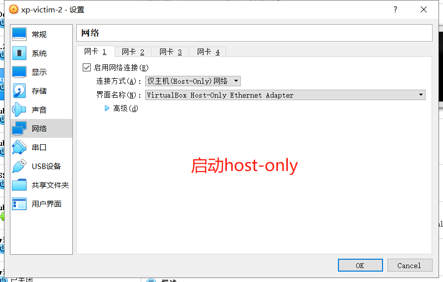                                            
4. 修改网络配置                           
* 控制面板->网络和internet->网上邻居->查看网络连接->本地连接->属性->IP/TCP->属性->使用下面的IP地址                       
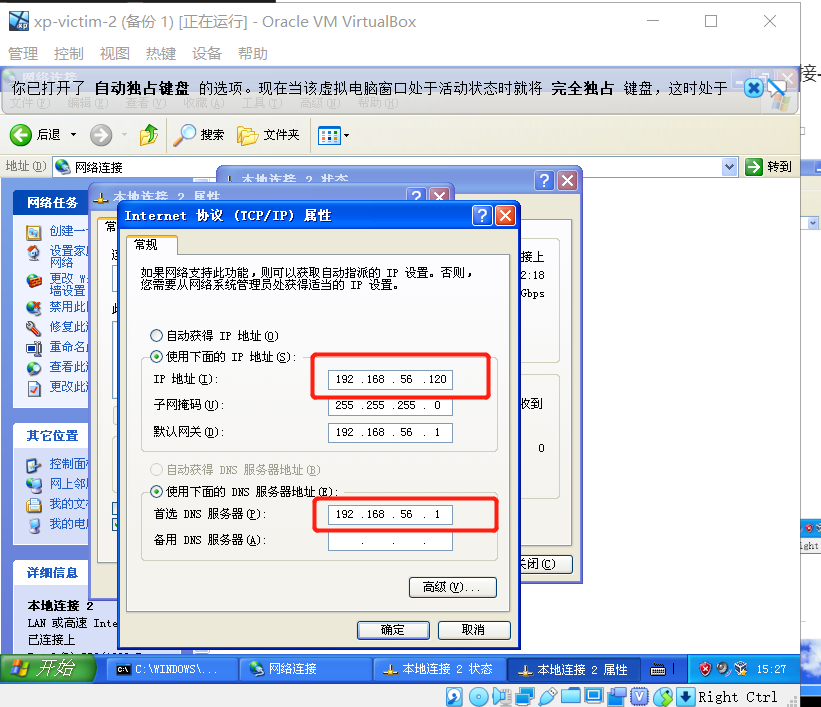                                        
5. 验证主机和客户机之间的连通性                      
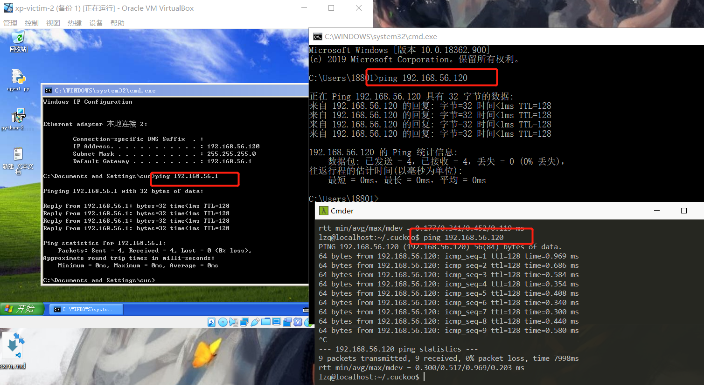                                      
6. 使xp可以上网，设置UbuntuIP报文转发（ubuntu为host主机 ）                    
```bash
sudo vim /etc/sysctl.conf
取消 net.ipv4.ip_forward=1 注释
sudo sysctl -p /etc/sysctl.conf
``` 
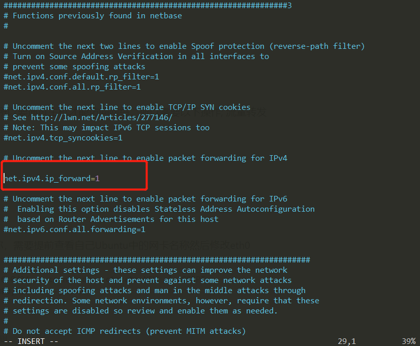                                     
5. 使用iptables提供NAT机制                       
```bash
sudo iptables -A FORWARD -o enp0s3 -i vboxnet0 -s 192.168.56.0/24 -m conntrack --ctstate NEW -j ACCEPT
sudo iptables -A FORWARD -m conntrack --ctstate ESTABLISHED,RELATED -j ACCEPT
sudo iptables -A POSTROUTING -t nat -j MASQUERADE
sudo vim /etc/network/interfaces
# 新增下列兩行
pre-up iptables-restore < /etc/iptables.rules #开机自启动规则
post-down iptables-save > /etc/iptables.rules #保存规则
sudo apt-get install iptables=persistent
sudo netfilter-persistent save
#dns
sudo apt-get install -y dnsmasq
sudo service dnsmasq start
``` 
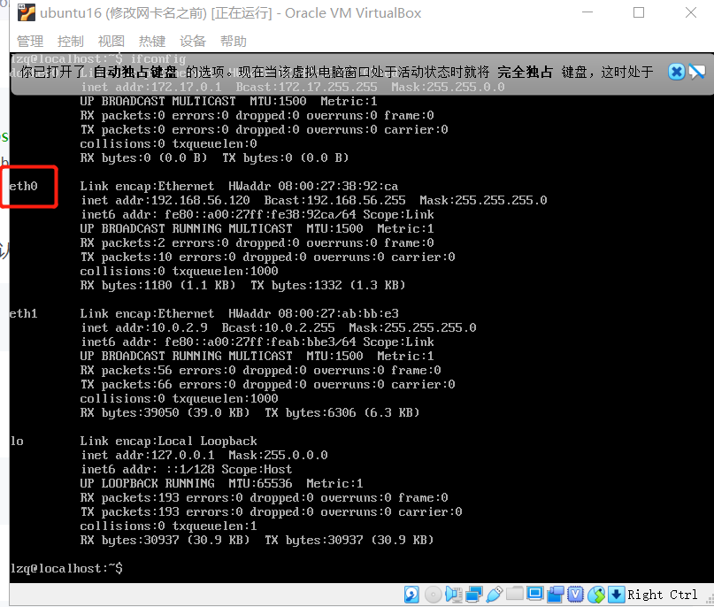                                 
6. 安装代理
* 在`.cook/agent`找到该agent.py文件。将此文件复制到客户机操作系统并运行它，代理将启动主机可以与之通信的小型API服务器。    
7. 配置cuckoo
* cuckoo.conf：cuckoo.conf是主要的配置文件，最主要的是 machinery 用于指定我们使用的虚拟机配置文件，默认是 virtualbox，该文件同样位于 conf 目录下，名字是 virtualbox.conf。另外一个比较重要的配置项是[resultserver] 的 ip和port，用于指定接收分析结果的服务器。该地址必须能够让虚拟机访问到，一般设置为虚拟网卡的地址，比如前面说过的 Host-only 虚拟网卡 vboxnet0 的 IP 地址192.168.56.1（也可以自己改成其他的,我写的是主机的地址），端口默认即可；下面是我的cuckoo.conf文件。
* vmware.conf：虚拟化配置文件，包括 virtualbox/vmware/kvm/qume等。在实际的配置当中，根据自己试用的虚拟化环境，只需要配置其中一个即可，同时采用的这个配置文件也必须 在cuckoo.conf 的 machinery 字段指定。这里的配置选项都是针对特定虚拟化平台的，很多选项只适用于某些平台。前面我们用的是 vmware.conf，其中 mode 指定vmware的运行模式，path 指定VMwareManage的绝对路径，machines指定我们使用的虚拟机的名字（多个虚拟机需要用半角逗号隔开），platform 指定虚拟客户机的系统类型，ip 指定虚拟机的ip地址                     
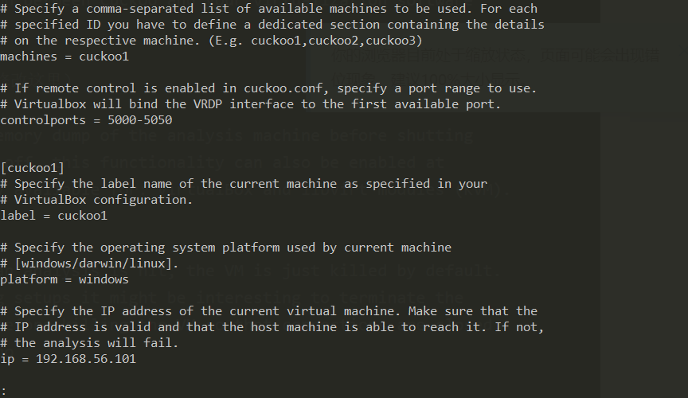                                      


* reporting.conf:至此，Cuckoo 自动化恶意软件分析环境的配置工作算是基本完成，接下来就是启动 Cuckoo 服务、上传样本进行自动化分析了。
在启动 Cuckoo 服务之前，还需要开启 MongoDB 服务，并根据 reporting.conf 中的关于 MongoDB 的配置创建一个新的数据集。比如我的 reporting.conf 关于数据库的 配置如下所示，我就需要手动创建一个名为 cuckoo 的数据集：
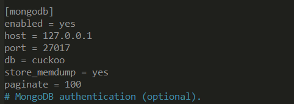                                      

### 使用cuckoo
1. 开启web服务
```bash
cd .cuckoo/web/
cuckoo web runserver
```
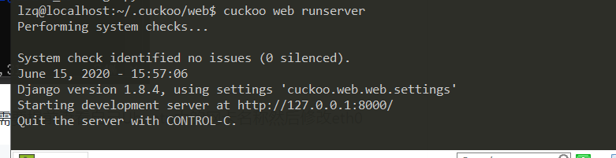                         
2. 访问 http://localhost:8000/
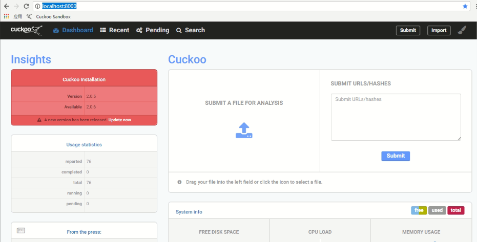                                      
3. 提交样本
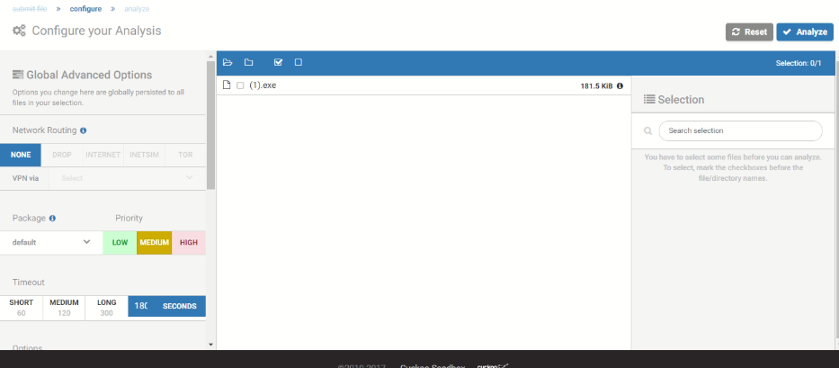                                  
* 需要留意的是，左侧的package可以用于指定Cuckoo以什么样的方法来运行你提交的样本。正常情况下，如果保持default的话，Cuckoo会根据文件内容自动进行选择（即进行文件类型识别，根据文件类型选择合适的方式）。但是这里是有bug的，你会发现它根本无法自动选择，而且在命令行还会抛出错误信息    
4. 样本运行完后，可以查看报告
> [cuckoo使用示例](https://www.anquanke.com/post/id/158553)


## 实验问题 
1. 安装cuckoo时，报错
```bash
ERROR: Could not find a version that satisfies the requirement django==1.8.4 (from cuckoo) (from versions: none)
ERROR: No matching distribution found for django==1.8.4 (from cuckoo)
```
* `pip install selenium -i http://pypi.douban.com/simple/ --trusted-host pypi.douban.com`出现新错误`ReadTimeoutError: HTTPSConnectionPool(host='files.pythonhosted.org', port=443): Read timed out.`
* 太慢，换源`sudo pip install -i  https://pypi.tuna.tsinghua.edu.cn/simple -U cuckoo`
* 还是超时`pip install --default-timeout=1000 download cuckoo`
* 报错`ERROR: Package 'setuptools' requires a different Python: 2.7.12 not in '>=3.5'`
* `pip install --default-timeout=1000 download setuptools==999`会显示很多版本，选择不是那么新的版本`pip install setuptools==39.1.0`成功

2. 出现警告` WARNING: The script cuckoo is installed in '/home/lzq/.local/bin' which is not on PATH.`
* 将其写入环境
```bash
sudo vim ~/.bashrc
## add
export PATH=/home/lzq/.local/bin/:$PATH
##
source ~/.bashrc
```

3. 主机ping不通虚拟机，虚拟机可以ping通主机和另一台虚拟机……
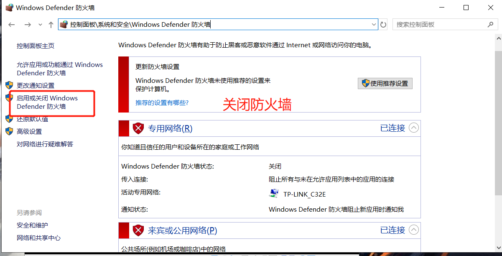                                      
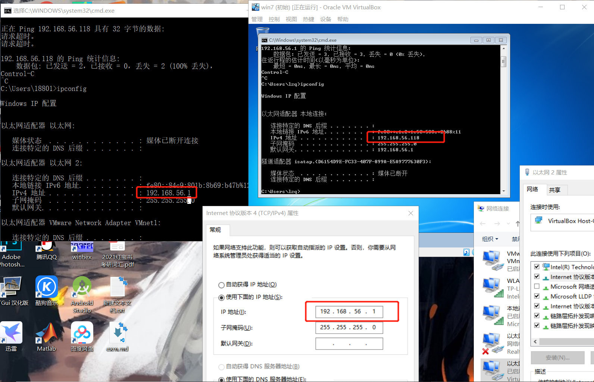                                      
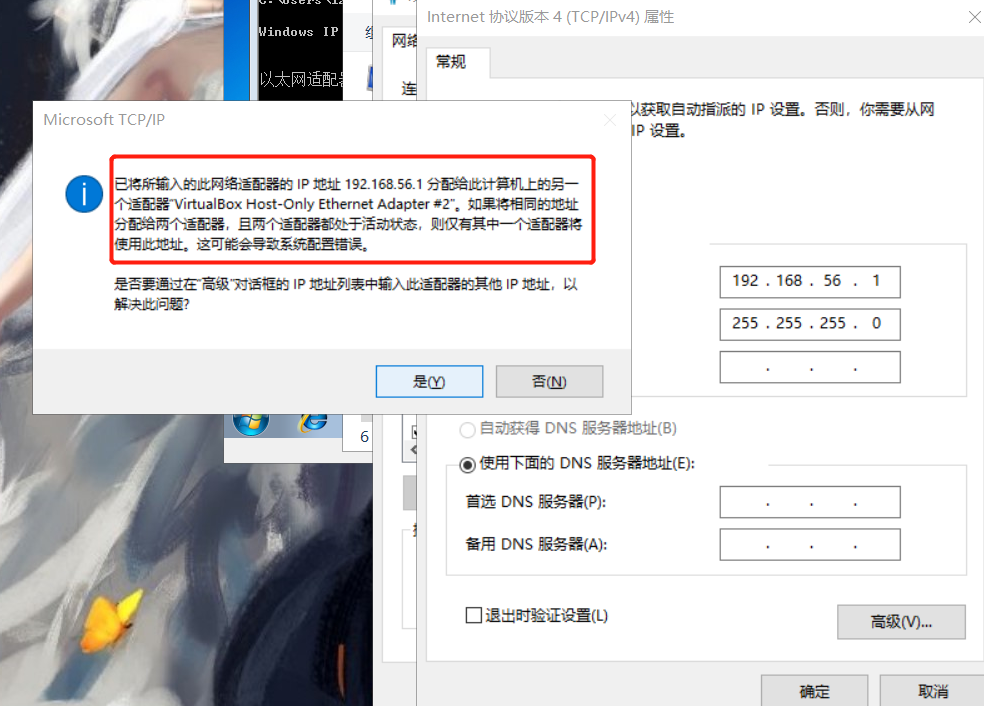                                      
* cmd中运行regedit.exe，打开注册表，`HKEY_LOCAL_MACHINE\SYSTEM\ControlSet0x\Services\Tcpip\Parameters\Interfaces`,在Interfaces分组里中项目对应右边有个IPAddress，可以看到你要设置的IP，发现有两个网卡都是192.128.56.1                  
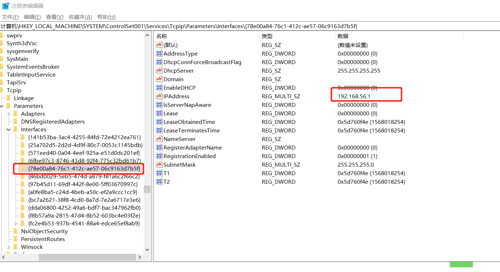                                      
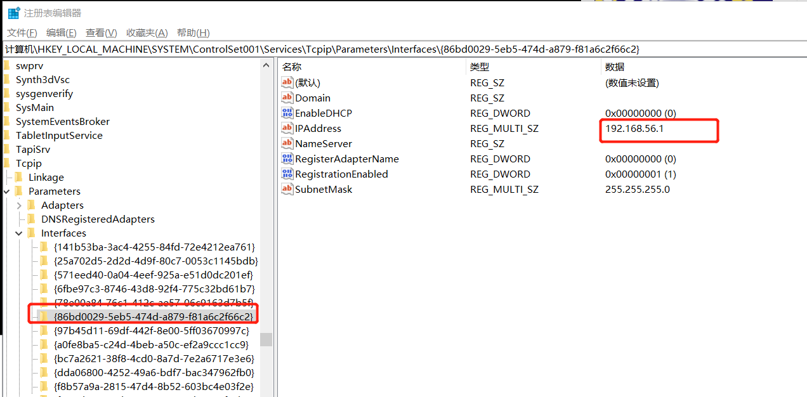                               
* 未免出其他问题，不要将它删除，双击IPAddress，把1192.168.56.1修改成其他IP，依旧不行
* 查看网卡                                 
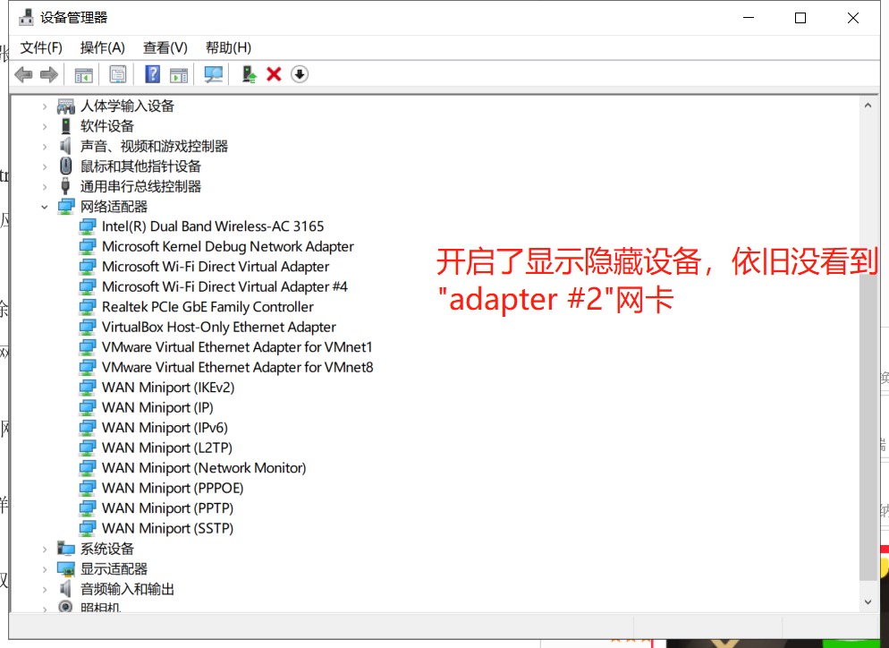                                      

4. 更换网卡名
```bash
## 更换网卡名为eth0 
sudo vim /etc/default/grub 
找到GRUB_CMDLINE_LINUX=""
改为GRUB_CMDLINE_LINUX="net.ifnames=0 biosdevname=0"
然后sudo grub-mkconfig -o /boot/grub/grub.cfg

sudo vim /etc/network/interfaces
## 修改
auto eth0
iface eth0 inet dhcp
auto eth1
iface eth1 inet dhcp
```

## 实验结论
1. 客机需要禁止防火墙和自动更新的原因
* 最重要的事情之一是禁用Windows防火墙和自动更新。这背后的原因是Windows防火墙和自动更新可以在正常情况下影响恶意软件的行为，并且它们可以通过丢弃连接或包括不相关的请求来污染Cuckoo执行的网络分析。

2. Cuckoo依赖于几个主要的配置文件：
* cuckoo.conf：用于配置常规行为和分析选项。
* auxiliary.conf：用于启用和配置辅助模块。
* < machinery > .conf：配置虚拟机的配置文件（如果用的是vmware虚拟机，就是vmware.conf）。
* memory.conf：内存取证分析工具 的 配置。
* processing.conf：用于启用和配置处理模块。
* reporting.conf：用于启用或禁用报告格式。
* 要让Cuckoo工作，你至少应该编辑cuckoo.conf和 < machinery > .conf

3. Cuckoo sandbox架构 
Cuckoo sandbox主要由中央管理软件和各分析虚拟机组成。中央管理软件也称为Host machine，负责管理各样本的分析工作，如启动分析工作、行为dump以及生成报告等；分析虚拟机又称为Guest Machine，主要完成对恶意程序的分析以及向中央管理软件报告分析结果等工作。每个分析虚拟机都是一个相对独立干净的执行环境，能安全隔离各恶意程序的执行和分析工作。沙盒的系统架构图如下图所示：
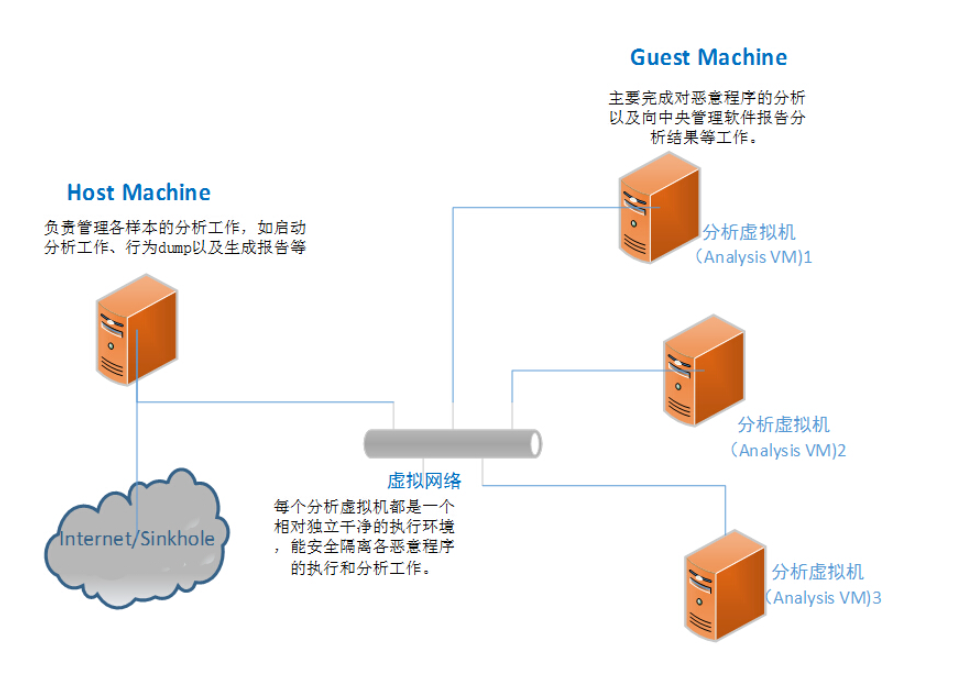                                      
## 参考资料
* [cuckoo](https://cuckoosandbox.org/)
* [Ubuntu16.04安装cuckoo sandbox](https://blog.csdn.net/root__user/article/details/89251386)
* [cuckoo官方安装手册](https://cuckoo.sh/docs/installation/index.html)
* [python windows下载](https://www.python.org/downloads/windows/)
* [VirtualBox 安装 XP 虚拟机与主机共享文件夹设置教程](https://wenku.baidu.com/view/94ce1f8cbceb19e8b8f6ba27.html)
* [十分钟学会恶意样本分析，一眼看透无所遁形](https://www.anquanke.com/post/id/158553)
