# 模糊测试
## Fuzzing
1. Fuzzing目前也是漏洞挖掘的主要方法之一，是各种漏洞挖掘技术中人力消耗比较低，技术门槛比较低，同时效果却比较好的一种方法。其他的方法，比如程序分析、符号执行等也人在用。但是难度相对较大一些。
2. 首先，第一个我们需要确定一个目标。你对什么软件进行漏洞挖掘，软件是做什么的。数据来源是文件还是网络，或者既有文件又有网络。因为我们知道Fuzzing的主要原理就是随机性的大量给被测试软件输入数据。当然首先就需要知道软件是处理什么样的数据的，应该如何给软件输入数据。
3. 一般来讲，现在主要就是文件和网络两种。如果是文件型的，最典型的比如Word。那么我们就需要构造大量的文件。如果是网络的，比如一个Web服务器，那么我们就需要构造大量的网络数据包发送给被测试软件。我们一般称为文件型Fuzzing和网络型Fuzzing
4. 选定了被测试软件以后，下面就需要构造软件的运行环境。如果是Windows Linux的应用软件，可以直接运行。如果是手机软件，由于手机自带的调试功能比较弱，比方便控制和输入，一般可能需要一个模拟器来运行。
5. 有了运行环境以后，下一步，需要选择一个Fuzzing的框架。Fuzzing技术发展了很多年，有很多人已经开发了不少框架。框架已经解决了Fuzzing测试中的一些基本的共性的问题，我们不需要重头开始做。在框架的基础上，我们只需要进行一些配置或者少量的编程就可以开始进行测试了。
6. 然后，我们需要选择一种策略。比如是基于生成的还是基于变异的。那什么是基于生成的呢，就是我们的数据完全是重新构造的，不基于一些已有的数据或者模板。当然重新构造的过程中，也不能完全瞎构造，通常有效的测试数据并不是完全畸形的数据，而是半畸形数据。因为完全畸形的数据，可能在到达测试对象之前就已经被丢弃了。比如一个网络数据包，如果不符合数据包的基本格式。连IP地址都不对。那肯定是到不了被测试对象的。所以基于生成的，也需要在规则、协议、文件格式的基础上进行。所以基于生成的策略，一般只对协议已知、格式开放的目标。那么一些位置协议或者格式不清楚的数据，就可以采用基于变异的策略。在已有的合法数据基础上，通过一定的随机性的变化来得到测试数据。已有的合法数据比较容易得到，比如很多年前，Word没有开放doc文件的格式。如果我们要对Word进行Fuzzing，就应该采取基于变异的策略。用Word先保存生产一个合法的doc文件，再在这个合法的doc文件的基础上大量变异，也就是随机性的替换一些数据、插入删除一些片段数据来得到大量的测试数据。同样，如果是对网络程序进行Fuzzing。我们可以让网络程序先正常运行，抓取数据包。然后对抓取的数据包进行重放，重放过程中进行一定比例的变异（随机性的替换、插入、删除）。
7. 总之，模糊测试技术是一种通过注入缺陷实现的自动化软件测试技术。其基础是在执行时将包括无效的、意外的或随机的数据输入注入到程序中，监视程序是否出现崩溃等异常，以获取意外行为并识别潜在漏洞。模糊测试的重点在于输入用例的构造。测试用例的生成方式可基于生成或基于变异。基于生成的模糊测试(Smart Fuzzing)首先对目标程序进行分析，尽可能收集有关它的信息，基于这些信息生成测试数据。此技术基于前期大量分析构造有效的测试数据，自动化程度相对较低。基于变异的模糊测试(Dumb Fuzzing)根据一定的规则对现有的样本数据进行修改并生成模糊测试用例。该生成方法简单，但是并未考虑程序自身的特点，因此生成测试用例有效性较低，漏报率高。但是模糊测试在一定程度上降低了安全性测试的门槛，原理简单，一般不会误报。但是对目标对象知识的获取程度直接影响模糊测试的效果。而且，模糊测试技术无法检测所有漏洞。
### 具体例子
1. 下面我们来针对一个具体的目标来说明。大家都用过家里上网的路由器，WiFi。这种路由器也是存在安全性漏洞的。那么如何对家用路由器采用Fuzzing技术进行漏洞挖掘呢？首先，需要了解到，这种路由器，其实是硬件和软件一体的一个小型的设备。它的架构和我们的电脑、手机其实有相同的地方。它也有CPU、内部有操作系统、在操作系统中还有少量的应用软件，来实现路由器的一些功能。不同的是，这种小型路由器一般是MIPS架构的CPU，我们的电脑一般是intel架构的CPU(x86 x64)，Intel架构的CPU既包括Intel生成的CPU也包括AMD公司生产的CPU。我们的手机都是ARM架构的CPU。这几种架构各有特点。MIPS适合小型化设备，功耗低性能弱、价格便宜，结构简单。ARM适合中型一些的设备，体积小能耗小功能适合手机，但是价格比较高。x86_64适合电脑和服务器，能耗高（发热也就高）、性能最高，价格最贵，结构最复杂。当然这几种CPU架构，他们的指令集是不一样的，所以有各自的汇编语言，也有各自的编译器工具链。我们知道，手机操作系统并不能运行在PC上。
2. 同样这种路由器的操作系统，也无法直接运行在PC上。所以前期有一些环境搭建的工作。需要把路由器的系统运行在模拟器中。QEMU就是中场景下广泛使用的模拟器。所以如果进行家用路由器的漏洞挖掘，首先第一步可能是安装 [QEMU](https://www.qemu.org/)                 
* ubuntu下，一个成功的QEMU安装实例：
```bash
apt-get install zlib1g-dev
apt-get install libglib2.0-0
apt-get install libglib2.0-dev
apt-get install libtool
apt-get install libsdll.2-dev
apt-get install libpixman-1-dev
apt-get install autoconf
apt-get install qemu
apt-get install qemu-user-static
apt-get install qemu-system
```
3. QEMU的基本原理是模拟各种CPU的执行环境，用软件来实现CPU的硬件功能并封闭出来执行的环境。使用QEMU可以跨平台运行系统和软件。在软件开发和调试中应用非常广泛。比如我们开发手机APP，安卓系统的调试模拟环境就是基于QEMU的。但是由于后面我们还有其他工具大多时运行在Linux系统中的，所以我们的Fuzzing实验可能需要再Linux系统中进行。
4. 有了第一步，执行环境有了。第二步，我们需要把我的目标程序在执行环境中运行。路由器的操作系统和整个应用软件，是植入到路由器的存储器中的。就像我们的PC中的系统和软件安装在硬盘上一样。由于路由器功能单一，系统不大，所以一般将操作系统和应用程序打包成一个镜像文件。称为固件,Firmware。如果有了固件，就可以在模拟器中运行整个路由器了。所以路由器这种东西也是分为硬件和软件的，其bug和漏洞也主要是出现在软件中，硬件中的问题，我们一般不考虑。软件都位于固件中。固件的主体是一个裁剪过的微型Linux系统。然后在这个系统至少运行一些实现路由器功能的应用程序。比如会有实现路由协议的实现包转发的程序、有实现用户配置的程序（一般是一个Web服务器）、有实现内网地址分发的DHCP的程序等。
5. 要得到固件，有两种办法。一种是直接从路由器中提取。一种是从官方网站上下载一个固件。路由器中当然是有固件的，否则它不能运行。厂家的官方网站有时候会开放固件供下载，因为有一些用户有升级固件的需求，比如上一个版本的固件中发现了bug，厂家就会在网站上发布一个新的固件，让用户在配置界面中升级。虽然对大多数用户不会去升级路由器的固件。但是负责任的厂家有更新的义务。不过既然绝大部分不更新，也不会更新，所以也有一些厂家不提供。那么如果有有固件的，我们可以直接下载，没有的，就需要提取。提取固件，也有现成的工具，比如binwalk。比如这是使用binwalk工具提取了一款tenda路由器的固件。           
                              
6. 提取以后的固件使用QEMU加载运行.使用qemu-arm-static运行提取的固件                              
                             
可以看到，路由器中用于用户配置的Web服务器已经运行起来了。这种小型设备一般使用httpd这种小型的静态的http server. 
7. 这个图比较清楚的说明了，我们搭建一个针对这种小型路由的漏洞挖掘工作环境的流程。                        
                              
8. 有一些下载的固件或者固件内部的部分软件是源代码形式的。所以可能还需要编译一下。这里的编译和我们之前用过的编译不同。称为交叉编译。我们以前在一个x86架构下的PC中，编译一个本架构下的软件，编译后在本机运行。而交叉编译是编译一个在其他系统中运行的软件，比如在x86系统中编译一个MIPS架构的软件。由于MIPS架构的主机一般性能不高，软件环境单一，所以通常不作为工作环境，也跑不起来编译器。所以我们在PC上进行编译发布在响应环境中运行。这种称为交叉编译。mips-gcc 和 mipsel-gcc 编译器就是交叉编译器。所以，在实验过程中，根据情况，可能还有其他的支撑工具需要使用。
9. 搭建好环境以后，系统和应用已经运行起来。下一步，就可以使用Fuzzing测试工具进行测试了。前面说，Fuzzing已经有一些框架可以使用了。SPIKE、AFL、Sulley、BooFuzz
### AFL（American Fuzzy Lop）
* AFL（American Fuzzy Lop）是由安全研究员Michał Zalewski开发的一款基于覆盖引导（Coverage-guided）的模糊测试工具，它通过记录输入样本的代码覆盖率，从而调整输入样本以提高覆盖率，增加发现漏洞的概率。其工作流程大致如下：
    1. 从源码编译程序时进行插桩，以记录代码覆盖率（Code Coverage）；
    2. 选择一些输入文件，作为初始测试集加入输入队列（queue）；
    3. 将队列中的文件按一定的策略进行“突变”；
    4. 如果经过变异文件更新了覆盖范围，则将其保留添加到队列中;
    5. 上述过程会一直循环进行，期间触发了crash的文件会被记录下来。                            
                             
可以看出AFL是基于变异策略的。所以Fuzzing测试，有一个目标就是通过输入畸形数据让程序崩溃crash.程序的崩溃往往就意味着有bug或者有漏洞。然后对引起崩溃的输入样本，或者崩溃或的系统日志、dump文件等进行分析。AFL用了一种称为插桩的技术来进行崩溃的检测。
### SPIKE
* SPIKE是由Dave Aitel编写的一款非常著名的Protocol Fuzz（针对网络协议的模糊测试）工具，完全开源免费。它提供一系列API用于用户使用C语言创建自己的网络协议模糊测试器。SPIKE定义了许多可用于C编码器的原语，这些原语允许其构造可以发送给网络服务的模糊消息以测试是否产生错误。SPIKE功能如下：
    1. 含大量可用于处理程序中产生错误的字符串。并且，SPIKE能够确定哪些值最适合发送到应用程序，从而以一种有用的方式导致应用程序异常。
    2. SPIKE引入“块”的概念，用于计算由SPKIE代码生成的数据内指定部分的大小，并且可以将这些值以各种不同的格式插入。
    3. 支持并以不同格式接收许多在网络协议中常用的不同数据类型。
SPIKE功能强大，是一款优秀的模糊测试工具，但是文档较少，只能根据各种参考资料和一些测试脚本整理常用的API使用方法。
### Sulley
* Sulley是由Pedram Amini编写的一款灵活且强大的模糊测试工具。可用于模糊化文件格式、网络协议、命令行参数和其它代码。除了专注于数据生成外，Sulley还具有如下功能：
    1. 监视网络并保留记录。
    2. 检测和监控目标程序的健康状况，能够使用多种方法恢复到已知的良好状态。
    3. 检测、跟踪和分类检测到的故障。
    4. 可以并行执行测试，提高检测速度。
    5. 自动确定测试用例触发的特殊错误。
Sulley功能比SPIKE更加的完善，能够进行构造模糊测试数据、监测网络流量、进行错误检测等，但是Sulley检测只能用于x86平台。
### Boofuzz
* Boofuzz是Sulley的继承与完善。Boofuzz框架主要包括四个部分：
    1. 数据生成，根据协议原语构造请求。
    2. 会话管理或驱动，将请求以图的形式链接起来形成会话，同时管理待测目标、代理、请求，还提供一个Web界面用于监视和控制检测、跟踪并可以分类检测到的故障。
    3. 通过代理与目标进行交互以实现日志记录、对网络流量进行监控功能等。
    4. 有独立的命令行工具，可以完成一些其他的功能。
1. 可以看出，以上几种主要的模糊测试工具中，BooFuzz是比较适合的一种。所以下一个需要进行的工作就是安装和配置BooFuzz
2. 使用Boofuzz对模拟器环境中的路由器程序进行测试主要步骤为：
    1. 根据网络请求数据包构造测试用例请求；
    2. 设置会话信息(目标IP、端口号等)，然后按照请求的先后顺序将其链接起来；
    3. 添加对目标设备的监控和重启机制等；
    4. 开始测试。
3. 比如上面那个tenda路由器，在运行起来以后，如果我们对其http服务进行Fuzzing，我们可以使用浏览器先访问他们的http 服务。                           
                              
这是路由器固件在QEMU中运行以后的结果。可以看到 服务器监听在 192.168.148.4:81。通过浏览器访问192.168.148.4:81与路由器管理界面进行尽可能多的交互，使用Wireshark抓取到不同URI的数据包。对捕获的数据包进行分析，确定数据输入点
以抓取到的其中一共数据包为例：
```bash
1   GET /goform/GetRouterStatus?0.7219206793806395&_=1587978102556  HTTP/1.1
2   Host: 192.168.148.4:81
3   User-Agent: Mozilla/5.0 (X11; Ubuntu; Linux x86_64; rv:75.0) Gecko/20100101 Firefox/75.0
4   Accept: text/plain, */*; q=0.01
5   Accept-Language: en-US,en;q=0.5
6   Accept-Encoding: gzip, deflate
7   X-Requested-With: XMLHttpRequest
8   DNT: 1
9   Connection: keep-alive
10  Cookie:password=""
11  Referer: http://192.168.148.4:81/main.html
```

根据HTTP协议特点及缓冲区溢出漏洞特点，对该请求选取以下数据输入点
第1行，HTTP协议有GET、POST、PUT、DELETE、CONNECT、OPTIONS、TRACE等方法，若方法使用错误可能会超长缓冲区溢出漏洞，例如，相比GET方法，POST方法可以提交更多的数据，若使用POST方法提交的表单误用了GET方法进行提交，会导致查询字符串过长造成溢出，因此把数据包中的GET方法当成一个输入点。若URI超长，服务器在处理请求的时候使用危险函数读取URI或未对URI长度进行限制，也可能导致安全漏洞，因此将URI处也进行模糊测试。第10行，若Cookie超长，程序认证用户身份信息时若用危险函数读取Cookie也可能造成缓冲区溢出，因此将Cookie处进行模糊测试。
4. 选定了一个具体目标，就可编写模糊测试脚本了
根据上述分析，利用Boofuzz提供的原语对HTTP请求进行定义，设置与会话相关的信息，包括目标设备IP地址、端口等。脚本的编写，需要大家查一下BooFuzz的官方文档，查看一是示例代码，比价容易。   
这是在测试过程中的一些截图。                        
                             
上面的截图是在进行测试的时候发现了程序崩溃异常的一个测试数据。在模拟器中监视到了程序崩溃。造成程序异常的数据包主要是其Cookie字段过长，初步判断是由于Cookie字段造成缓冲区溢出导致程序异常退出。                    
                              
有了以上数据以后，就可以将引起崩溃的输入数据在调试环境下再次输入到测试对象，进行调试了。这是上面那个漏洞的相关代码，在IDA-pro调试后定位的漏洞代码。                  
                             
图中的if语句不满足，函数不会读取R3寄存器存储地址，而是直接返回，因此，若在测试数据中添加.gif，则PC寄存器将会被覆盖。这些事后的分析是经过了非常多的调试工作以后确定的。工具主要是GDB和IDA-pro

# 路由器漏洞分析
## 实验背景
* Ubuntu 18.04 DESKTOP
## 实验要求
* 搜集市面上主要的路由器厂家、在厂家的官网中寻找可下载的固件
* 在CVE漏洞数据中查找主要的家用路由器厂家的已经公开的漏洞，选择一两个能下载到切有已经公开漏洞的固件。如果能下载对应版本的固件，在QEMU中模拟运行。确定攻击面（对哪个端口那个协议进行Fuzzing测试），尽可能多的抓取攻击面正常的数据包（wireshark）。
* 查阅BooFuzz的文档，编写这对这个攻击面，这个协议的脚本，进行Fuzzing。
* 配置BooFuzz QEMU的崩溃异常检测，争取触发一次固件崩溃，获得崩溃相关的输入测试样本和日志。尝试使用调试器和IDA-pro监视目标程序的崩溃过程，分析原理。
## 工具安装
### QEMU安装
```bash
sudo apt-get install zlib1g-dev
sudo apt-get install libglib2.0-0
sudo apt-get install libglib2.0-dev
sudo apt-get install libtool
sudo apt-get install libsdl1.2-dev
sudo apt-get install libpixman-1-dev
sudo apt-get install autoconf
sudo apt-get install qemu
sudo apt-get install qemu-user-static
sudo apt-get install qemu-system
```
### binwalk安装
```bash
sudo apt-get update
# 正在运行Python 2.x，还需要安装Python lzma模块：
sudo apt-get install python-lzma
sudo apt-get install build-essential autoconf git
git clone https://github.com/devttys0/binwalk
cd binwalk  
sudo python setup.py install
```
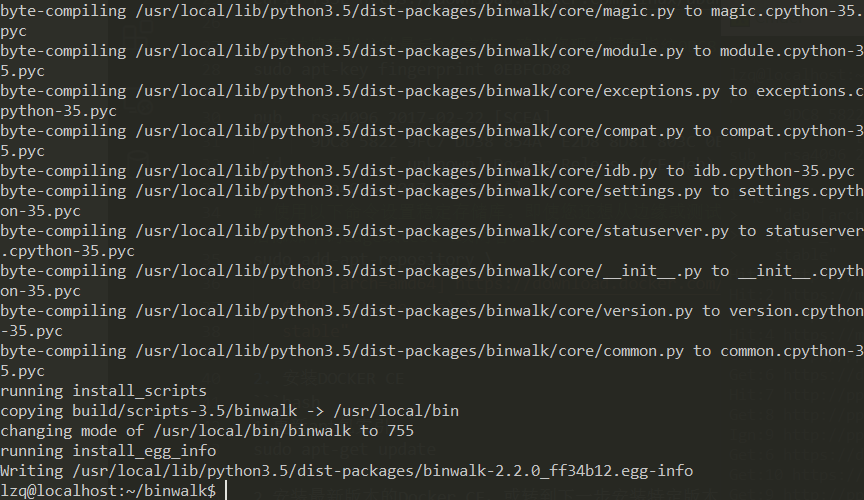                                      
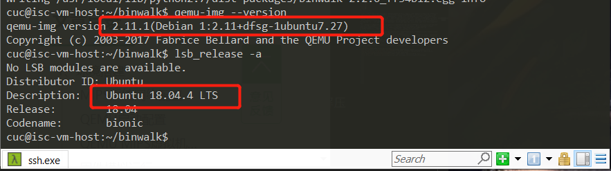                                      
## DLink RCE漏洞CVE-2019-17621分析
### MIPS系统网络配置
1. 使用QEMU 模拟运行MIPS系统，需要将ubuntu虚拟机设置成桥接，这样以来ubuntu系统就可以和QEMU虚拟机进行通信和数据传输（此操作类似配置VMware Workstation的桥接用以与物理机的通信）。                                  
2. 获取安装依赖，执行以下命令：
```bash
sudo apt-get update
sudo apt-get install bridge-utils uml-utilities
```
3. 修改ubuntu主机网络配置，将ubuntu的网络接口配置文件 `/etc/network/interfaces` 修改为如下内容并保存、关闭：
```bash
sudo vim /etc/network/interfaces
```
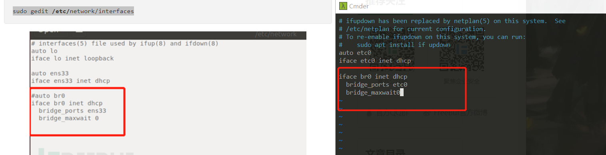                                      
4. 修改QEMU的网络接口启动脚本，重启网络使配置生效，执行以下命令：
```bash
sudo vim /etc/qemu-ifup
```
在脚本文件/etc/qemu-ifup结尾增加如下内容：
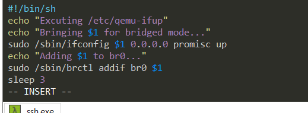                                      
5. 保存文件/etc/qemu-ifup 以后，赋予可执行权限，然后重启网络使所有的配置生效：
```bash
sudo chmod a+x /etc/qemu-ifup

sudo /etc/init.d/networking restart
```
### QEMU启动配置
Qemu运行之前先启动桥接网络，在本地ubuntu命令行终端执行以下命令（注意：ens33为ubuntu默认网卡）：
```
sudo ifdown enp0s3
sudo ifup br0
```
### QEMU MIPS虚拟机启动
1. 从[站点](https://people.debian.org/~aurel32/qemu/mips/)下载debianmips qemu镜像，由于虚拟机是Ubuntu linux，下载debian_squeeze_mips_standard.qcow2和vmlinux-2.6.32-5-4kc-malta即可：
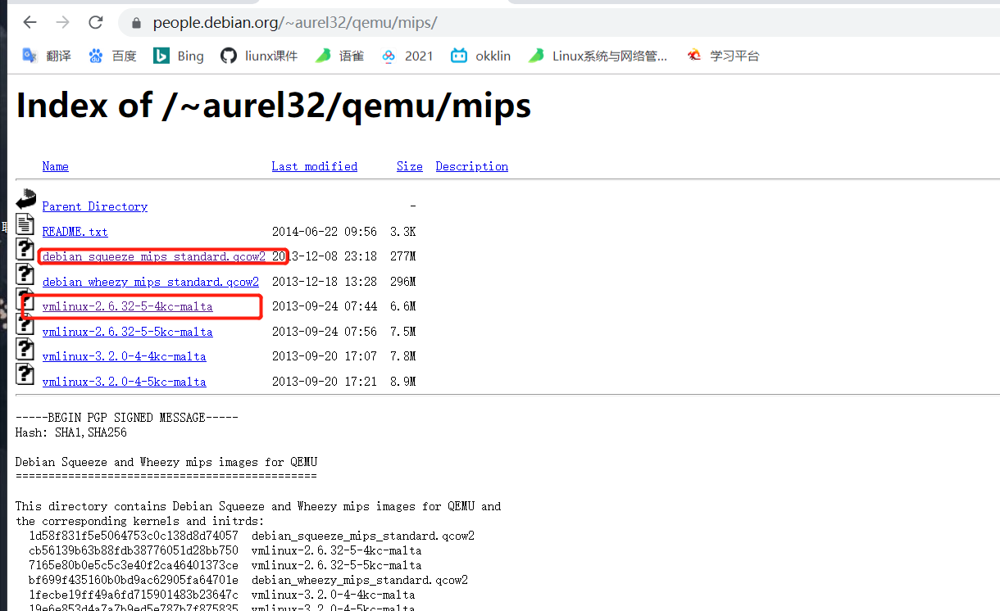                                      
```
wget https://people.debian.org/~aurel32/qemu/mips/debian_squeeze_mips_standard.qcow2
wget https://people.debian.org/~aurel32/qemu/mips/vmlinux-2.6.32-5-4kc-malta
```
2. 进入前面下载的mips镜像目录，执行以下命令：
```
sudo qemu-system-mips -M malta -kernelvmlinux-2.6.32-5-4kc-malta -hda debian_squeeze_mips_standard.qcow2 -append"root=/dev/sda1 console=tty0" -net nic,macaddr=00:16:3e:00:00:01 -nettap
```

### 固件模拟运行
1. 从[DLink官网下载包含漏洞版本的路由器固件](ftp://ftp2.dlink.com/PRODUCTS/DIR-859/DIR-859_REVA_FIRMWARE_v1.05B03.zip)，使用binwalk-Me直接解压固件可得到文件系统文件
```
binwalk DIR859Ax_FW105b03.bin
```
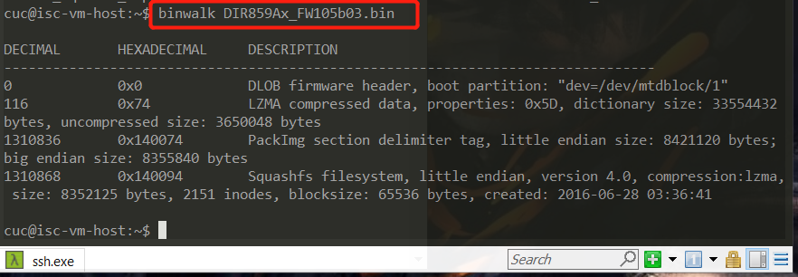                                      
2. 使用scp命令将squashfs-root目录上传到qemu mips虚拟机
```
chroot /root/squashfs-root sh
```
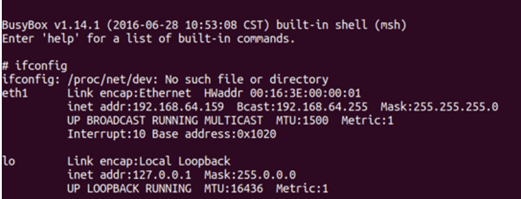                                      
3. Ubuntu中打开浏览器，输入192.168.0.1即可访问仿真路由器：                 
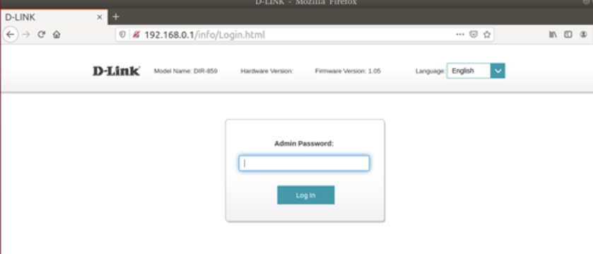                                      
### 漏洞分析
1. 在路由器运行状态下，文件系统中的/htdocs/cgibin的genacgi_main()函数在UPnP请求处理过程中，存在远程执行代码漏洞。UPnP是专用网络中设备之间的通信协议，实现了智能设备端到端网络连接结构。它也是一种架构在TCP/IP和HTTP技术之上的，分布式、开放的网络结构，以使得在联网的设备间传递控制和数据。UPnP不需要设备驱动程序，因此使用UPnP建立的网络是介质无关的。同时UPnP使用标准的TCP/IP和网络协议，使它能够无缝的融入现有网络。构造UPnP应用程序时可以使用任何语言，并在任何操作系统平台上编译运行。
2. 尝试静态下使用IDA反汇编cgibin文件，然后F5查看伪代码，发现操作失败，故换用Ghidra(NSA发布的、基于Java开发的、适用于Windows、Mac和Linux的跨平台反汇编工具)，发现可快速定位genacgi_main()函数并查看伪码
3. 从伪码中可以看到，sprintf()函数设置了一个包含所有值的缓冲区，其中函数参数 ?service=及其值，被xmldbc_ephp()函数(最后调用send())将“buffer_8”中包含的数据发送给PHP：                                       
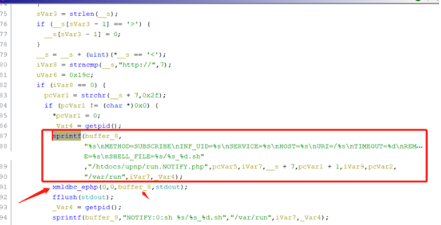                                      
4. 可看出sprintf()用于连接多个变量的值，用于填充一个缓冲区，设置要传递的新变量，其中SHELL_FILE将以格式%s_%d.sh进行传递，主要用于为新的shell脚本命名。缓冲区中的数据经过xmldbc_ephp处理，由PHP文件run.NOTIFY.php进行处理                          
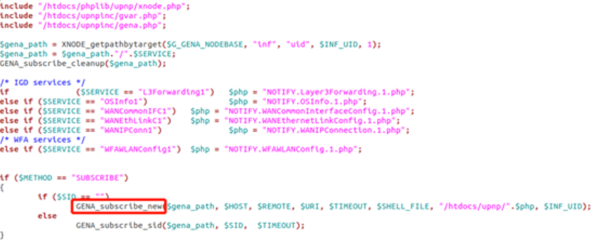                                      
5. 程序的调用流程为：buf_8 ->xmldbc_ephp->FUN_0041420c ->FUN_0041372c -> socket。                              
6. 其中可见调用了PHP函数 GENA_subscribe_new()，并传递cgibin程序中genacgi_main()函数获得的变量，还包括变量SHELL_FILE。搜索GENA_subscribe_new()发现其定义在gena.php文件中，分析GENA_subscribe_new功能可知其并不修改$shell_file变量，              
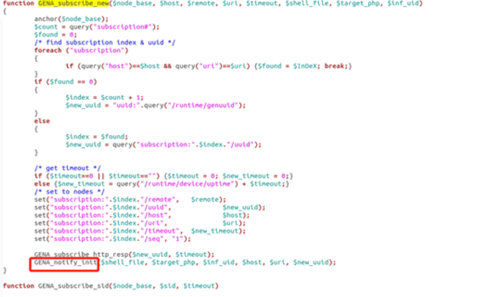                                        
7. 其传递 $shell_file到GENA_notify_init函数，也就是shell_file最终处理的地方：通过调用PHP函数fwrite()创建新文件，且fwrite()函数被使用了两次：                   
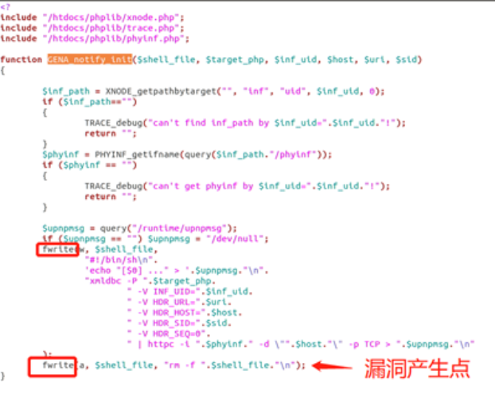                                      
8. fwrite()函数第一次创建文件，文件名由可控的SHELL_FILE变量(uri_service)以及getpid()组成                 
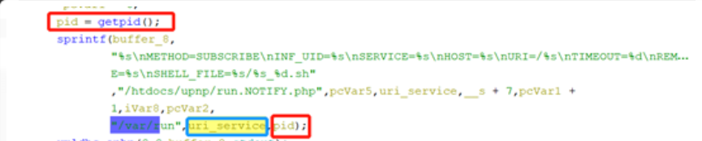                                      
10. 第二次调用fwrite()向文件中添加删除命令”rm -f”.$shell_file.”\n”，攻击时，只需要插入一个反引号包裹的系统命令，将其注入到shell脚本中，当脚本执行rm命令时遇到反引号将失败，继续执行引号里面的系统命令，从而达到远程命令执行漏洞的触发。因此，控制好”/gena.cgi?service=shell_file”中shell_file的内容为反引号包裹的系统命令，就可以触发漏洞。

## 实验问题
1. `sudo apt-get install libsdll.2-dev`安装时报错
```
E: Unable to locate package libsdll.2-dev
E: Couldn't find any package by glob 'libsdll.2-dev'
E: Couldn't find any package by regex 'libsdll.2-dev'
```
* `apt-cache search libsdl`
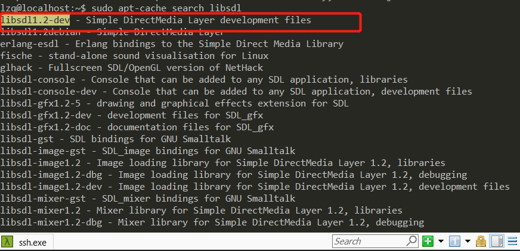                                      
找到了正确名称`libsdl1.2-dev`

## 实验结论
### 路由器漏洞分类
#### Wi-Fi密码破解漏洞
* 路由器中，Wi-Fi密码常见的加密认证方式为WEP、WPA、WPA2，Wi-Fi联盟组织近期又推出了WPA3，目前最常用的为WPA2（Wi-Fi Protected Access 2）。
* WEP加密方式的加密强度相对较低、很容易被黑客破解，现在正逐渐被淘汰。但据统计，显示全国仍有0.7%的路由器使用WEP加密认证。
* WPA/WPA2是Wi-Fi联盟后来推出的一个较为安全密码认证协议，但因为其增加了用户连接Wi-Fi上网的复杂度，后来Wi-Fi联盟又推出了一种叫做WPS的新技术。可以大大简化用户连接Wi-Fi上网的复杂度，目前市场中的大部分路由器的机身上通常都带有一个WPS按钮，用户只需要轻轻按下该按钮或输入简短的PIN码就能完成Wi-Fi连接。因为这个PIN码共有8位（数字），最后一位是校验位，可以不必破解而直接计算，所以仅破解前7位即可。但实际情况是，这前7位也可分为前半部分（前4位）和后半部分（后3位），当黑客构造一次PIN认证失败后，路由器会间接的返回给客户端关于这个PIN认证码的前半部分或后半部分是否正确。换句话说，攻击者只需要从7位的PIN码中找出一个4位的PIN码和一个3位的PIN码。所以，破解的难度又被降低，攻击者最多需要实验10^4+10^3（共11000次），这通常会在很短的时间内被破解。
* 即使在WPS功能被关闭的情况下，据书中提及的报告显示，仍然存在约1%的用户没有设置密码。也存在相当比例用户虽然设置了密码，但很多为弱密码（如简短的数字组合、电话号码、生日等），这种情况下，黑客通过一个好的字典+字典暴力破解的方法也可以轻易的获取Wi-Fi密码。
另外，除了常规的暴力破解方法，在2017年末和2019年初，WPA/WPA2和WPA3都分别被披露存在严重安全漏洞。
Wi-Fi密码被破解后，攻击者就可以对路由器的进行进一步的渗透，进而获取到路由器的控制权。
#### Web漏洞
* 家用路由器一般都带有Web管理服务，可通过Web管理页面设置宽带账号密码、Wi-Fi名和密码等信息，路由器中既然存在了Web服务，就必然也存在传统Web安全中常见的SQL注入、命令执行、CSRF（Cross-Site Request Forgery）、XSS等攻击手段。
例如CSRF攻击中，如用户访问了一个被攻陷的网站，而该被攻陷的网站网页代码中被植入了恶意代码，当用户打开含有恶意代码的网页时，恶意代码就会对用户曾经授权访问过的路由器Web管理服务进行攻击。即，黑客在用户的浏览器中模拟了用户对路由器的合法操作。而这种攻击却不需要黑客拥有路由器的Web管理员密码即可控制路由器。
#### 后门漏洞
* 除了路由器开发者在写代码时无意留下的漏洞外，也存在为了便于调试或其他目的有意在路由器程序中保留的后门程序，黑客可由此直接控制路由器，进一步发起DNS劫持、窃取信息、网络钓鱼等攻击。
#### 缓冲区溢出漏洞
* 缓冲区溢出漏洞是一种高级攻击手段，也是一种常见且危险的漏洞，广泛存在于路由器中。缓冲区溢出的利用攻击，常见表现为程序运行失败、系统假死、重新启动等。而更为严重的是，黑客可以利用它执行非授权指令，进而取得系统特权，从而进行各种非法操作。
## 参考资料
* [信息安全漏洞门户](http://cve.scap.org.cn/)
* [CVE-2017-17215 华为智能路由器HG532 漏洞分析笔记](https://www.cnblogs.com/deerCode/p/11919612.html)
* [Huawei Home Routers in Botnet Recruitment](https://research.checkpoint.com/2017/good-zero-day-skiddie/)
* [CVE-2017-17215-HG532命令注入漏洞分析](https://xz.aliyun.com/t/4819)
* [DLink RCE漏洞CVE-2019-17621分析（有固件）](https://www.freebuf.com/vuls/228726.html)
* [binwalk在ubuntu中的安装与使用问题](https://blog.csdn.net/LongHitler/article/details/77529782)
* [DLink官网下载包含漏洞版本的路由器固件](ftp://ftp2.dlink.com/PRODUCTS/DIR-859/DIR-859_REVA_FIRMWARE_v1.05B03.zip)
