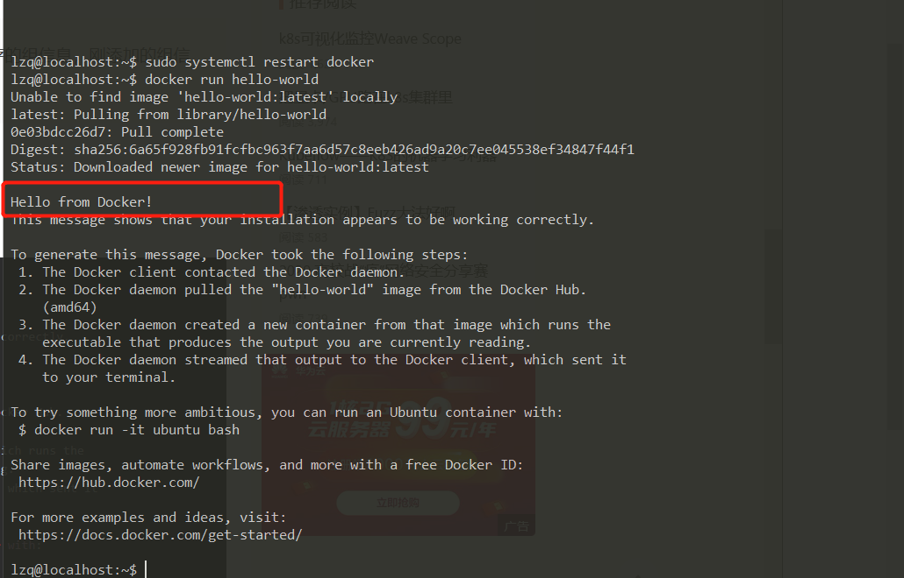
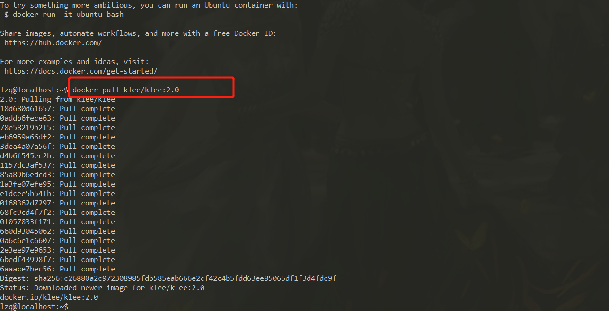
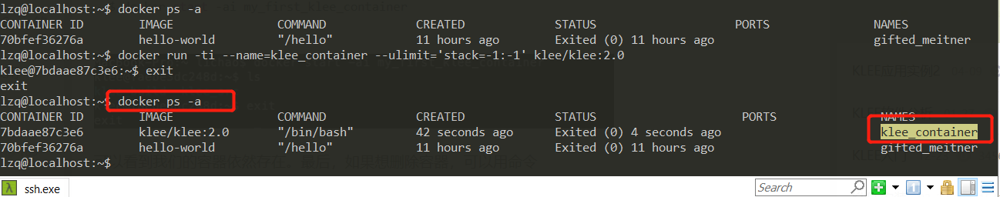
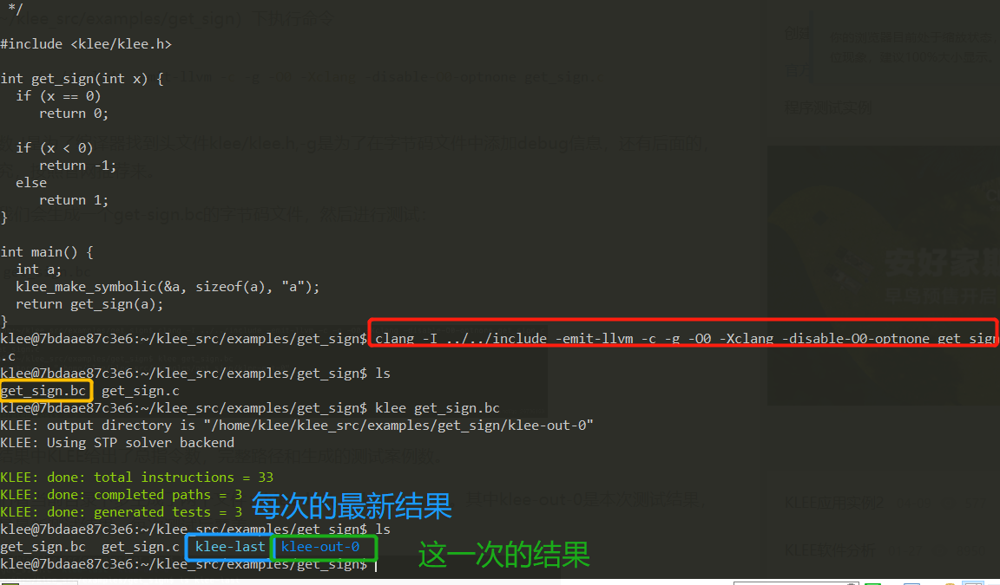
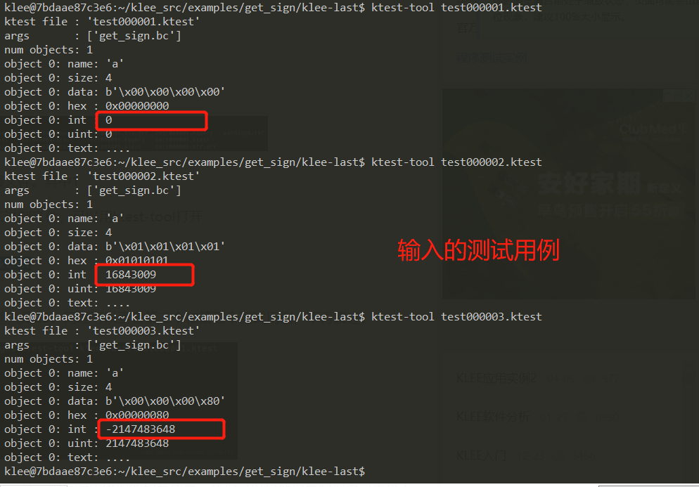
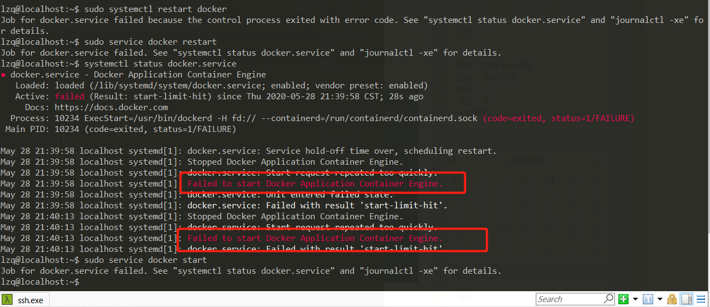

# KLEE
## 实验背景
## 实验完成度
* [x] 安装KLEE
* [x] 完成官方tutorials（至少完成前三个）
## 实验过程
### 安装docker
1. 安装命令
```bash
sudo apt-get update
sudo apt-get install \
    apt-transport-https \
    ca-certificates \
    curl \
    software-properties-common
## 添加软件仓库
## 阿里云仓库
curl -fsSL https://mirrors.aliyun.com/docker-ce/linux/ubuntu/gpg | sudo apt-key add -
sudo add-apt-repository \
     "deb [arch=amd64] https://mirrors.aliyun.com/docker-ce/linux/ubuntu \
     $(lsb_release -cs) \
     stable"

## 安装
sudo apt-get install docker-ce

## 添加访问权限
cd /var/run
ll | grep docker
sudo gpasswd -a ${USER} docker

sudo service docker restart
# 切换当前会话到新 group 或者重启 X 会话
newgrp - docker
```
2. 运行docker测试
```bash
docker run hello-world

Hello from Docker!
This message shows that your installation appears to be working correctly.

To generate this message, Docker took the following steps:
 1. The Docker client contacted the Docker daemon.
 2. The Docker daemon pulled the "hello-world" image from the Docker Hub.
    (amd64)
 3. The Docker daemon created a new container from that image which runs the
    executable that produces the output you are currently reading.
 4. The Docker daemon streamed that output to the Docker client, which sent it
    to your terminal.

To try something more ambitious, you can run an Ubuntu container with:
 $ docker run -it ubuntu bash

Share images, automate workflows, and more with a free Docker ID:
 https://hub.docker.com/

For more examples and ideas, visit:
 https://docs.docker.com/get-started/
```
                                      

### dockers环境下安装KLEE
1. 一条命令安装完成
```
docker pull klee/klee:2.0
```
                                      
2. 或者通过创建容器
```bash
# 创建临时KLEE Docker容器
docker run --rm -ti --ulimit='stack=-1:-1' klee/klee:2.0
# 创建永久容器
## 创建并进入容器
docker run -ti --name=klee_container --ulimit='stack=-1:-1' klee/klee:2.0

# 退出容器，检查容器是否依然存在
exit
docker ps -a

# 重新进入容器
docker start -ai klee_container

# 删除容器
docker rm my_first_klee_container
```
                                      
### KLEE官方tutorials
#### [tutorials One](http://klee.github.io/tutorials/testing-function/)
1. 在`klee_src/examples/get_sign`目录下的`get_sign.c`,是用来判断一个整数的正，负，或者为0.
```cpp
/*                                                            
 * First KLEE tutorial: testing a small function              
 */                                                           
                                                              
#include <klee/klee.h>                                        
                                                              
int get_sign(int x) {                                         
  if (x == 0)                                                 
     return 0;                                                
                                                              
  if (x < 0)                                                  
     return -1;                                               
  else                                                        
     return 1;                                                
}                                                             
                                                              
int main() {                                                  
  int a;                                                      
  klee_make_symbolic(&a, sizeof(a), "a");              //klee_make_sybolic是KLEE自带的函数，用来产生符号化的输入        
  return get_sign(a);                                         
}                                                             
```
2. 因为KLEE是在LLVM字节码上进行工作,所以将将.c编译为LLVM字节码
```bash
clang -I ../../include -emit-llvm -c -g -O0 -Xclang -disable-O0-optnone get_sign.c
```
3. 同目录下会生成一个get-sign.bc的字节码文件，然后进行测试
```bash
klee get_sign.bc
```
                                      
4. klee-last目录,.ktest文件是KLEE生成的测试用例，是二进制文件，可以用ktest-tool打开
```bash
cd klee-last
ktest-tool test000001.ktest
```
                                      
5. 其他后缀结尾的，包括.free,err、.div,err等，则是对应错误的相关信息，我们可以将他们复制到自己主机上进行查看。
```bash
docker cp <containerId>:/file/path/within/container   /host/path/target
```
然后用文本格式打开，可以看到类似以下信息，包括错误的位置以及原因：
### [tutorials TWO](https://klee.github.io/releases/docs/v2.0/tutorials/testing-regex)
>测试一个简单的正则表达式的匹配函数
1. 安装 LLVM 和 Clang
```bash
## 下载llvm的源代码
wget http://llvm.org/releases/3.6.0/llvm-3.6.0.src.tar.xz
xz -d llvm-3.6.0.src.tar.xz
tar -xf llvm-3.6.0.src.tar
mv llvm-3.6.0.src llvm

## 下载clang的源代码
cd llvm/tools
wget http://llvm.org/releases/3.6.0/cfe-3.6.0.src.tar.xz
tar xf cfe-3.6.0.src.tar.xz
mv cfe-3.6.0.src clang

3、下载compiler-rt的源代码
cd llvm/tools/projects
wget http://llvm.org/releases/3.6.0/compiler-rt-3.6.0.src.tar.xz
tar xf compiler-rt-3.6.0.src.tar.xz
mv compiler-rt-3.6.0.src compiler-rt

4、配置编译选项
cd ..
./configure --enable-optimized CC=gcc CXX=g++

5、编译llvm
make -j4
编译成功后的提示：
llvm[0]: ***** Completed Release+Asserts Build
编译好的bin默认放在Release+Asserts/bin目录下。


6、安装编译好的llvm
make install
会安装在/usr/local/bin中

7、检查clang的版本
clang --version

clang version 3.6.0 (tags/RELEASE_360/final)
如果还是旧版本，需要将/usr/bin/clang指向clang 3.6.0：
ln -s /usr/local/bin/clang /usr/bin/clang


8、使用llvm+clang编译c源码：
./clang test.c -o test
```
1. 编译构造
```bash
cd klee_src/examples/regexp
llvm-gcc -I ../../include -emit-llvm -c -g Regexp.c
```
                                      
                                      
                                      
                                      
                                      
                                      
                                        
                                      
                                      
                                      
                                      
                                      
                                      
                                      
                                      
                                      
                                      
                                      
                                        
## 实验问题
1. 运行：`sudo docker run hello-world`
```
Unable to find image 'hello-world:latest' locally
docker: Error response from daemon: Get https://registry-1.docker.io/v2/: net/http: TLS handshake timeout.
See 'docker run --help'.
```
* docker在本地没有找到hello-world镜像，也没有从docker仓库中拉取镜像，出项这个问题的原因：是应为docker服务器再国外，我们在国内无法正常拉取镜像，所以就需要我们为docker设置国内阿里云的镜像加速器
* 需要修改配置文件 /etc/docker/daemon.json 如下
```bash
{
“registry-mirrors”: [“https://alzgoonw.mirror.aliyuncs.com”]
}
```
* 重启报错`Failed to start Docker Application Container Engine.`                    
                                      
* 编辑daemon.json文件中的内容有错,复制过来的符号是中文的，而不是英文的
* 再次重启`sudo systemctl restart docker`
                                      
                                      
                                      
                                      
                                      
                                      
                                      
                                      
                                      
                                      
                                        
## 实验结论

## 参考资料
* [KLEE入门](https://blog.csdn.net/vincent_nkcs/article/details/85224491)
* [Ubuntu 16.04 安装配置Docker](https://www.jianshu.com/p/724315d13ad7)
* [Docker容器启动失败 Failed to start Docker Application Container Engine的解决办法](https://www.cnblogs.com/huhyoung/p/9495956.html)
* [出错： Unable to find image 'hello-world:latest' locally docker: Error response from daemon](https://blog.csdn.net/weixin_43414429/article/details/96453772)
* [Ubuntu 16.04 安装配置Docker](https://www.jianshu.com/p/724315d13ad7)
* [KLEE安装](https://blog.csdn.net/qq_26736193/article/details/103367551)
* [官方指导实例1](https://blog.csdn.net/qq_26736193/article/details/103455451)
* [KLEE应用实例1](https://blog.csdn.net/fjnuzs/article/details/79869930)
* [KLEE应用实例2](https://blog.csdn.net/fjnuzs/article/details/79869946)
* [KLEE应用实例3](https://blog.csdn.net/fjnuzs/article/details/79869956)
* [tutorials One](http://klee.github.io/tutorials/testing-function/)
* [tutorials TWO](https://klee.github.io/releases/docs/v2.0/tutorials/testing-regex)

* []()
* []()
* []()
* []()
* []()
* []()