# KLEE
## 实验背景
## 实验完成度
* [x] 安装KLEE
* [x] 完成官方tutorials（至少完成前三个）
## 实验过程
### 安装docker
1. 安装命令
```bash
sudo apt-get update
sudo apt-get install \
    apt-transport-https \
    ca-certificates \
    curl \
    software-properties-common
## 添加软件仓库
## 阿里云仓库
curl -fsSL https://mirrors.aliyun.com/docker-ce/linux/ubuntu/gpg | sudo apt-key add -
sudo add-apt-repository \
     "deb [arch=amd64] https://mirrors.aliyun.com/docker-ce/linux/ubuntu \
     $(lsb_release -cs) \
     stable"

## 安装
sudo apt-get install docker-ce

## 添加访问权限
cd /var/run
ll | grep docker
sudo gpasswd -a ${USER} docker

sudo service docker restart
# 切换当前会话到新 group 或者重启 X 会话
newgrp - docker
```
2. 运行docker测试
```bash
docker run hello-world

Hello from Docker!
This message shows that your installation appears to be working correctly.

To generate this message, Docker took the following steps:
 1. The Docker client contacted the Docker daemon.
 2. The Docker daemon pulled the "hello-world" image from the Docker Hub.
    (amd64)
 3. The Docker daemon created a new container from that image which runs the
    executable that produces the output you are currently reading.
 4. The Docker daemon streamed that output to the Docker client, which sent it
    to your terminal.

To try something more ambitious, you can run an Ubuntu container with:
 $ docker run -it ubuntu bash

Share images, automate workflows, and more with a free Docker ID:
 https://hub.docker.com/

For more examples and ideas, visit:
 https://docs.docker.com/get-started/
```
                                      

### dockers环境下安装KLEE
1. 一条命令安装完成
```
docker pull klee/klee:2.0
```
                                      
2. 或者通过创建容器
```bash
# 创建临时KLEE Docker容器
docker run --rm -ti --ulimit='stack=-1:-1' klee/klee:2.0
# 创建永久容器
## 创建并进入容器
docker run -ti --name=klee_container --ulimit='stack=-1:-1' klee/klee:2.0

# 退出容器，检查容器是否依然存在
exit
docker ps -a

# 重新进入容器
docker start -ai klee_container

# 删除容器
docker rm my_first_klee_container
```
                                      
### KLEE官方tutorials
#### [tutorials One](http://klee.github.io/tutorials/testing-function/)
1. 在`klee_src/examples/get_sign`目录下的`get_sign.c`,是用来判断一个整数的正，负，或者为0.
```cpp
/*                                                            
 * First KLEE tutorial: testing a small function              
 */                                                           
                                                              
#include <klee/klee.h>                                        
                                                              
int get_sign(int x) {                                         
  if (x == 0)                                                 
     return 0;                                                
                                                              
  if (x < 0)                                                  
     return -1;                                               
  else                                                        
     return 1;                                                
}                                                             
                                                              
int main() {                                                  
  int a;                                                      
  klee_make_symbolic(&a, sizeof(a), "a");              //klee_make_sybolic是KLEE自带的函数，用来产生符号化的输入        
  return get_sign(a);                                         
}                                                             
```
2. 因为KLEE是在LLVM字节码上进行工作,所以将将.c编译为LLVM字节码
```bash
clang -I ../../include -emit-llvm -c -g -O0 -Xclang -disable-O0-optnone get_sign.c
```
3. 同目录下会生成一个get-sign.bc的字节码文件，然后进行测试
```bash
klee get_sign.bc
```
                                      
4. klee-last目录,.ktest文件是KLEE生成的测试用例，是二进制文件，可以用ktest-tool打开
```bash
cd klee-last
ktest-tool test000001.ktest
```
                                      

### [tutorials TWO](https://klee.github.io/releases/docs/v2.0/tutorials/testing-regex)
>测试一个简单的正则表达式的匹配函数。该实例的源程序在klee_dir/examples/regexp/regexp.c。通过本例将会学习如何通过KLEE编译和运行具体的实例，以及如何解读输出
1. 编译构造
```bash
cd klee_src/examples/regexp
clang -I ../../include -emit-llvm -c -g -O0 -Xclang -disable-O0-optnone Regexp.c
# klee Regexp.bc
klee --only-output-states-covering-new Regexp.bc
# 参数 --only-output-states-covering-new是用于限定输出，若不指定，会生成大量的ktest测试数据，大概有六千多，指定该参数则仅仅输出新覆盖输出
```
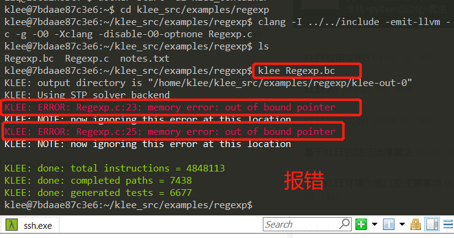                               
2. 当KLEE在执行程序时发现错误，那么它会生成一个test case来展示该错误，并把相关信息写入文件testN，类型TYPE为err的文件中。进入`klee-last`目录会发现，eer文件                                    
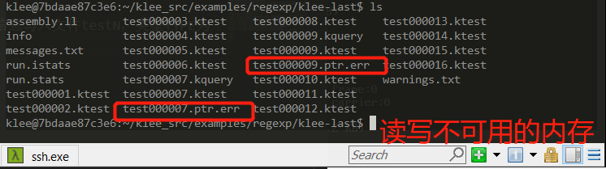                                      
                                      
3.  KLEE可以发现的错误包括
* ptr: Stores or loads of invalid memory locations.读写不可用的内存
* free: Double or invalid free(). 多次free同一空间或者是不可释放的空间
* abort: The program called abort(). 程序调用abort
* assert: An assertion failed. asset断言错误
* div: A division or modulus by zero was detected. 除数为0的情况
* user: There is a problem with the input (invalid klee intrinsic calls) or the way KLEE is being used. 不可用的klee调用
* exec: There was a problem which prevented KLEE from executing the program; for example an unknown instruction, a call to an invalid function pointer, or inline assembly. 由于某些原因阻止KLEE执行程序，例如未知的指令，调用无效函数指针，或者内联汇编
* model: KLEE was unable to keep full precision and is only exploring parts of the program state. For example, symbolic sizes to malloc are not currently supported, in such cases KLEE will concretize the argument. KLEE不能够保证准确性的情况
4. 查看错误`cat test000007.ptr.err`
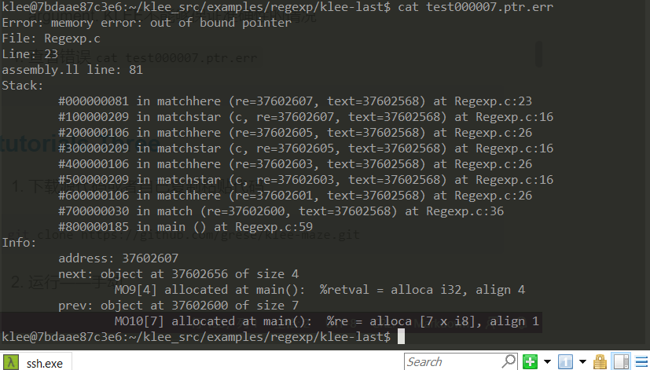                                      
* 每一行的backtrace包含 frame number, the instruction line (汇编程序assebly.ll的行号)，函数，参数和源代码位置信息。对于不同的错误，其所含信息也不同，例如内存错误，KLEE会显示无效地址、以及堆中的对象是什么，以及前后的地址。本例中，可以看到错误地址发生在上一个对象地址的下一个字节位置。
5. 修改测试方法
* KLEE在此程序中发现内存错误的原因不是因为正则表达式函数存在错误，而是测试驱动程序存在问题。问题是我们使输入正则表达式缓冲区完全是符号，但是match函数期望它是一个'\0'为结尾的字符串
* 第一种方法：将'\ 0'存储在缓冲区的末尾，通过明确声明约束，这将迫使测试用例包含'\0'在其中
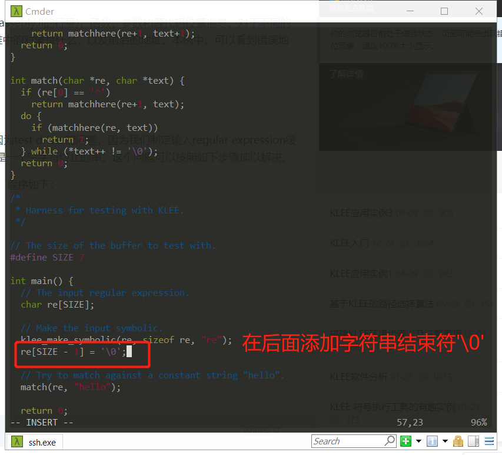                                      
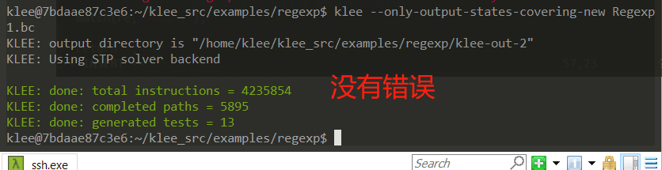                                      
* 第二种方法：使用klee_assume内部函数。klee_assume接受单个参数（无符号整数），该参数通常应使用某种条件表达式，并“假定”该表达式在当前路径上为真（如果永远不会发生，即该表达式可证明是假，则KLEE将报告错误）。
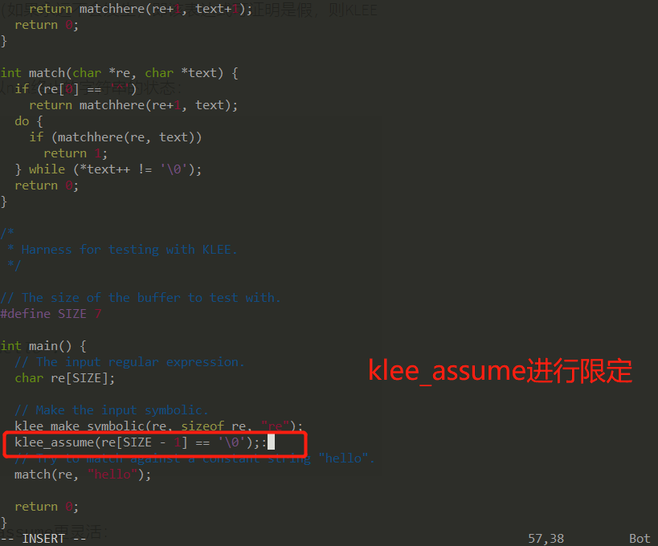                                      
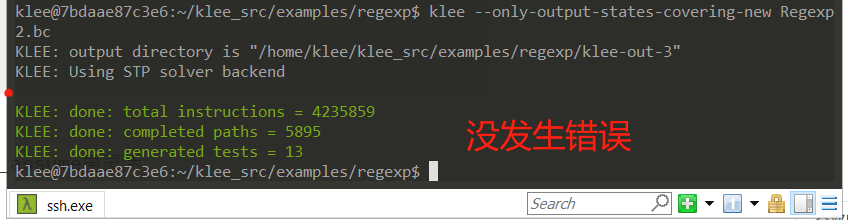                                      

### [tutorials Three](http://feliam.wordpress.com/2010/10/07/the-symbolic-maze/)
1. 下载源代码或者自己复制粘贴代码
```bash
git clone https://github.com/grese/klee-maze.git
```
2. 运行——手动
```bash
cd klee-maze
gcc maze.c -o maze

### 
./maze
ssssddddwwaawwddddssssddwwww
```
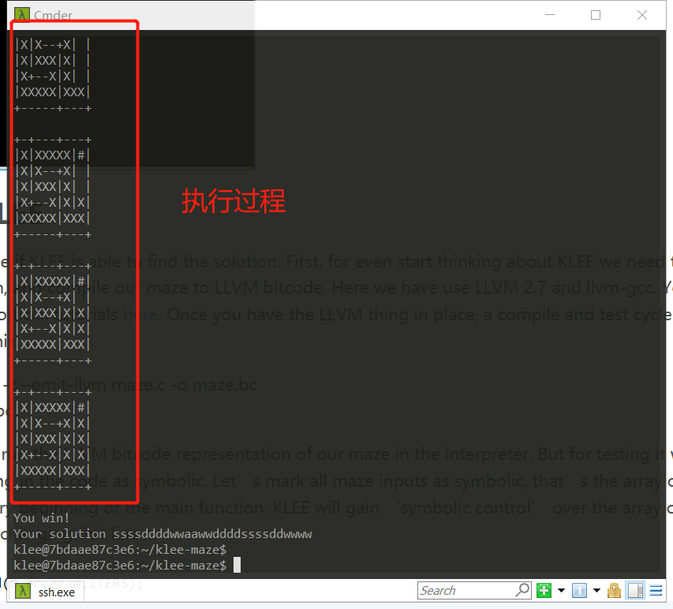                                      
3. 修改代码为maze_klee.c                    
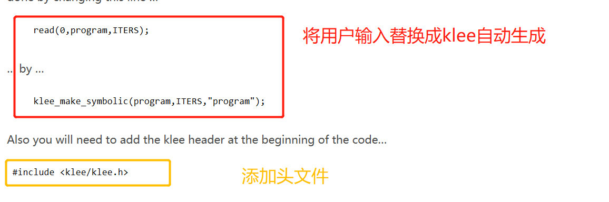                                      
4. 运行
```bash
cd klee-maze
clang -I ../klee_src/include -emit-llvm -c -g -O0 -Xclang -disable-O0-optnone maze_klee.c
klee --emit-all-errors maze_klee.bc
```           
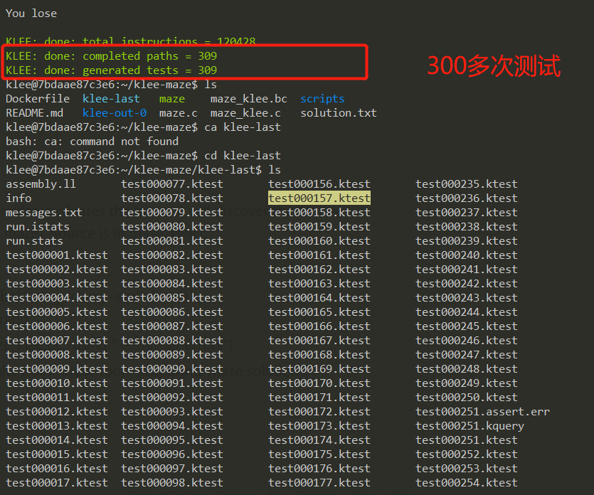                                    
5. 查看得出结果
```bash
./scripts/show_solutions.sh
``` 
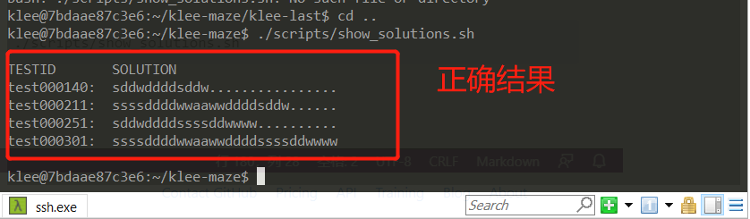                                        
或者手动查找,形如`testID.assert.err`对应的`testID.ktest`,然后用`ktest-tool testID.ktest`进行查看，中的solution就是正确答案                                
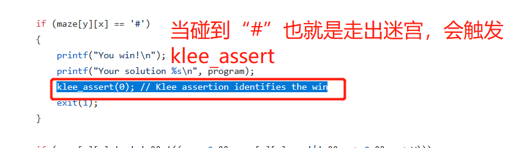                                       
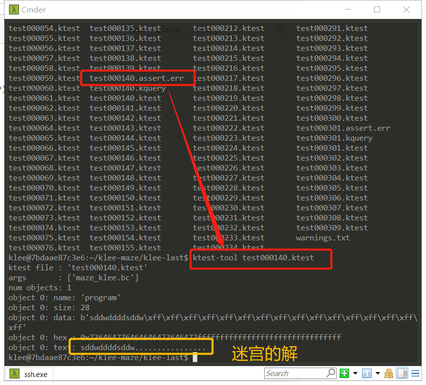                                      

## 实验问题
1. 运行：`sudo docker run hello-world`
```
Unable to find image 'hello-world:latest' locally
docker: Error response from daemon: Get https://registry-1.docker.io/v2/: net/http: TLS handshake timeout.
See 'docker run --help'.
```
* docker在本地没有找到hello-world镜像，也没有从docker仓库中拉取镜像，出项这个问题的原因：是应为docker服务器再国外，我们在国内无法正常拉取镜像，所以就需要我们为docker设置国内阿里云的镜像加速器
* 需要修改配置文件 /etc/docker/daemon.json 如下
```bash
{
“registry-mirrors”: [“https://alzgoonw.mirror.aliyuncs.com”]
}
```
* 重启报错`Failed to start Docker Application Container Engine.`                    
                                      
* 编辑daemon.json文件中的内容有错,复制过来的符号是中文的，而不是英文的
* 再次重启`sudo systemctl restart docker`

2. docker使用时需要换源，但是vim没有下载
```bash
sudo mv /etc/apt/sources.list /etc/apt/sources.list.bak
sudo touch /etc/apt/sources.list
sudo chmod 777 /etc/apt/sources.list
echo "deb http://mirrors.aliyun.com/ubuntu/ xenial main" >> /etc/apt/sources.list
echo "deb-src http://mirrors.aliyun.com/ubuntu/ xenial main" >> /etc/apt/sources.list
echo "deb http://mirrors.aliyun.com/ubuntu/ xenial-updates main" >> /etc/apt/sources.list
echo "deb-src http://mirrors.aliyun.com/ubuntu/ xenial-updates main" >> /etc/apt/sources.list
echo "deb http://mirrors.aliyun.com/ubuntu/ xenial universe" >> /etc/apt/sources.list
echo "deb-src http://mirrors.aliyun.com/ubuntu/ xenial universe" >> /etc/apt/sources.list
echo "deb http://mirrors.aliyun.com/ubuntu/ xenial-updates universe" >> /etc/apt/sources.list
echo "deb-src http://mirrors.aliyun.com/ubuntu/ xenial-updates universe" >> /etc/apt/sources.list
echo "deb http://mirrors.aliyun.com/ubuntu/ xenial-security main
deb-src http://mirrors.aliyun.com/ubuntu/ xenial-security main" >> /etc/apt/sources.list
echo "deb http://mirrors.aliyun.com/ubuntu/ xenial-security universe" >> /etc/apt/sources.list
echo "deb-src http://mirrors.aliyun.com/ubuntu/ xenial-security universe" >> /etc/apt/sources.list
```

## 实验结论
1. KLEE可以发现的错误包括
* ptr: Stores or loads of invalid memory locations.读写不可用的内存
* free: Double or invalid free(). 多次free同一空间或者是不可释放的空间
* abort: The program called abort(). 程序调用abort
* assert: An assertion failed. asset断言错误
* div: A division or modulus by zero was detected. 除数为0的情况
* user: There is a problem with the input (invalid klee intrinsic calls) or the way KLEE is being used. 不可用的klee调用
* exec: There was a problem which prevented KLEE from executing the program; for example an unknown instruction, a call to an invalid function pointer, or inline assembly. 由于某些原因阻止KLEE执行程序，例如未知的指令，调用无效函数指针，或者内联汇编
* model: KLEE was unable to keep full precision and is only exploring parts of the program state. For example, symbolic sizes to malloc are not currently supported, in such cases KLEE will concretize the argument. KLEE不能够保证准确性的情况
## 参考资料
* [KLEE入门](https://blog.csdn.net/vincent_nkcs/article/details/85224491)
* [Ubuntu 16.04 安装配置Docker](https://www.jianshu.com/p/724315d13ad7)
* [Docker容器启动失败 Failed to start Docker Application Container Engine的解决办法](https://www.cnblogs.com/huhyoung/p/9495956.html)
* [出错： Unable to find image 'hello-world:latest' locally docker: Error response from daemon](https://blog.csdn.net/weixin_43414429/article/details/96453772)
* [Ubuntu 16.04 安装配置Docker](https://www.jianshu.com/p/724315d13ad7)
* [KLEE安装](https://blog.csdn.net/qq_26736193/article/details/103367551)
* [官方指导实例1](https://blog.csdn.net/qq_26736193/article/details/103455451)
* [KLEE应用实例1](https://blog.csdn.net/fjnuzs/article/details/79869930)
* [KLEE应用实例2](https://blog.csdn.net/fjnuzs/article/details/79869946)
* [KLEE应用实例3](https://blog.csdn.net/fjnuzs/article/details/79869956)
* [tutorials One](http://klee.github.io/tutorials/testing-function/)
* [tutorials TWO](https://klee.github.io/releases/docs/v2.0/tutorials/testing-regex)
* [tutorials Three](https://klee.github.io/tutorials/testing-coreutils/)
* [KLEE 符号执行工具的有趣实例](https://blog.csdn.net/weixin_43996899/article/details/91986394)
* [grese /klee-maze](https://github.com/grese/klee-maze)