# SQL注入
## Diango-教务系统实验基础        
1. Diango安装                       
```bash 
python -m pip install --upgrade pip
pip install Django
```
2. 构建了一个基于Django的基本框架的web应用程序。
```bash
cd D:\YearJunior2\SoftwareAndSystemSecurity

django-admin startproject mysite

cd  mysite

python manage.py startapp polls

python manage.py runserver

```               
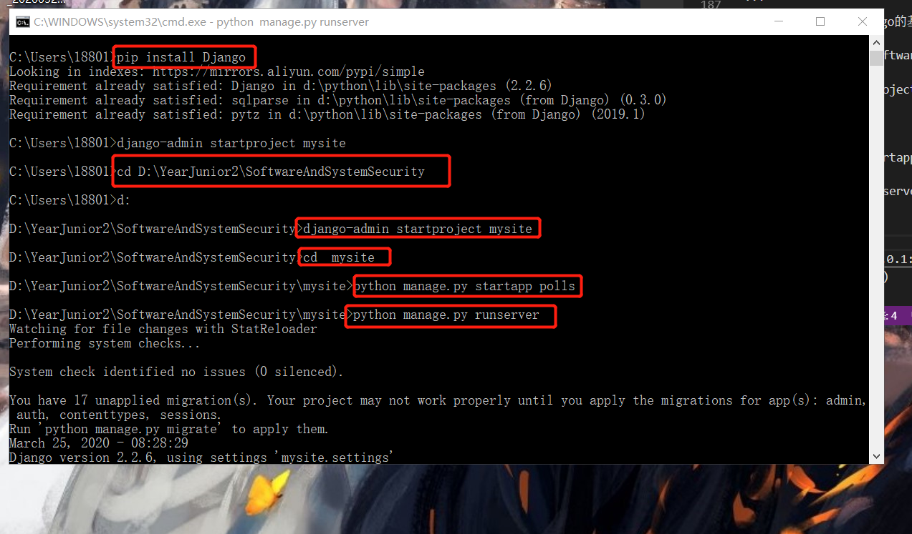                             
3. 访问 http://127.0.0.1:8000/              
                              
4. 在命令行里，可以看到服务器的打印输出，表示服务器收到了 request。看到的页面就是框架自动返回给大家的response.说明，request和response，请求相应的处理过程已经搭建起来了。
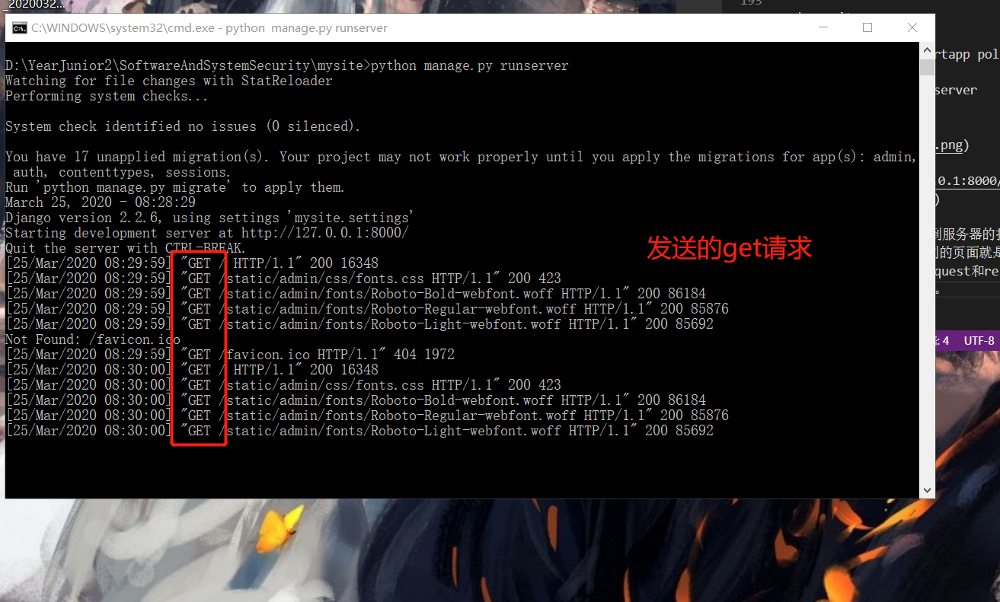                              
5. 编写大型程序的时候，一定要做到mvc分离，m数据模型，我们要先建立基础的底层的数据结构。然后在处理用户输入，构建每个用户输入对应的处理函数。就是c 控制。然后，在底层m数据模型的基础上，绘制用户界面。比如写贪吃蛇游戏，最先做的事情，使用链表来保存蛇和食物的相应的数据，写一些处理这个数据的函数，供上层的c和v来调用。我们把这个叫做封装。
6. 大到一个复杂的大型web程序，其实底层思想还是mvc。只是换了个名字，叫mvt，t是页面模板。
7. 写Django的程序，或者任何框架程序。主要就是写三大部分，第一，数据模型，models，第二，views和url。是用户请求对应的处理程序。第三，前端页面模板。处理完的结果如何显示的问题。
8. 其中url部分，又称为路由。是把用户请求的url，对应到处理函数的过程。Django的处理函数，有一个专门名称，叫views。其基本过程就是框架收到用户的request ，其中有URL。框架根据urls.py中的配置。将用户请求对应到一个处理函数。一般在views.py中。views.py中的函数，参数就是request对象，Django中是HttpRequest类。然后views函数需要返回一个HTTPResponse类型的request。Django把这个reqeust变化为http协议的request数据包，返回给浏览器。一般在views的处理过程中，会访问数据库，也就是models。
9. models把底层的数据库操作，比如sql全部封装为了对象化的处理。比如底层操作数据库是用sql语句，这个大家在数据的课程中学习过。所以我们最原始的web程序，一般会程序员拼装sql语句。但是在Django中不用。我们把这种底层数据的封装，称为orm（Object-relational Mapper）
10. 现在我们使用的数据库分两种，一种叫关系型数据库，一种叫非关系型数据库。其中教务系统这种信息管理类的软件，一般是使用关系型数据库。关系型数据库的基本结构是表。那如何体现“关系”呢？关系其实是指表与表之间的关系。
11. 程序员只需要写好这个models.py文件。所有的建表的操作框架就可以完成。
12. 再建一个app ，比如叫 edu_admin
```bash
cd D:\YearJunior2\SoftwareAndSystemSecurity\mysite
python manage.py startapp edu_admin
code . #用vscode打开工程
```
然后在 edu_admin的models.py文件        
```python
from django.db import models
from django.contrib.auth.models import AbstractUser

class Course(models.Model):
    name = models.CharField(verbose_name='课程名',  max_length=100)
    number = models.IntegerField(verbose_name='编号', default=0)
    summary = models.CharField(verbose_name='摘要', max_length=500, null=True)


class Student(models.Model):
    class_name = models.CharField(verbose_name="班级", max_length=100, blank=True, null=True)
    name = models.CharField(verbose_name="姓名", max_length=100, blank=True, null=True)
    number = models.IntegerField(verbose_name="学号", default=0)
    phone_number = models.CharField(verbose_name='手机号', max_length=11,null=True)

class Score(models.Model):
    course = models.ForeignKey(Course, verbose_name='课程', on_delete=models.CASCADE, related_name='students')
    student = models.ForeignKey(Student, verbose_name='学生', on_delete=models.CASCADE, related_name='my_courses')
    score = models.FloatField(verbose_name='成绩',  null=True)

```
13. 表中的每个记录，都有一个唯一的编号，称为主键。而外键是其他表中主键记录。通常我们用外键来记录表和表的关系。成绩，是学生与课程的“关系”.所以成绩表需要记录的就是某学生某门课的分数。那学生和课程都有专门的表来记录。我们无需在成绩表中重复记录多余的信息，只需记录id.这个其他表中主键id，就是外键。而每个表中的主键，这里没有明确说明。系统会自动增加一个id字段。
14. 需要把这个表结构，真实的写入到数据库中。也就是create table的过程。django称为migrate。打开 mysite的settings.py。在  INSTALLED_APPS 这里增加一个 edu_admin，表示 edu_admin 这个是我们这个site的一个app.之前startapp命令只是创建了app，必须要把app写入到这里，这个app才会被纳入到站点功能中。             
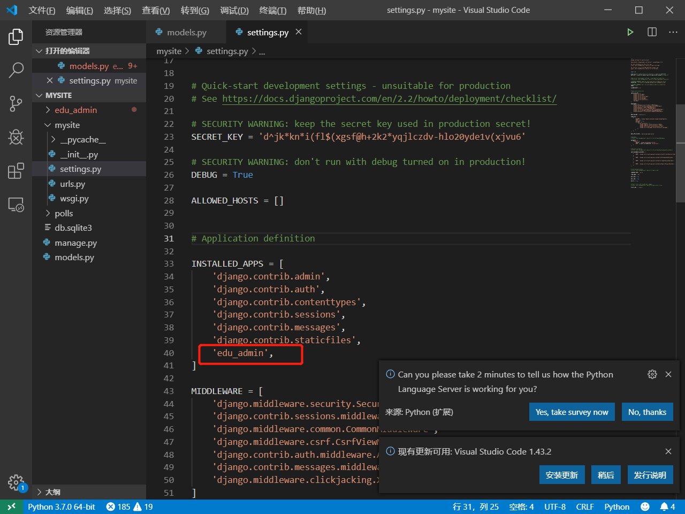                             
15. 生成db.sqlite3
```
python .\manage.py makemigrations
python .\manage.py migrate
```
                              
然后会出现一个 db.sqlite3             
                         
文件，数据库表结构就建立完成了             
makemigrations成功的标志是在app的目录下有migrations目录
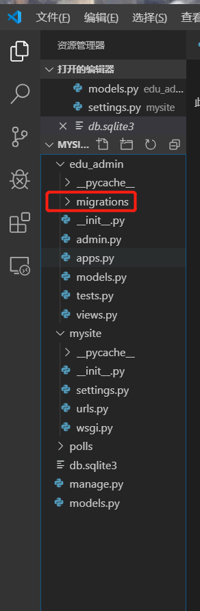                              
16. Django这里默认使用了sqlite这种简单的文件型数据库,这种数据库的好处是不用按照，就是一个文件来保存数据的所有信息，适合轻量级小规模的应用。但是效率和容量都有效。一般用在开发调试环境，不用在生产环境。
17. 为了验证Django真的建立了表，我们去下载一个[sqlite的客户端软件](https://www.sqlite.org/download.html)，来看一下它的表结构。下好后加到环境变量里面（记得重新打开cmd）或者或者放在db.sqlite同一个目录                                         
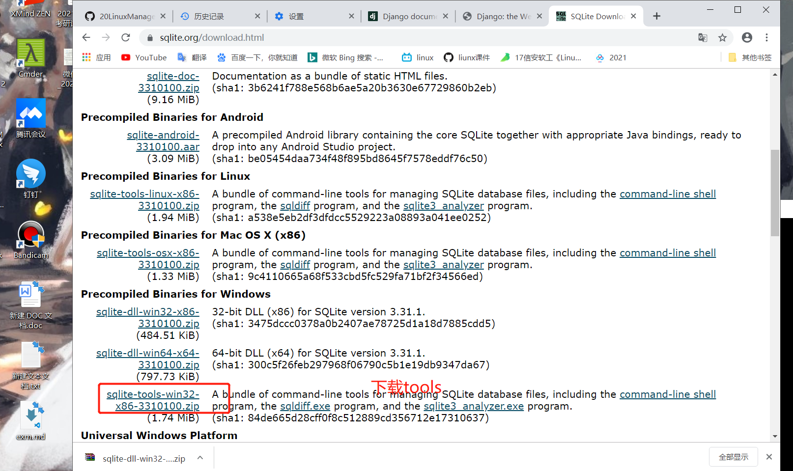                             
18. 查看表
```bash
cd D:\YearJunior2\SoftwareAndSystemSecurity\mysite

sqlite3.exe db.sqlite3

. table #可以看到所有的表
```                                     
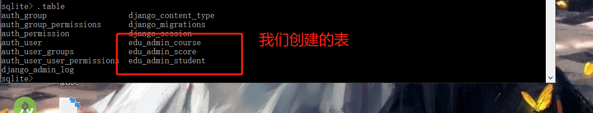                              
19. 执行sql语句，插入一条记录
```sql
insert into edu_admin_course values (1,"课程1",1,"课程1的说明");

select * from edu_admin_course;
```                     
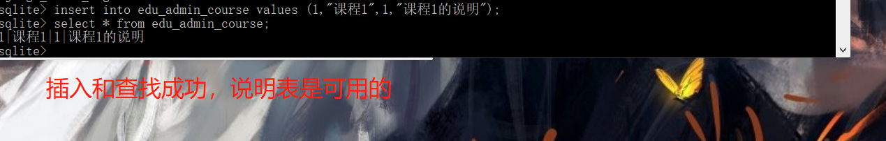                             

## Diango教务系统实验进阶
1. 使用Django这种框架编程，第一步是定义模型，Django会自动把定义好的模型转化为数据库表结构。这种方式称为 ORM
2. 所以我们在models里定义了三个类，然后执行了生成migrations和migrate。数据库的表就建立完成，以后每次修改了models，都需要执行makemigrations和migrate。才能将修改结果对应到数据库中。
3. views是Django功能实现应用功能的地方。如果你想写一个动态的页面，就在views中定义一个函数。这是最基本的方法。在此基本的方法上还可以有高级的，系统内置的一些高级的数据库增删改查的方法。
4. 最基本的views函数，是收到一个HttpRequest类型的参数，需要返回一个HTTPResponse类型的返回值，和http协议对应。
5. 在edu_admin中的views.py写入一下内容
```python
from django.shortcuts import render
from django.http import HttpResponse

def index(request):

    return HttpResponse('<html><body>OK</body></html>')   # 一个基本的 “处理请求，返回响应”
    
# Create your views here.

```
6. 写好了以后，还没有结束。我们还需要把这个views，对应到一个路径上。也就是客户端如何调用这个views函数对应的功能。因为一个实用的web app只有一个views是不够的，可能有很多很多views.然后我们需要把这些views对应到不懂的url上。这样客户端才能访问。这个工作，是urls.py来完成的。
7. 在 edu_admin中建一个urls.py文件，写入如下内容
```python
from django.urls import path

from .views import *

urlpatterns = [
    path('index',index),
]
```
8. 然后需要再主urls.py，也就是 mysite的urls.py中包括这个url配置。添加`path('edu/', include('edu_admin.urls')),`
9. 运行
```bash
cd D:\YearJunior2\SoftwareAndSystemSecurity\mysite
python manage.py runserver
```         
10. 浏览器访问`http://127.0.0.1:8000/`                 
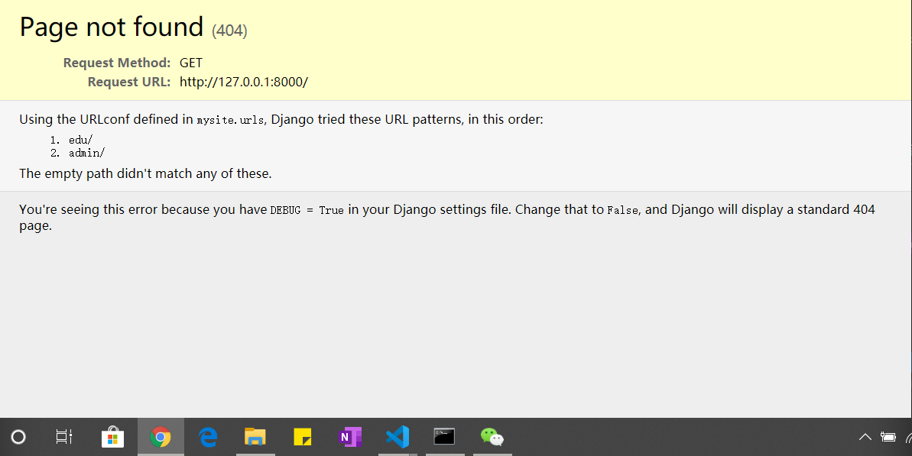                              
11. 在访问`http://127.0.0.1:8000/edu/index`                     
                     
12. 如果这一步有，就说明我们 urls和views配合工作成功。用户在浏览器中输入路径，django把这个url对应到一个views函数上。views函数处理HttpRequest。返回HttpResponse。这个工作流程跑通.把url对应到一个views函数的过程，专业术语叫“路由”注意，这个路由不是路由器的那个路由。路由器的路由是IP层的IP数据包分发功能。注意一个url是可以带参数的。views函数也是可以带参数的。        
13. 完成动态页面。修改edu.min的urls.py 
```python
urlpatterns = [
    path('index/<int:pk>',index),
]
```
修改edu中的view.py    
```python
def index(request,pk):

    return HttpResponse('<html><body>hello world %d </body></html>' % pk)
    
```
14. 访问`http://127.0.0.1:8000/edu/index/10`         
                        
15. pk就是参数，而且只允许整数。路由系统会把这个参数赋值传递给views函数的pk参数。
16. 改一下edu的views.py
```python
from django.contrib.auth.decorators import login_required
from django.shortcuts import render

from django.http import HttpResponse

# 从models中导入模型类,然后调用这个模型类的objects的filter方法，就完成了一次sql select
from .models import Score 

def index(request,pk):
    return HttpResponse('<html><body>hello world %d </body></html>' % pk)

# Create your views here.

@login_required
def my_score(request):
    # filter函数的参数是就相当于查询的过滤条件
    # 要查询的是 student为当前登录用户的Score表的记录
    result=Score.objects.filter(student=request.user)
    return render(request,'score.html',{'result':result})
```
17. Django中，当前登录用户，就在request对象的user属性中。views写了还不够。我们还需要修改一下模型。Django是有默认的用户管理系统的。用户相关的数据库表结构其实Django已经建立好了.但是我们这里用了student表来作为系统用户。所以我们要告诉Django不要用系统默认的用户模型了，用Student.
18. 首先在edu的models.py中导入`from django.contrib.auth.models import AbstractUser`这个是Django默认的用户管理的数据库模型.AbstractUser已经有很多数据库字段了，比如密码肯定是需要以某种方式保存到数据库中的。这些字段 AbstractUser都有了。我们在AbstractUser的基础上，扩充几个我们要用的字段就可以了。
19. Student继承了AbstractUser。           
                             
告诉Django用Student作为系统用户管理的数据库模型。
20. 在mysite settings.py也就是整个站点的配置文件中，增加一条`AUTH_USER_MODEL='edu_admin.Student'`告诉Django，使用 edu_admin 的Student作为用户管理登录授权的模型。
21. 代码修改完以后。这里是不是涉及到数据库修改啊。所有要进行数据库表结构的migrate
```bash
python manage.py makemigrations 
python manage.py migrate
```
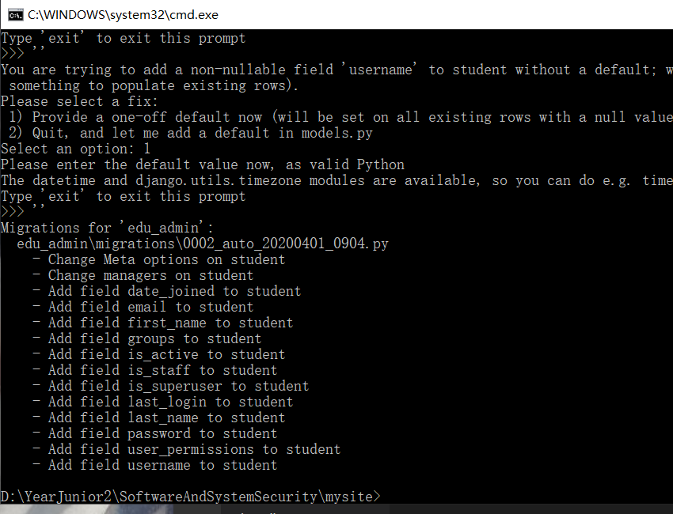                  
22. 下面，我们尝试在数据库中写入一些数据。然后测试看看Django的数据库访问是否正常。最原始的方法就是在sqlite.exe 中用sql语句插入。但是这个方法容易把数据搞乱了。  而且比如用户密码这样的东西，不是明文保存的。所有插入会有问题.我们用Django的方式，先建立一个超级用户，建立一个管理员账户。先删除db.sqlite3,再`python manage.py migrate`
```bash
python manage.py createsuperuser  
#admins
#0000
```
23. 建立好了以后，用sqlite3.exe可以看到Student表多了一条记录.然后我们可以用Django的admin功能，用超级管理员录入数据。Django的admin相当于一个数据管理的超级权限后台。可以直接操作数据库。在admin.py中录入以下内容。
```python
from django.contrib import admin

from .models import Student, Course, Score

class ScoreAdmin(admin.ModelAdmin):
    list_display=('course','score','student')

admin.site.register(Student)
admin.site.register(Course)
admin.site.register(Score,ScoreAdmin)
# Register your models here.
```
24. 访问 http://127.0.0.1:8000/admin/ 刚才新建的用户 登录后看到这个页面。可以录入一些课程，学生，和成绩了(一定先要有 课程 和 学生)。                   
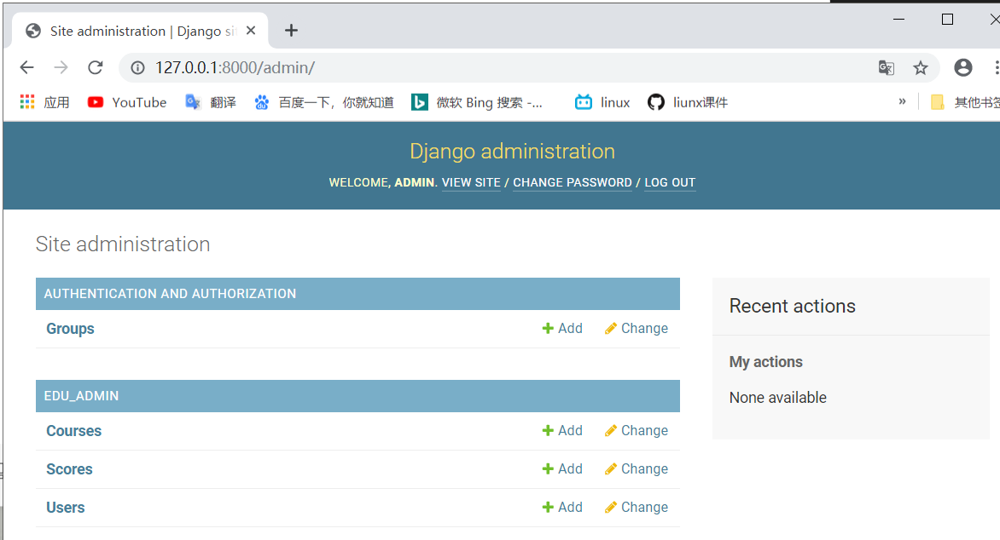                              
                             
25. 为了在admin管理的时候，直接显示课程名称，可以给course模型增加一个 __str__方法。这样所有course对象的str ，返回的是name字段。界面显示就是课程名称了。
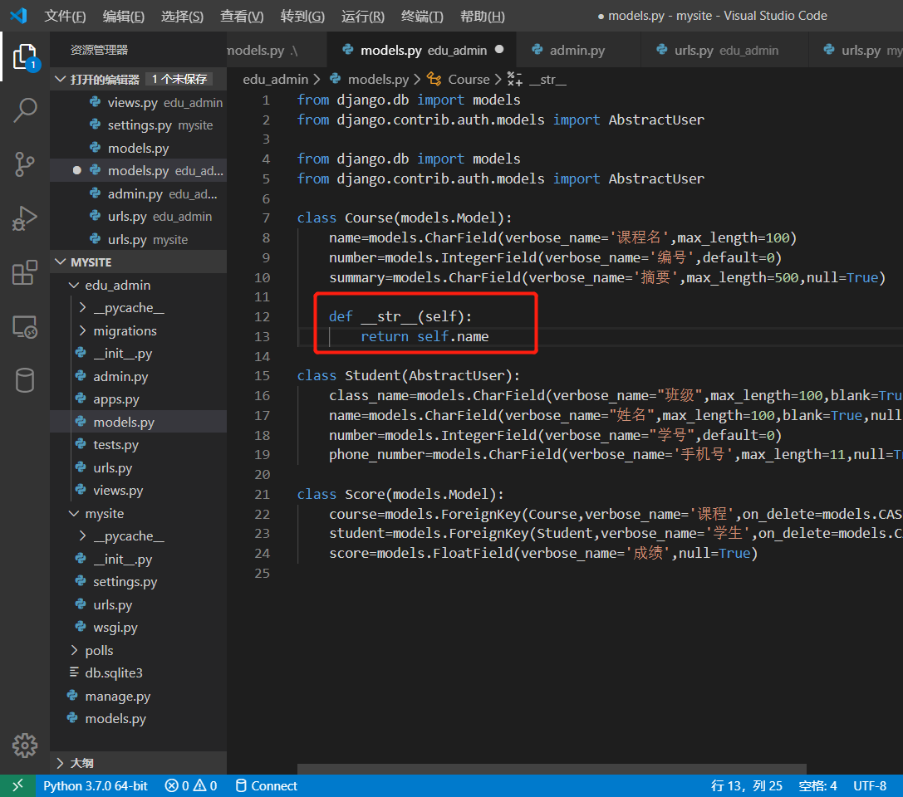                              
26. 当数据库有了值以后。我们就可以在view中验证，我们查询自己成绩的功能是否正常了。views中的@login_required表示需要登录。我们这里已经用超级管理员登录了，所以是可以访问的。
27. 然后说一下 render函数。render是一个Django内置的函数。用于在模板文件的基础上，通过渲染得到动态的网页效果。其中 score.html是模板,后面的{} dict是参数.render必须传参reqeust,然后render函数就会在模板html文件的基础上，生成一个html,并返回 HTTPResponse,所有可以直接作为 views函数的返回。
28. 那么还需要一个score.html.在edu下新建templates目录，下面新建score.html
```html
<html>
<body>

科目： {{ i.course.name }}
成绩： {{ i.score }}
<br>

</body>
</html>
```
这里的result 就是 render传入的result,对每一个result 显示其课程名和分数,大家看到这里的多表查询 (course表中的name）直接. 就调用出来了。模板语言的语法 {{ 变量名 }},很容易理解。
29. 写了新的views函数，需要增加url.在edu下的urls.py中添加
```python
urlpatterns = [
    path('index/<int:pk>',index),
    path('myscore',my_score)
]
```
30. 访问 http://127.0.0.1:8000/edu/myscore ，可以看到成绩                       
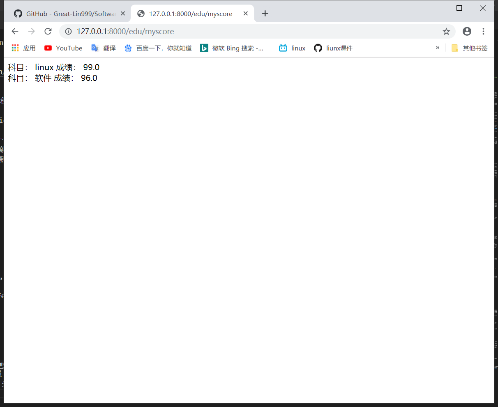                              
31. 这就完成了当前登录用户（超级管理员 admin 同学）的成绩查询。注意，这里我们偷了一个懒，实际情况，并不是每个用户都是超级管理员。需要有普通用户登录注册页面。这个页面需要自己写，我们这里时间关系，先不实现普通用户的登录，先用超级管理员用户验证一下查询功能。实际情况下普通用户是不能访问 127.0.0.1:8000/admin页面的。

## SQL注入攻击
### sql_injection.py
1. 这个文件是一个独立的httpserver，因此和django没有什么关系。它的运行就是独立运行py文件。
2. 在调试界面，点击 “增加配置”，选python 当前文件               
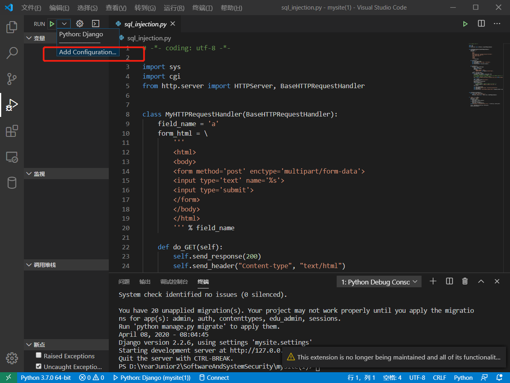                             
3. 然后在 launch.json中，会这么一个配置项                         
                              
4. 用这种方式可以调试sql_injection,然后点击sql_inejction文件，使其成为编辑器的当前文件。将自己的db.sqlite3进行覆盖，点击绿色箭头，就可以调试了。运行以后，访问http://127.0.0.1:8080/ ，是一个编辑框，输入学生ID，查询对应的成绩。                
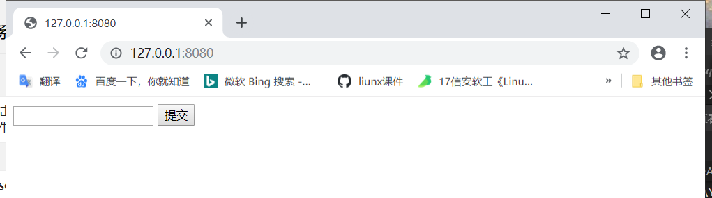                             
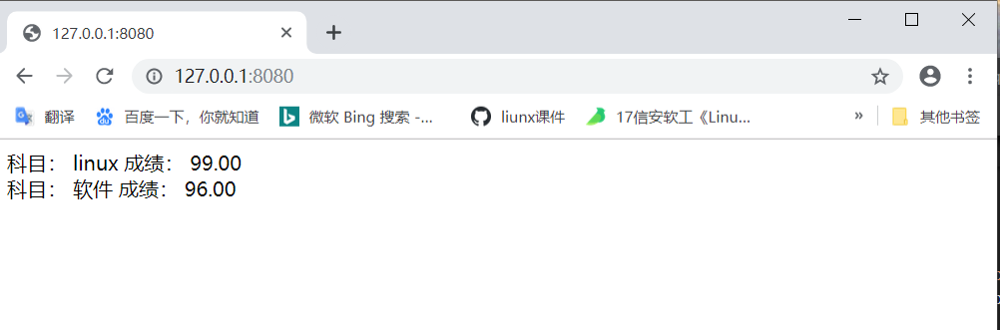                              
5. 通过直接查询数据库，我们知道当前的用户的ID是1，所以输入1，查询。返回了用户id 1的成绩
6. 提交`1 OR 1= 1`,查出了当前系统中所有用户的成绩。相当于整个数据库我都获得了。                                               
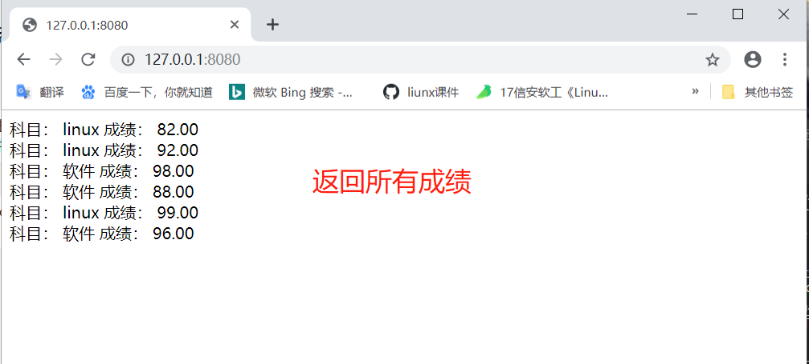                                 
7. 问题在代码的43行，我们直接把用户输入的数据，作为sql语句中的查询条件。
8. 最后的 sql语句为：
```sql
SELECT edu_admin_course.name, edu_admin_score.score FROM edu_admin_score INNER JOIN edu_admin_course ON edu_admin_score.course_id=edu_admin_course.id WHERE student_id = 1 OR 1=1
```
查询条件变成了`student_id = 1 OR 1=1`,`1=1`恒为真， 任何数OR真值，也是真。所以，相当于 
```sql
SELECT edu_admin_course.name, edu_admin_score.score FROM edu_admin_score INNER JOIN edu_admin_course ON edu_admin_score.course_id=edu_admin_course.id WHERE true;
```
或者没有WHERE,变成了无条件查询,于是显示出了数据中的所有记录。
9. 在软件安全中，有一个原则，所有用户的输入都是不可信的。因此，我们必须对用户输入进行过滤。进行严格的限制。
10. 有两种方法：                   
* 就是对用户输入进行过滤，比如这里。我们可以判断一下 input_data是否数字就可以。用python内置函数 isdigit
* 使用参数化查询语句。不将用户的输入作为SQL指令的一部分处理，而是在完成SQL指令的编译后，才套用参数执行
11. 但是对于大型的系统，会有很多sql语句拼接和执行的地方。每一个都去过滤，编程效率很低，而且不一定能保证你写的过滤就是对的。实际系统的业务远比我们这里输入ID要复杂。这里就在说回到Django，这就是框架ORM的意义了。ORM完全避免了程序员直接接触sql语言，所有的sql语句都在模型管理器中有框架进行拼接。程序员在编程时，只需要使用模型管理器提供的方法进行查询，创建等，就可以了。比如，我们之前写的Django代码。
```python
result = Score.objects.filter(student=request.user)
```
底层在进行sql的拼接,就避免了这种情况
12. Django的模型管理器中，主要有filter get等获取数据的方法。这些方法返回的数据类型是QuerySet数据类型。这个数据类型是一个数据库访问的接口。在调用filter时，实际上还未查询数据库，只是初步完成了数据库sql语句的拼接。
13. 实际的查询是在render中进行的。Django会根据render时需要的具体数据，来精确优化查询语句，所有这里的result，并不是真正的查询结果。而是一个查询对象。在模板 score.html 我们用到了 数据 {{ i.course.name }}.course是 socre表的一个外键，course.name实际是在course表中。所有这里其实是一个跨表查询。这种两个表的跨表查询，我们自己写的sql语言已经比较复杂了。真实系统往往会有多个表的联合跨表查询，sql语句会非常复杂。但是Django处理后，查询数据库的操作就变得非常简单，把数据中的值得访问，编程了python对象的属性访问。所以，建议大家，使用框架。但是，从学习的角度，我们需要知道Django内部是怎么做的，也就是我也需要一些底层的http server的开发原理，比如request response模式，html sql语言，数据库表结构等。底层知识要了解。这有助于我们理解Django的工作原理，学习起来就很快。对一些高级的操作也能比较深入理解。但是，具体做工程的时候，就尽量不要直接使用原始的方法了。就比如，学过windows GDI，都知道，所有的界面原始都是使用GDI绘制出来的，但是如果我们写一个软件会自己去用GDI来做原始操作吗？不会，因为有上层的软件做好了控件，我们直接调用控件，然后有了html。我们直接编写html可以快速的构建软件界面，比自己写GDI，效率高一万倍。
14. `student_id = 1; DROP TABLE xxx`这种注入方式，可以获得任意表的数据.在sqlite中，大家做实验的时候，可以用PRAGMA table_info(table_name);取得表项的名字。

## 参考资料
* [sqlite的客户端软件](https://www.sqlite.org/download.html)