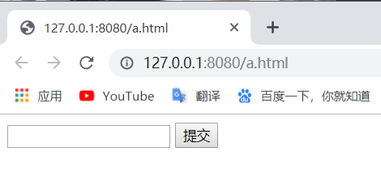
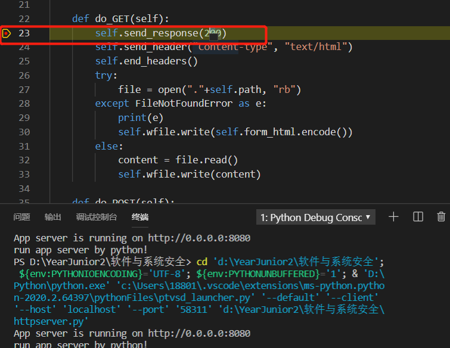
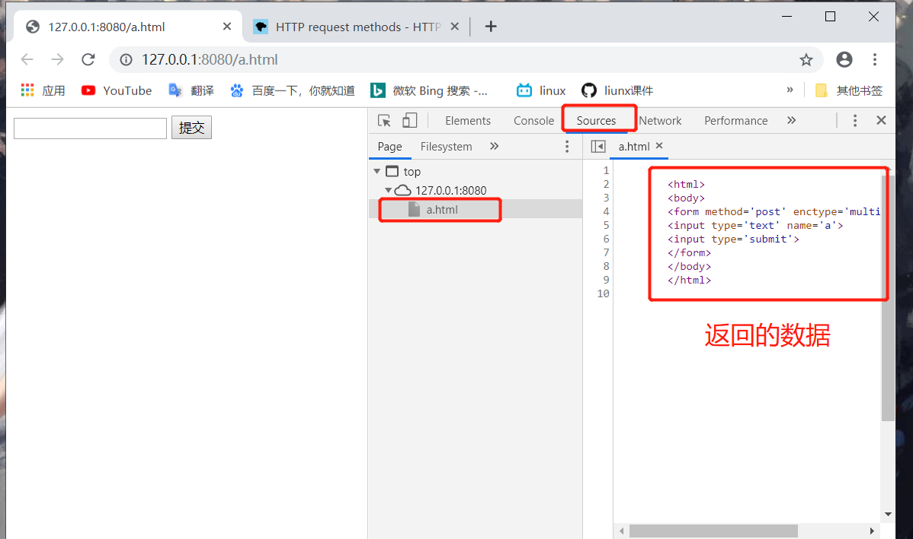
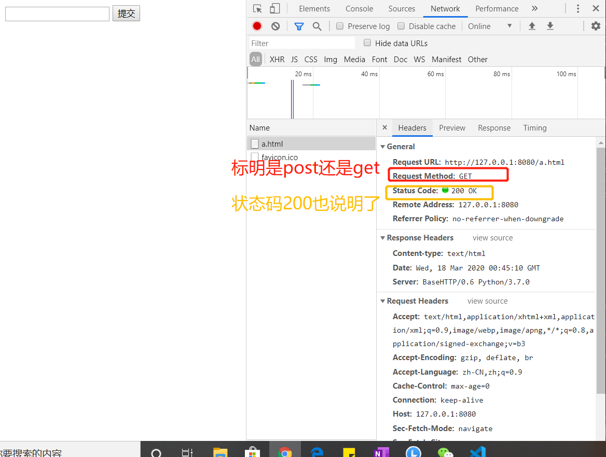
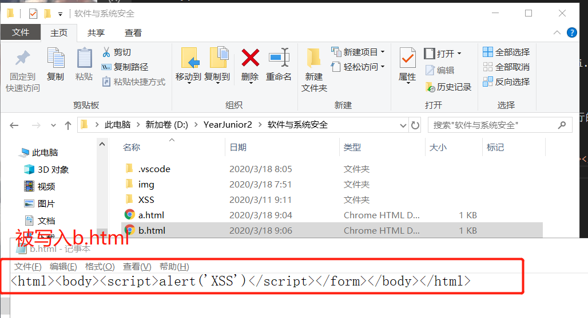
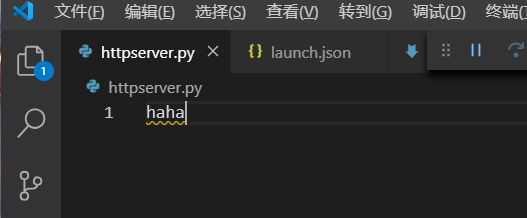

# SQL网页
## 实验背景
* Windows主机
* httpserver.py
## 实验完成度    
* [x] 写两个页面:
    * [x] 教师录入成绩页面:
        * 教师录入成绩页面表单有三个字段，课程id，学生id，成绩。录入提交以后，httpserver调用sqlite库使用sql语句写入数据库。
    * [ ] 学生查询成绩页面: 
        * 学生输入学生id，课程id，httpserver使用sql语句查询成绩后返回给用户.

## 课内实验
## 实验
1. vscode调试httpserver.py文件后，会生成一个launch.json        
2. 代码跑起来以后，就可以在浏览器中访问 http://127.0.0.1:8080/a.html                     
                             

## httpserver.py
```python
# -*- coding: utf-8 -*-

import sys
import cgi
from http.server import HTTPServer, BaseHTTPRequestHandler

# 是整个代码的主体，也是出问题的地方
class MyHTTPRequestHandler(BaseHTTPRequestHandler): # 这个是 HTTPServer 的回调,用来处理到达的请求。
    field_name = 'a'  #这里的表单是使用的post方法提交数据。
    form_html = \   
        '''
        <html>
        <body>
        <form method='post' enctype='multipart/form-data'> 
        <input type='text' name='%s'>
        <input type='submit'>
        </form>
        </body>
        </html>
        ''' % field_name

    def do_GET(self):
        self.send_response(200)
        self.send_header("Content-type", "text/html")
        self.end_headers()
        try:
            file = open("."+self.path, "rb")  # self.path 是这个请求的路径
        except FileNotFoundError as e:
            print(e)
            self.wfile.write(self.form_html.encode())
        else:
            content = file.read()
            self.wfile.write(content)

    def do_POST(self):
        form_data = cgi.FieldStorage(          #解析了客户端提交的请求，将form组织为python的dict数据类型
            fp=self.rfile,
            headers=self.headers,                    # 原始的请求的头部
            environ={
                'REQUEST_METHOD': 'POST',
                'CONTENT_TYPE': self.headers['Content-Type'],
            })
        fields = form_data.keys()
        if self.field_name in fields:  # 处理了用户提交，写入文件
            input_data = form_data[self.field_name].value   #就是你在编辑框中填入的数据
            file = open("."+self.path, "wb")
            file.write(input_data.encode())

        self.send_response(200)
        self.send_header("Content-type", "text/html")
        self.end_headers()
        self.wfile.write(b"<html><body>OK</body></html>")


class MyHTTPServer(HTTPServer): # MyHTTPServer类，是继承自原生的HTTPSever
    def __init__(self, host, port):
        print("run app server by python!")
        # 指定了 MyHTTPRequestHandler 来处理 http请求，那么当用get方法请求，就会调用 do_GET,POST方法请求，就会调用 do_POST函数
        HTTPServer.__init__(self,  (host, port), MyHTTPRequestHandler)


if '__main__' == __name__:
    server_ip = "0.0.0.0"
    server_port = 8080
    if len(sys.argv) == 2:
        server_port = int(sys.argv[1])
    if len(sys.argv) == 3:
        server_ip = sys.argv[1]
        server_port = int(sys.argv[2])
    print("App server is running on http://%s:%s " % (server_ip, server_port))

    server = MyHTTPServer(server_ip, server_port)
    server.serve_forever()

```
1. 这个是使用python原生的cgi和http.server两个库运行的一个简单的http服务器程序。因为没有使用第三方库，所有不需要使用pip安装依赖。运行比较简单。
2. HTTPServer：重写了 ```init```函数，增加了打印输出语言，然后字节调用父类的 ```init``` 传递了服务器运行需要的地址 端口 等参数。我们的监听地址和端口是 0.0.0.0:8080。
3. MyHTTPRequestHandler 类，这个是 HTTPServer 的回调,MyHTTPRequestHandler 类，这个是 HTTPServer 的回调。也就是0.0.0.0:8080 上有任何的HTTP请求到达时，都会调用 MyHTTPRequestHandler来处理。MyHTTPRequestHandler 直接 继承自 BaseHTTPRequestHandler，其中 BaseHTTPRequestHandler 的 do_GET和do_POST两个方法被重写。
4. [http请求的方法](https://developer.mozilla.org/en-US/docs/Web/HTTP/Methods)中.http请求有如下这么多种methods，但是我们通常使用得最多的，是GET和POST。比如，大家直接在浏览器中输入链接，浏览器拿到地址以后，默认是采用GET方式向服务器发送请求。所以GET方式最常见。
5. 所以通常来说，从服务器获取数据，使用get方面，向服务器提交数据，使用post方法。
6. 在 python 的 BaseHTTPRequestHandler 类中 ，do_XXX函数，就是处理对应的客户端请求的函数。
7. 下断点，然后刷新浏览器，代码就会断点命中中断。                       
                              
8. http://127.0.0.1:8080/a.html 其中 http://127.0.0.1:8080是协议服务器地址和端口。/a.html就是路径。
9. 通常，一个静态的http服务器，这里的路径就是http服务器根目录下的文件，动态服务器这里可能是文件和参数，或者是对应其他服务器后台的处理过程。
10. 例如 http://127.0.0.1:8080/a.php?p1=x 指定有a.php来处理这个请求，参数是p1=x，问号后面是参数，可以有多个。那么就去读 a.html文件，如果文件不存在，就返回404，也就是```self.send_response(200)```,200按照协议 应该是404。这里做了一个特殊的处理，如果指定的文件不存在，我还是返回200，表示请求路径是正确的，可以处理，然后返回一个默认的页面。这个页面就是 form_html的变量，在FileNotFoundError异常处理过程中写回
11. wfile和rfile对应http响应和请求的body部分。
12. GET处理完成以后，浏览器就拿到了 200 状态的 "Content-type"为"text/html"的 form_html
13. 打开浏览器的调试模式，到sources这个tab就看到了服务器向浏览器返回的数据，就是我们的form_html变量                 
                           
表单指定了使用post方式向服务器提交数据
14. network tab里可以看到完整的请求响应过程                  
                              
15. 在表单中填入数据。点提交按钮。然后服务器的do_POST函数回被调用。这里通过 cgi.FieldStorage解析了客户端提交的请求，原始的请求的头部在self.headers。body部分在self.rfile 
16. 提交框里填写123，执行完成后，你的目录下会多一个a.html，内容为123                 
                             
17. 再访问 http://127.0.0.1:8080/a.html 时，这个时候a.htm已经存在了所以是运行的do_GET(self)的else部分，直接把文件内容会写给浏览器 
18. 再访问一个不存在的页面，比如b.html，会出现那个默认的form
19. 在输入框输入```<html><body><script>alert('XSS')</script></form></body></html>```,这段内容就会被写入b.html                          
                           
20. 再次访问b.html的时候，（不要刷新，刷新是重复上一次的POST请求，直接在地址栏里回车）整个页面被载入 script在浏览器上执行,出现弹窗           
                              
21. 理论上，任何的js都是可以被执行的。js可以实现非常丰富的功能。比如可以让你扫码支付。
22. 比如在 c.html里填入```<html><body><script>window.location.href='http://by.cuc.edu.cn'</script></form></body></html>```,下次再访问c.html的时候。页面跳转了这就是 window.location.href='http://by.cuc.edu.cn' 这段脚本的功能                   
                              
23. 在浏览器中访问 http://127.0.0.1:8080/httpserver.py ，在sources中，是我们的源代码。       
                             
24. 由于服务器没有做任何过滤，只要是存在的文件，就发送给客户端，源代码文件也发送给了客户端。现在黑客可以知道我整个后台的逻辑了。如果还有一些配置文件，比如数据库地址和访问口令等，也都被泄露了。更严重的是，黑客甚至可以注入后端代码。
25. 由于我们是回写到文件，你可以构造一个http post请求，把httpserver.py文件改写了。但是构造这个请求用浏览器就不行了，需要采用curl等更基础的工具裸写post请求发送给服务器的
26. 到浏览器调试工具的 elements处，由于后台只处理名为a的表单项，所以我们需要把input的name改为a，**在做之前，记得把httpserver.py复制一份，要不然就没了**
                  
27. 然后输入框输入haha,httpserver.py，它变了
                              
28. 所以，我们甚至可以给后端注入代码。当然，如果只是注入一个hahaha 服务器就挂了。再也跑不起来了。所以，这是一个及其简单，但是漏洞百出的web服务器。这就是不做任何过滤，直接写入数据的危害。             
## 实验过程
1. 老师提交成绩的页面
```html
        <html>
        <head>
        <meta charset="utf-8">
        <title>成绩提交</title>
        </head>
        <body>
        <form method='post' enctype='multipart/form-data'>
        classID:<input type='text' name='cla'><br>
        studentID:<input type='text' name='stu'><br>
        Score:<input type='text' name='sco'><br>
        <input type='submit'>
        </form>
        </body>
        </html>
```
2. 学生查询成绩的页面
```html
        <html>
        <head>
        <meta charset="utf-8">
        <title>成绩查询</title>
        </head>
        <body>
        <form method='post' enctype='multipart/form-data'>
        classID:<input type='text' name='cla'><br>
        studentID:<input type='text' name='stu'><br>
        <input type='submit'>
        </form>
        </body>
        </html>
```

3. python-sqlite3创建数据库和导入数据
```python
import sqlite3

con = sqlite3.connect('d:/mydatabase.db3')
cur = con.cursor()
cur.execute('CREATE TABLE cuc (classid INTEGER , studentid INTEGER, score INTEGER)')
con.commit()
cur.execute('INSERT INTO cuc (classid, studentid , score) VALUES(0, 1, 100)')
con.commit()
cur.execute('SELECT * FROM cuc')
print cur.fetchall()
```

## 参考资料
* [python-sqlite3](https://docs.python.org/3/library/sqlite3.html)

