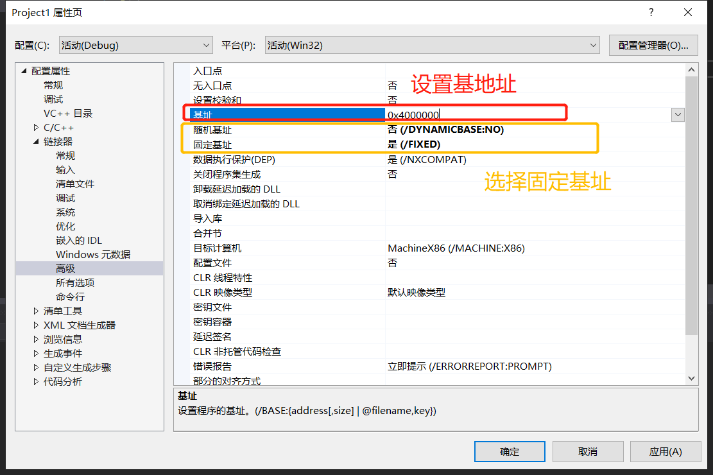
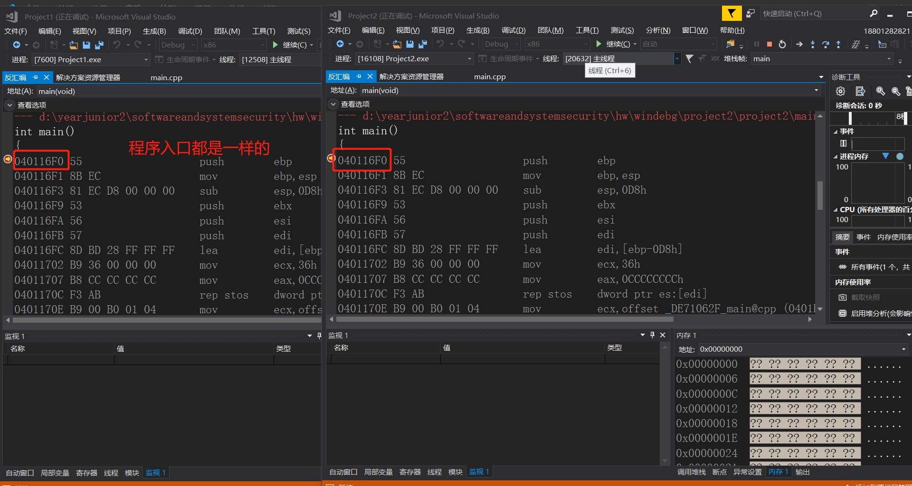
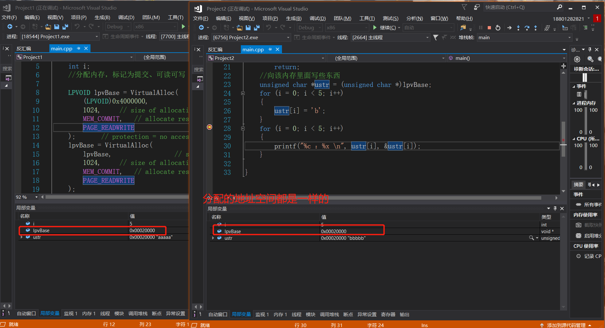
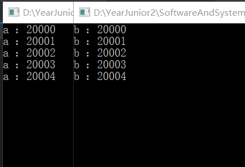
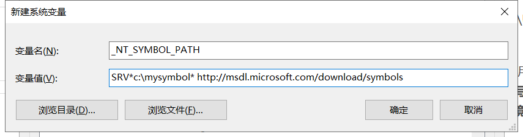
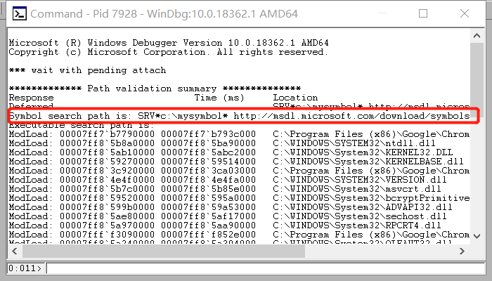
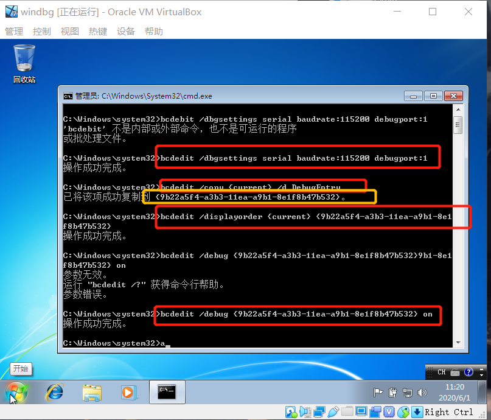
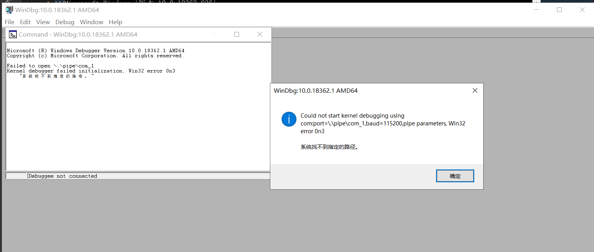
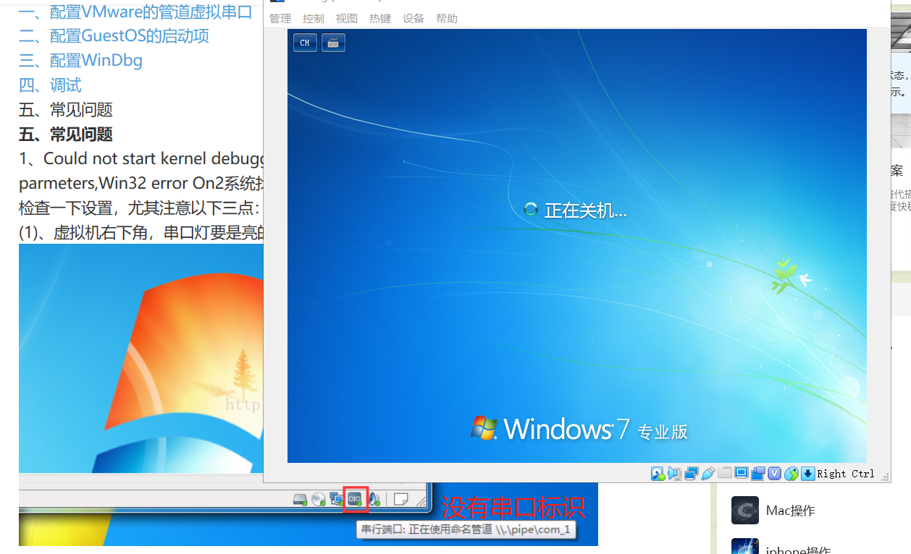
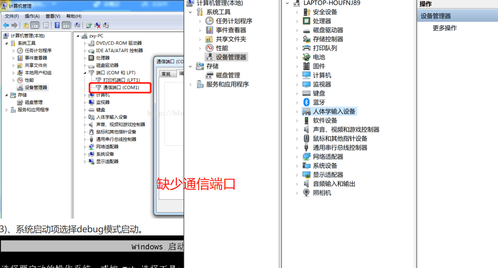

# WINDBG
## 实验背景
## 实验完成度
* [x] 验证不同进程的相同的地址可以保存不同的数据。
    * [x] 在VS中，设置固定基地址，编写两个不同可执行文件。同时运行这两个文件。然后使用调试器附加到两个程序的进程，查看内存，看两个程序是否使用了相同的内存地址；
    * [x] 在不同的进程中，尝试使用VirtualAlloc分配一块相同地址的内存，写入不同的数据。再读出。
* [x] （难度较高）配置一个Windbg双机内核调试环境，查阅Windbg的文档，了解 
    * [x] Windbg如何在内核调试情况下看物理内存，也就是通过物理地址访问内存
    * [x] 如何查看进程的虚拟内存分页表，在分页表中找到物理内存和虚拟内存的对应关系。然后通过Windbg的物理内存查看方式和虚拟内存的查看方式，看同一块物理内存中的数据情况。
> 其中第二个作业难度比较大。首先需要搭建Windbg的内核调试环境.由于我们直接调试的操作系统内核，所以需要两台计算机安装两个Windows，然后连个计算机使用串口进行链接。好在我们有虚拟机。所以我们需要再虚拟机中安装一个Windows（安装镜像自己找，XP就可以），然后通过虚拟串口和host pipe链接的方式，让被调试系统和windbg链接，windbg可以调试。使用Windbg  内核调试 VirtualBox 关键字搜索，能找到很多教程。如果决定Windows虚拟机太重量级了，可以用Linux虚拟机+gdb也能进行相关的实验，以gdb 远程内核调试 为关键字搜索，也能找到很多教程。

## 实验过程
### 验证不同进程的相同的地址可以保存不同的数据
1. 新建两个项目                  
```cpp
#include<stdio.h>
int main()
{
	int x, y;
	x = 1;
	y = 0;
}
```
2. 修改基地址                                  
                                      
3. 开始调试后转到反汇编，可以看到程序入口的地址都是一样的                                     
                                      
4. 使用VirtualAlloc分配一块相同地址的内存，写入不同的数据，再读出
```cpp
#include <windows.h>
#include<stdio.h>
void main()
{
	int i;
	//分配内存，标记为提交、可读可写 

	LPVOID lpvBase = VirtualAlloc(
		(LPVOID)0x4000000,                 // system selects address
		1024,     // size of allocation
		MEM_COMMIT,   // allocate reserved pages
		PAGE_READWRITE
	);       // protection = no access   
	lpvBase = VirtualAlloc(
		lpvBase,                 // system selects address
		1024,     // size of allocation
		MEM_COMMIT,   // allocate reserved pages
		PAGE_READWRITE
	);
	if (lpvBase == NULL)
		return;
	//向该内存里面写些东西
	unsigned char *ustr = (unsigned char *)lpvBase;
	for (i = 0; i < 5; i++)
	{
		ustr[i] = 'a';   //'b'
	}
	for (i = 0; i < 5; i++)
	{
		printf("%c ：%x \n", ustr[i],&ustr[i]);
	}
	

}
```
5. 先执行完project1的写数据，再执行project2的写数据，再读取project1的数据，再读取project2的数据                   
* VirtualAlloc分配的地址空间都是一样的                              
                                      
* 对存入的数据地址的打印显示也都是一样的，并且相互不干扰                        
                                      

### Windbg双机内核调试环境配置
1. 主机上下载windbg,并将`C:\Program Files (x86)\Windows Kits\10\Debuggers\x64`添加到环境变量里
2. 在系统变量中创建一个名为 _NT_SYMBOL_PATH,值为:SRV*c:\mysymbol* http://msdl.microsoft.com/download/symbols  的环境变量。                     
                                      
3. 随便attach一个进程，可以看到配置完成                      
                                      
4. 对虚拟机配置虚拟串口，目的是为了建立host到guest的调试通信连接，选择com1并且映射成为`\\.pip\com_1`。                                    
                                      
5. 启动虚拟机，进入Window内部进行配置。以管理员身份启动CMD                           
```bash
bcdedit /dbgsettings serial baudrate:115200 debugport:1
bcdedit /copy {current} /d DebugEntry
bcdedit /displayorder {current} {替换第二个命令显示的UUID}
bcdedit /debug {替换第二个命令显示的UUID} on
```
                                      
6. 启动guest上的win7系统后启动主机上的windbg                 
```bash
windbg.exe -k com:port=\.\pipe\com_1,baud=115200,pipe
```


                                      
                                      
                                      
                                        
                                      
                                      
                                      
                                      
                                      
                                      
                                      
                                      
                                      
                                      
                                      
                                        
## 实验问题
* `windbg.exe -k com:port=\.\pipe\com_1,baud=115200,pipe`出现错误`Could not start kernel debugging using com:port=\\.\pipe\com_1,baud=11520,pipe parmeters,Win32 error On3系统找不到指定的文件`                                 
                                      
1. 发现虚拟机的下标处没有串口表示，并且主机查看也没串口                                                              
                                      
                                      
                                      
                                      
                                      
                                      
                                      
                                      
                                      
                                        
## 实验结论

## 参考资料

* [windbg遍历进程页表查看内存](https://www.cnblogs.com/ck1020/p/6148399.html)
* [windbg下看系统非分页内存](https://blog.csdn.net/lixiangminghate/article/details/54667694)
* [windbg下看系统非分页内存](https://blog.csdn.net/lixiangminghate/article/details/54667694)
* [使用WinDbg查看保护模式分页机制下的物理地址](https://blog.csdn.net/weixin_42486644/article/details/80747462)
* [软件安全4.内存布局](https://www.jianshu.com/p/09fab7c07533)
* [Windows 内核调试](https://zhuanlan.zhihu.com/p/47771088)
* [!pte](https://docs.microsoft.com/en-us/windows-hardware/drivers/debugger/-pte)
* [windbg - What is the relation between the VAD (!vad) the PTEs (!pte), and loaded modules and sections (lm and !dh)?](https://reverseengineering.stackexchange.com/questions/21031/windbg-what-is-the-relation-between-the-vad-vad-the-ptes-pte-and-loade)
* [When Kernel Debugging - Find The Page Protection of a User Mode Address](https://stackoverflow.com/questions/16749764/when-kernel-debugging-find-the-page-protection-of-a-user-mode-address)
* [Download WinDbg](https://docs.microsoft.com/zh-cn/windows-hardware/drivers/debugger/debugger-download-tools)
* [WinDbg的安装](https://blog.csdn.net/chaootis1/article/details/79834117)
* [](https://blog.csdn.net/one_in_one/article/details/51767007)
* []()
* []()
* []()
* []()
* []()

                                      
                                      
                                      
                                      
                                      
                                      
                                      
                                      
                                      
                                      
                                      
                                        
