# Windbg
## 虚拟内存
1. 在溢出型漏洞攻击中，内存地址的有效性在漏洞利用程序的编写中是首要考虑的问题。漏洞攻击的目的是要驻留在系统内，而不是引起系统的崩溃。如果对内存访问不对，读写到了不可用的内存地址上。那么引起的效果是崩溃程序退出，那么攻击程序也就退出结束运行了。所以，攻击程序必须要考虑内存地址的有效性的。
2. 内存地址的有效性和访问属性，都是以4KB为单位的。这样是为了方便操作系统进行管理。我们平常所用的动态地址分配，malloc和free等，在操作系统层面，叫堆内存管理Heap，是在虚拟内存之上的。
3. 虚拟内存分页的分配释放管理，然后在分页之上进行堆块管理。其实堆快管理只是给应用程序提供的一个接口，不影响内存是否有效，根本还是虚拟内存在管理。堆长度可变，指定任意长度都可以，堆块是使用双链表进行管理的。而虚拟内存分页，是使用一个定长的表就可以管理了。
## 物理内存
1. 与虚拟内存对应的是物理内存。
2. 物理内存有一个金手指，就是很多导线，插入插槽的那一段。这些线，有的是用来传输地址的，有的是用来传输数据的。当计算机在地址线上设置对应的地址是，内存就在数据线上用高低电平来给出数据。这就和cpu操作数据的读写类似。
3. 物理内存通常只有一个。所以应该只有一套地址体系。
4. 但是在操作系统中，同时在运行很多程序。这些程序都需要访问地址。那如果只有一套地址体系，就意味着只要去遍历一遍这个地址体系中的所有地址，就可以把所有程序的所有的内存数据获取到了。如果一个应用程序的开发人员稍有不慎，就会引起整个系统的崩溃。
5. 所以系统必须设计一种机制。让一个应用程序的错误，只影响这个应用程序。也必须设计一种机制，让一个应用程序不能随意访问其他应用程序的内存。
6. 在做exe编译的时候，有一个基地址的概念。所谓基地址，就是这个exe文件在运行的时候，它的exe文件会被放到内存的那个地址上。基地址要固定，因为只有基地址确定了以后，程序内部的很多其他的数据或者程序跳转的地址才能确定。这个地址的确定，是在程序运行之前，在编译链接的时候就确定了。
## 虚拟地址
1. 为了保证每个应用程序都能使用到自己想要的地址，而且，同一个exe可以运行很多次，每个的基地址都一样，相互之间不会冲突。这些问题的解决就是因为虚拟地址。
2. 也就是说应用程序所有使用的地址，都不是物理地址，而是一套虚拟地址系统。
3. 这个机制在Linux中同样有效。通过分页映射虚拟。在OS的内核中，有一个非常重要的数据结构——分页表。这个分页表其实就是记录了每个分页地址是否可用的，它其实还记录了一个非常重要的内容，就是这一块分页，对应的是哪一个物理内存。他们以4KB单位对应。
4. 在真正的数据访问的过程中，每次访问，系统都会去查分页表，把访问的虚拟地址，在分页表中表项的记录中找到这一块虚拟地址分页对应的物理地址分页。分页内部的偏移不会变。而且，每一个进程都有一个分页表。所以其实可以把不同的进程的相同分页，对应到不同的物理地址上。所以进程A在访问地址0x400000的时候和进程B在访问同样的地址0x400000的时候。对应的是不同的物理地址。
5. 在32位系统中。地址空间从0x0-0xFFFFFFFF。一共4GB。也是一个进程最多可以有4GB的内存可用。但是我们的物理内存并没有那么多。往往一个进程也使用不了4GB这么大的数据。所以，系统是只有进程需要使用了，才把内存分页的地址对应到物理地址上。如果没有使用，不会白白占用物理地址。
6. VirtualAlloc函数                           
	* 分配，是以分页的大小为单位的
	* 返回地址，是分页的基地址，是分页大小的整数倍
	* 分页大小有两种，4KB和4MB，但是一般都是4KB，是默认设置。
7. 有的时候，各个进程所使用的总内存会超过物理内存的总大小。这种情况下，部分分页会被缓存到硬盘上。但是缓存到硬盘上的内存分页数据在使用的时候，又需要载入到物理内存。专业术语叫分页交换 swap。所以，有的时候，跑大型的程序，内存占用很多，超过了物理内存大小，这时候程序仍然能运行，但是变得很慢。就因为系统在不停的进行分页交换，而硬盘的访问比内存的速度差了1-2个数量级。
8. 进程的相同地址的分页可以映射到不同的物理地址上。同样也能映射到相同的物理内存上。比如动态链接库，每个进程都会调用基础的动态链接库，但是需要在每个进程的地址空间中放置一份吗？不用，只需要把分页表中项对应过来就好了。让虚拟内存分页对应到已经存在的物理内存分页中。这既是为什么有的时候启动的进程比较慢，再启动就比较快了。使用虚拟地址的这种分页的方式，虽然有地址翻译和映射的过程，但是，效率更高。就是因为对与用量很大的底层库等实际是共享的。这也是为什么 Linux系统中动态链接库是.so后缀名（shared object）。
----
# 课外实验
## 实验背景
* win7
* win10
## 实验要求
1. 验证不同进程的相同的地址可以保存不同的数据。
    * 在VS中，设置固定基地址，编写两个不同可执行文件。同时运行这两个文件。然后使用调试器附加到两个程序的进程，查看内存，看两个程序是否使用了相同的内存地址；
    * 在不同的进程中，尝试使用VirtualAlloc分配一块相同地址的内存，写入不同的数据。再读出。
2. （难度较高）配置一个Windbg双机内核调试环境，查阅Windbg的文档，了解 
    * Windbg如何在内核调试情况下看物理内存，也就是通过物理地址访问内存
    * 如何查看进程的虚拟内存分页表，在分页表中找到物理内存和虚拟内存的对应关系。然后通过Windbg的物理内存查看方式和虚拟内存的查看方式，看同一块物理内存中的数据情况。
> 其中第二个作业难度比较大。首先需要搭建Windbg的内核调试环境.由于我们直接调试的操作系统内核，所以需要两台计算机安装两个Windows，然后连个计算机使用串口进行链接。好在我们有虚拟机。所以我们需要再虚拟机中安装一个Windows（安装镜像自己找，XP就可以），然后通过虚拟串口和host pipe链接的方式，让被调试系统和windbg链接，windbg可以调试。使用Windbg  内核调试 VirtualBox 关键字搜索，能找到很多教程。如果决定Windows虚拟机太重量级了，可以用Linux虚拟机+gdb也能进行相关的实验，以gdb 远程内核调试 为关键字搜索，也能找到很多教程。

## 验证不同进程的相同的地址可以保存不同的数据
1. 新建两个项目                  
```cpp
#include<stdio.h>
int main()
{
	int x, y;
	x = 1;
	y = 0;
}
```
2. 修改基地址                                  
                                      
3. 开始调试后转到反汇编，可以看到程序入口的地址都是一样的                                     
                                      
4. 使用VirtualAlloc分配一块相同地址的内存，写入不同的数据，再读出
```cpp
#include <windows.h>
#include<stdio.h>
void main()
{
	int i;
	//分配内存，标记为提交、可读可写 

	LPVOID lpvBase = VirtualAlloc(
		(LPVOID)0x4000000,                 // system selects address
		1024,     // size of allocation
		MEM_COMMIT,   // allocate reserved pages
		PAGE_READWRITE
	);       // protection = no access   
	lpvBase = VirtualAlloc(
		lpvBase,                 // system selects address
		1024,     // size of allocation
		MEM_COMMIT,   // allocate reserved pages
		PAGE_READWRITE
	);
	if (lpvBase == NULL)
		return;
	//向该内存里面写些东西
	unsigned char *ustr = (unsigned char *)lpvBase;
	for (i = 0; i < 5; i++)
	{
		ustr[i] = 'a';   //'b'
	}
	for (i = 0; i < 5; i++)
	{
		printf("%c ：%x \n", ustr[i],&ustr[i]);
	}
	

}
```
5. 先执行完project1的写数据，再执行project2的写数据，再读取project1的数据，再读取project2的数据                   
* VirtualAlloc分配的地址空间都是一样的                              
                                      
* 对存入的数据地址的打印显示也都是一样的，并且相互不干扰                        
                                      

## Windbg双机内核调试环境配置
1. 主机上下载windbg,并将`C:\Program Files (x86)\Windows Kits\10\Debuggers\x64`添加到环境变量里
2. 对虚拟机配置虚拟串口，目的是为了建立host到guest的调试通信连接，选择com1并且映射成为`\\.\pipe\com_1`。                                    
                                     3. 启动虚拟机，进入Window内部进行配置。以管理员身份启动CMD                           
```bash
bcdedit /dbgsettings serial baudrate:115200 debugport:1
bcdedit /copy {current} /d DebugEntry
bcdedit /displayorder {current} {替换第二个命令显示的UUID}
bcdedit /debug {替换第二个命令显示的UUID} on
```
                                       
3. 重启系统，进入调试模式                       
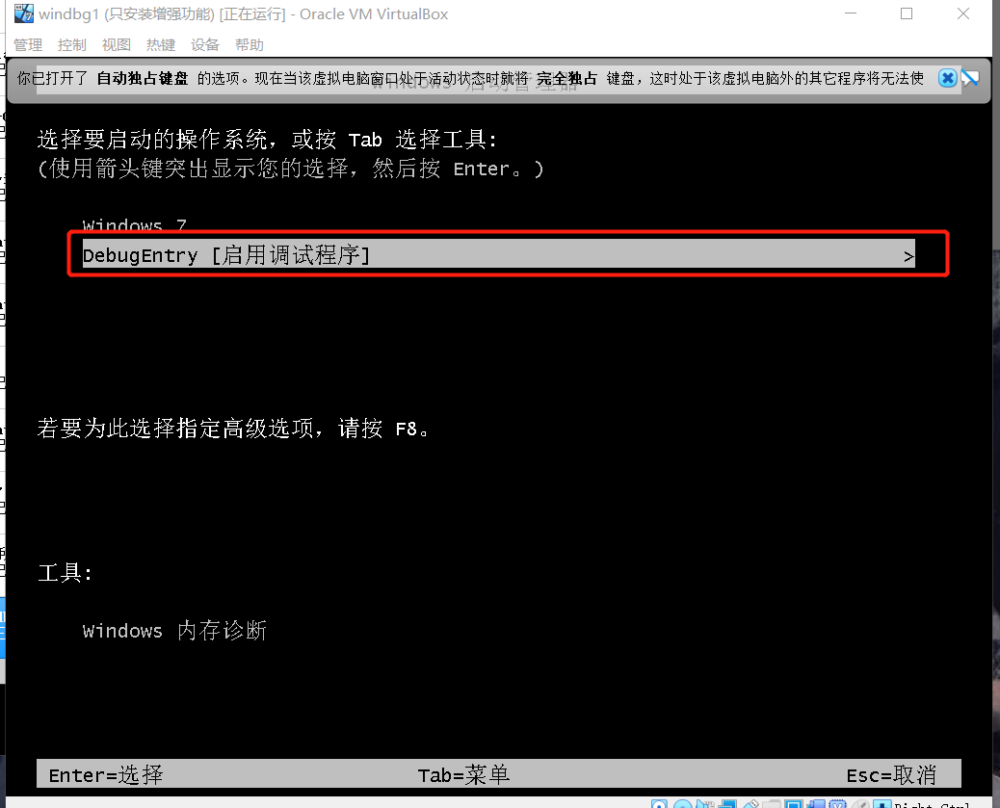                                      
4. 打开windbg，进行符号的配置，配置 Windbg 的符号下载地址：
` SRV*c:\mysymbol* http://msdl.microsoft.com/download/symbols`                    
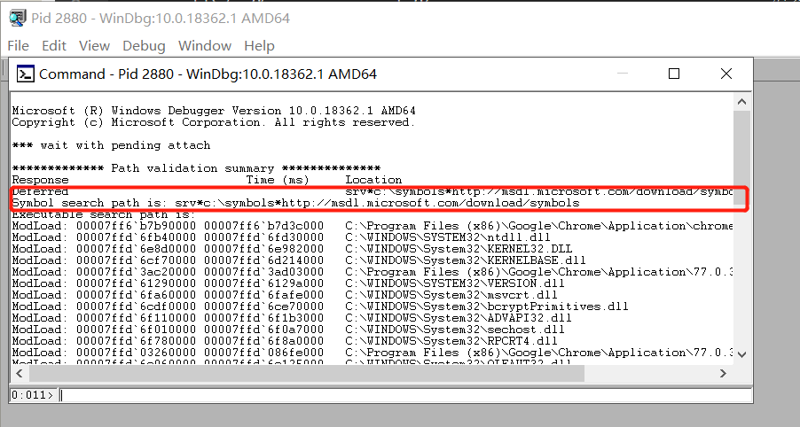                                      
5. 随便attach一个进程，可以看到配置完成                      
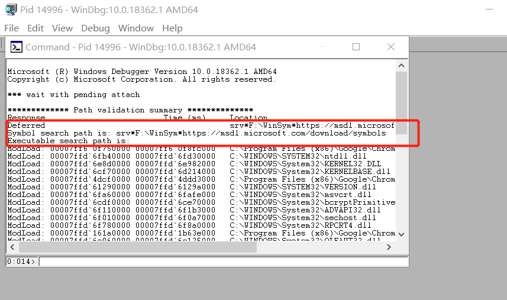                                      
6. 启动guest上的win7系统后启动主机上的windbg                 
```bash
Windbg.exe -b -k com:port=\\.\pipe\com_1,baud=115200,pipe
```
需要一个比较长的时间,一直连接……就在网上看看别人的实验                         
                                      

7. `!process 0 0`显示系统中的进程信息，找到notepad进程的指针
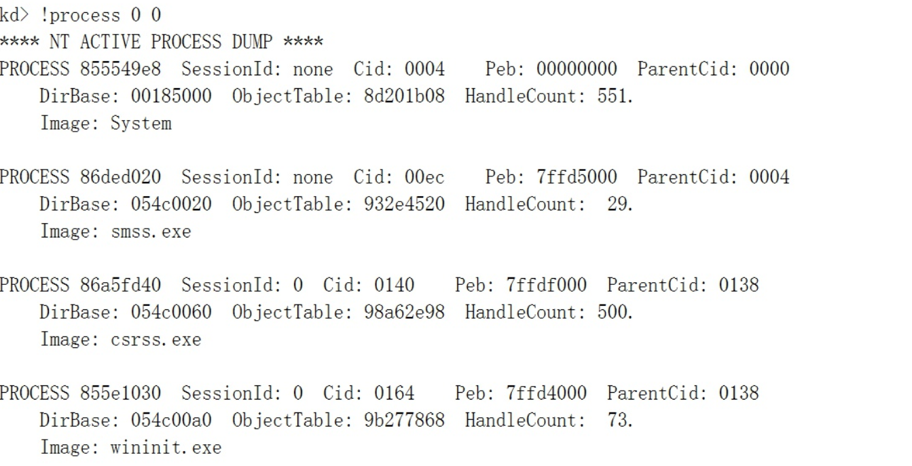                                  
8. 然后使用dt命令查看进程信息.`dt _EPROCESS 882e4030`
```bash
nt!_EPROCESS
   +0x000 Pcb              : _KPROCESS
   +0x098 ProcessLock      : _EX_PUSH_LOCK
   +0x0a0 CreateTime       : _LARGE_INTEGER 0x1d46d08`491e5950
   +0x0a8 ExitTime         : _LARGE_INTEGER 0x0
   +0x0b0 RundownProtect   : _EX_RUNDOWN_REF
   +0x0b4 UniqueProcessId  : 0x00000be0 
   +0x0b8 ActiveProcessLinks : _LIST_ENTRY [ 0x8295dc88 - 0x85666470 ]
   +0x0c0 ProcessQuotaUsage : [2] 0xca8
   +0x0c8 ProcessQuotaPeak : [2] 0xed0
   +0x0d0 CommitCharge     : 0xfe
   +0x0d4 QuotaBlock       : 0x86a38780 _EPROCESS_QUOTA_BLOCK
   +0x0d8 CpuQuotaBlock    : (null) 
   +0x0dc PeakVirtualSize  : 0x3750000
   +0x0e0 VirtualSize      : 0x374f000
```                
9. `.process -i 882e4030`设置当前进程。然后使用`!peb 0x7ffde000` 或者 `dt _PEB 0x7ffde000`查看进程信息。`s -u 0x00000000 L0x01000000 "Hello World!"`搜索 Hello World! 这个字符串
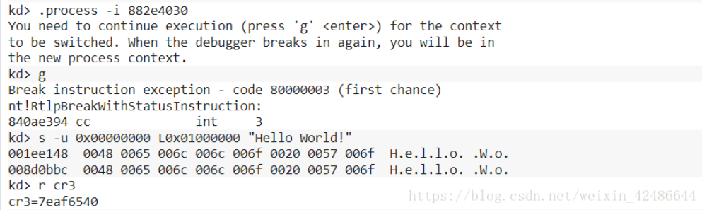                                      
10. CPU中有一个CR3寄存器保存了当前进程的页目录表的的基址通过 r cr3命令查看cr3寄存器的值，得到cr3=7eaf6540，即为页目录的基址（注意，cr3保存的是物理地址，用WinDbg查看物理地址时要在最前面加上！符号）。因为页目录表索引为0，所以使用 !dq 7eaf6540+0*8查看页目录的基址                     
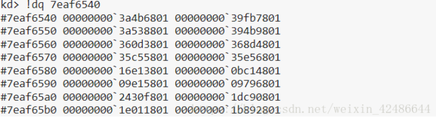                                     
11. 页目录和页表的每一项都是8个字节，其中第12-31位保存了页表的基址。从之前对虚拟地址的分解可知，页目录项的索引为0，也就是是第一项，所以页目录的基址为3a4b6000，而页目录索引为0
使用！dq 3a4b6000+0*8查看页表的基址             
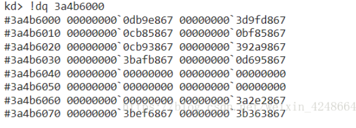                                     
12. 使用！dq db9e000+8*0x1ee找到页基址                
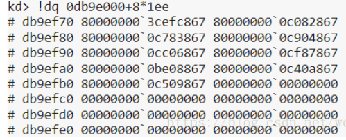                                        
13. 可以得到物理地址所在页基址为3cefc000，而字节索引为0x148
使用！db 3cefc000+0x148查看该地址的内容                      
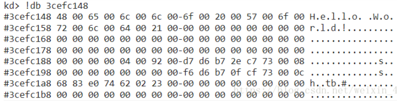                                   
正好是我们的Hello World字符串，所以我们成功地根据虚拟地址通过分页机制找到了物理地址   

## 实验问题
* `windbg.exe -k com:port=\.\pipe\com_1,baud=115200,pipe`出现错误`Could not start kernel debugging using com:port=\\.\pipe\com_1,baud=11520,pipe parmeters,Win32 error On3系统找不到指定的文件`                                 
                                      
1. 发现虚拟机的下标处没有串口表示，并且主机查看也没串口                                                  
                                      
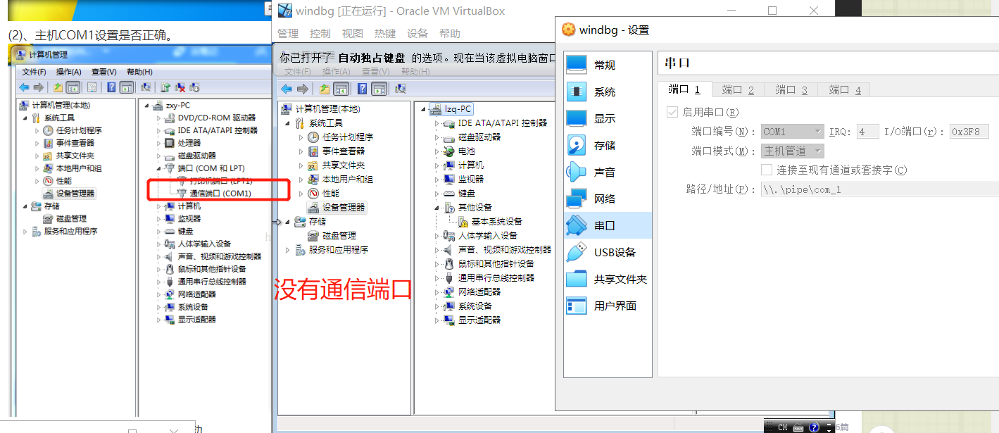                                      
2. 安装增强功能，报错`未能插入 VBoxsGuestAdditions.iso磁盘映像文件到虚拟电脑`                                                
                                      
3. 添加虚拟光驱                  
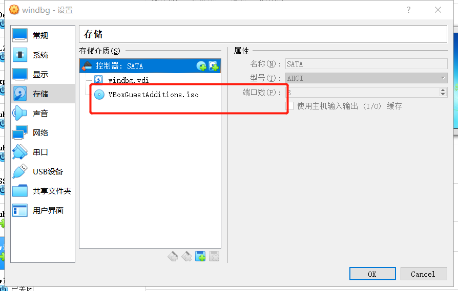                                      
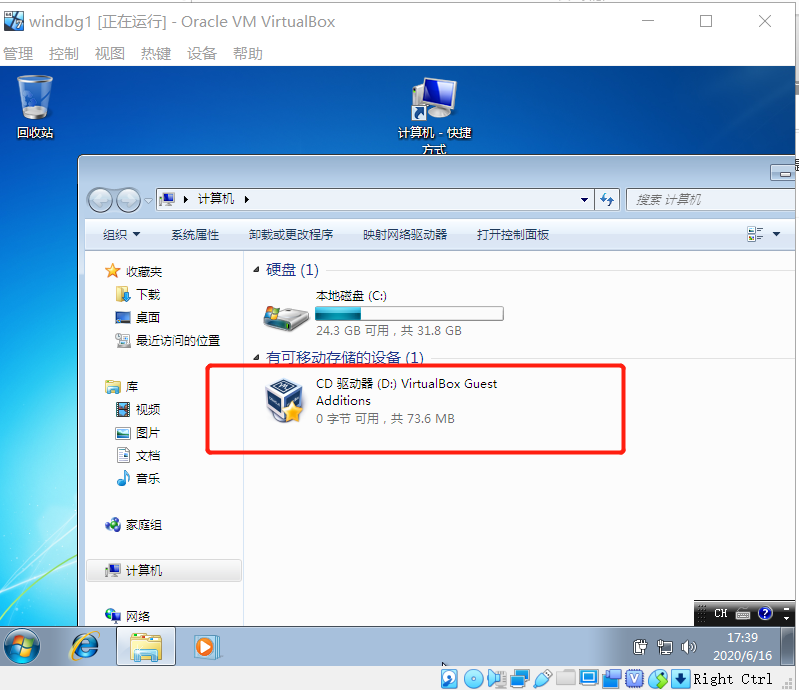                                      
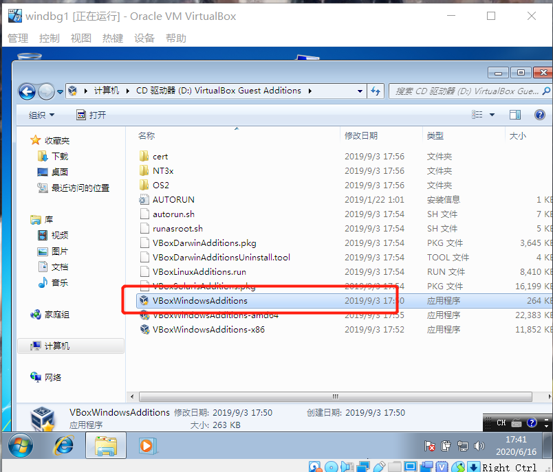                                      
4. 安装完后就不会发生这错误了
                                      

* windbg符号路径每次重新开始就要开始重新设置
                                      

## 实验结论
1. 虚拟内存和物理内存就像房子和土地的关系。物理内存就是你所拥有的一片土地。而虚拟内存以4kb为单位进行分配，就像在土地上进行建房子。你调用虚拟内存就像对房子进行入住，虽然土地有那么多，但是只能入住有房子的一部分（也就是进行分配的一部分地址），没有房子的那部分土地是不能动的
2. 不同进程的相同的地址可以保存不同的数据就相当于一片土地上有两所房子，虽然他们的门牌号是一样的，但是他们实际上所占的土地并不是同一块
## 参考资料
* [windbg遍历进程页表查看内存](https://www.cnblogs.com/ck1020/p/6148399.html)
* [windbg下看系统非分页内存](https://blog.csdn.net/lixiangminghate/article/details/54667694)
* [windbg下看系统非分页内存](https://blog.csdn.net/lixiangminghate/article/details/54667694)
* [使用WinDbg查看保护模式分页机制下的物理地址](https://blog.csdn.net/weixin_42486644/article/details/80747462)
* [软件安全4.内存布局](https://www.jianshu.com/p/09fab7c07533)
* [Windows 内核调试](https://zhuanlan.zhihu.com/p/47771088)
* [!pte](https://docs.microsoft.com/en-us/windows-hardware/drivers/debugger/-pte)
* [windbg - What is the relation between the VAD (!vad) the PTEs (!pte), and loaded modules and sections (lm and !dh)?](https://reverseengineering.stackexchange.com/questions/21031/windbg-what-is-the-relation-between-the-vad-vad-the-ptes-pte-and-loade)
* [When Kernel Debugging - Find The Page Protection of a User Mode Address](https://stackoverflow.com/questions/16749764/when-kernel-debugging-find-the-page-protection-of-a-user-mode-address)
* [Download WinDbg](https://docs.microsoft.com/zh-cn/windows-hardware/drivers/debugger/debugger-download-tools)
* [WinDbg的安装](https://blog.csdn.net/chaootis1/article/details/79834117)
* [Win7(WinDbg) + VMware(Win7) 双机调试环境搭建之五](https://blog.csdn.net/one_in_one/article/details/51767007)
* [Oracle VMVirtualBox 点击用户界面的【安装增强功能】没有用/按钮无效](https://blog.csdn.net/sjks22/article/details/80316166)
* [使用WinDbg查看保护模式分页机制下的物理地址](https://blog.csdn.net/weixin_42486644/article/details/80747462)
