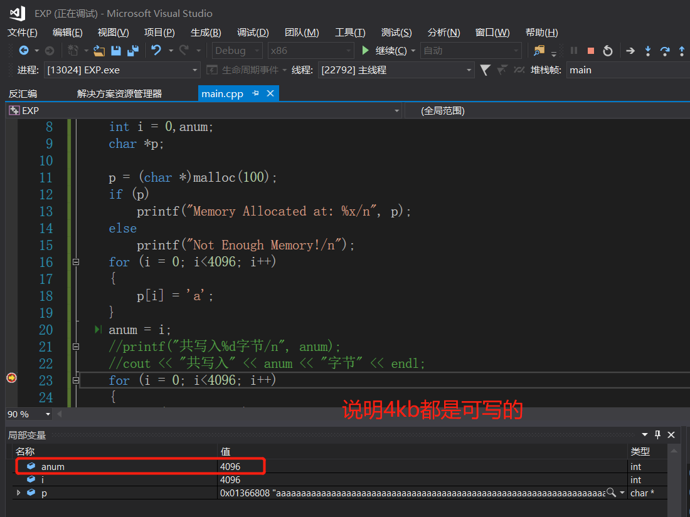
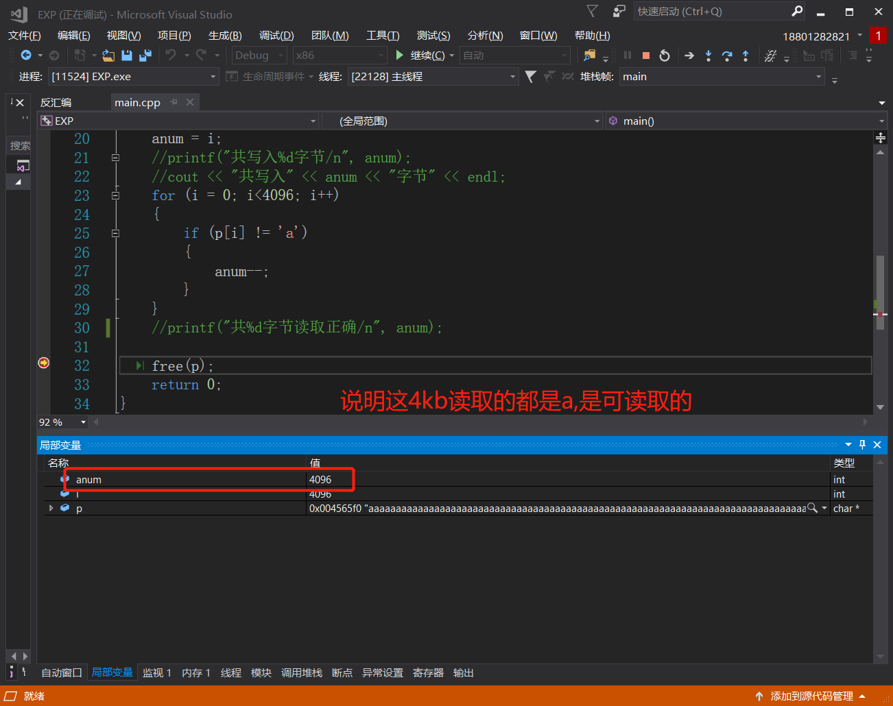
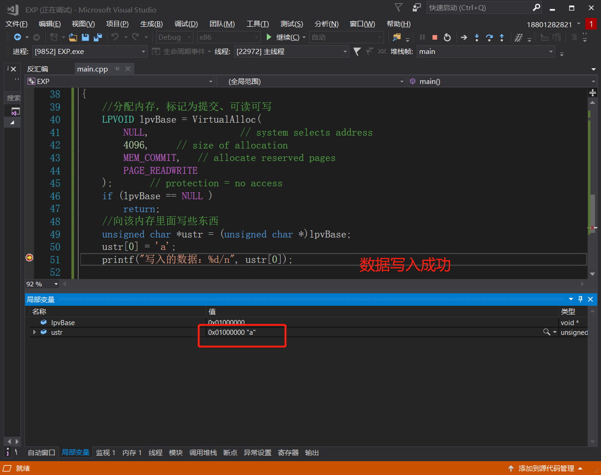
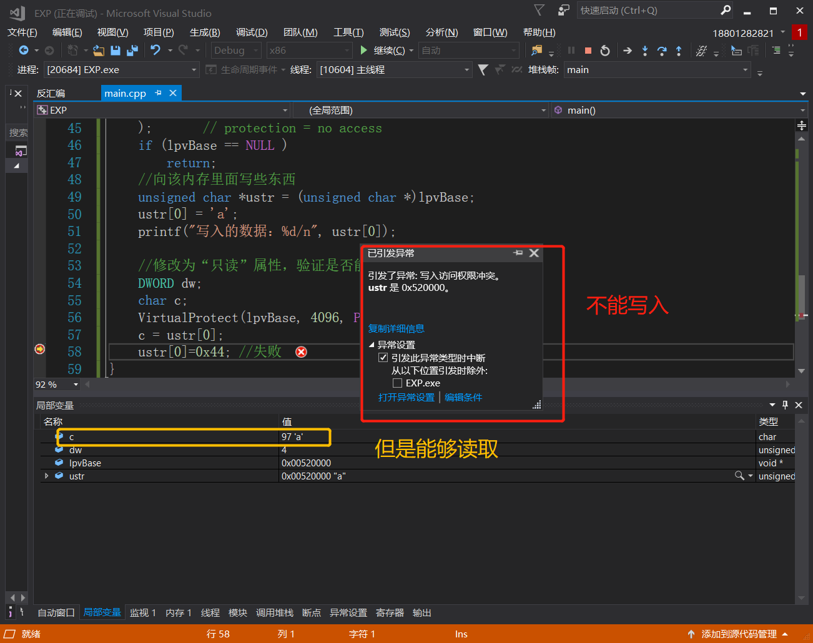
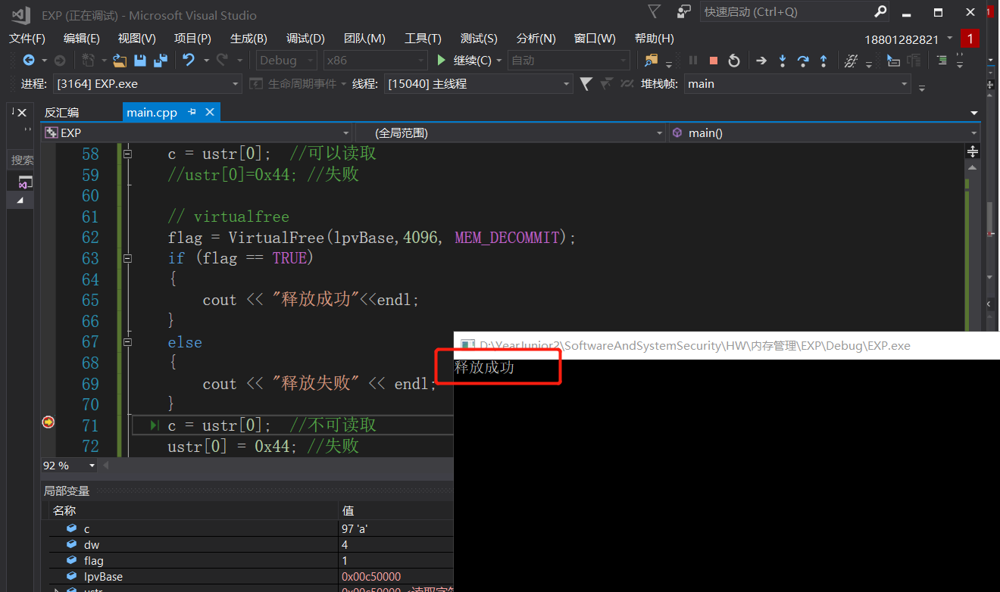
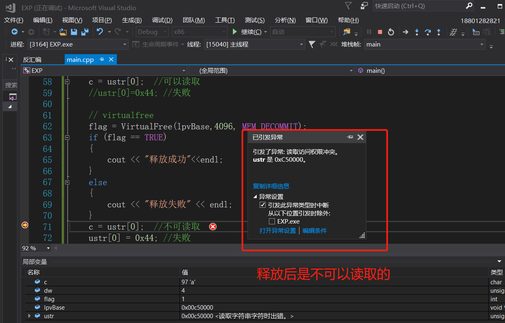
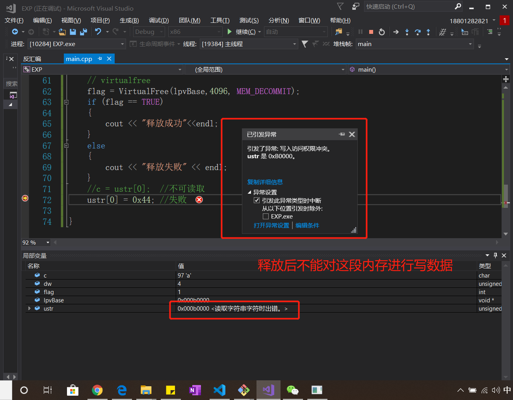

# 虚拟内存管理
## 实验完成度
* [x] 阅读[VirtualAlloc](https://docs.microsoft.com/en-us/windows/win32/api/memoryapi/nf-memoryapi-virtualalloc)、[VirtualFree](https://docs.microsoft.com/en-us/windows/win32/api/memoryapi/nf-memoryapi-virtualfree)、[VirtualProtect](https://docs.microsoft.com/en-us/windows/win32/api/memoryapi/nf-memoryapi-virtualprotect)等函数的官方文档。
* [x] 编程使用malloc分配一段内存，测试是否这段内存所在的整个4KB都可以写入读取。
* [x] 使用VirtualAlloc分配一段，可读可写的内存，写入内存，然后将这段内存改为只读，再读数据和写数据，看是否会有异常情况。然后VirtualFree这段内存，再测试对这段内存的读写释放正常。
## 实验过程
### [VirtualAlloc](https://docs.microsoft.com/en-us/windows/win32/api/memoryapi/nf-memoryapi-virtualalloc)
1. 在调用进程的虚拟地址空间中保留，提交或更改页面区域的状态。此功能分配的内存将自动初始化为零。
2. 语法
```cpp
LPVOID VirtualAlloc(
  LPVOID lpAddress, //要分配的区域的起始地址
  SIZE_T dwSize, //区域的大小，以字节为单位。如果lpAddress参数为 NULL，那么此值将四舍五入到下一页的边界
  DWORD  flAllocationType, //内存分配的类型
  DWORD  flProtect //对要分配的页面区域的内存保护
);
```
3.  * 这个函数可以用来对虚拟地址空间进行分配(保留操作MEM_RESERVE) 
    * 这个函数可以把已经保留的虚拟地址提交到物理存储器(MEM_COMMIT) 
    * 这个函数可以使RAM上的内容无效(MEM_RESET)
### [VirtualFree](https://docs.microsoft.com/en-us/windows/win32/api/memoryapi/nf-memoryapi-virtualfree)
1. VirtualFree该函数的功能是取消或者释放调用进程的虚地址空间页的一个区域，如果想释放一块调用VirtualAllocEx函数分配的内存(包括虚拟内存),就使用VirtualFreeEx函数。
2. 语法
```cpp
BOOL VirtualFree(
LPVOID lpAddress, // 区域地址
SIZE_T dwSize, // 区域大小，字节
DWORD dwFreeType // 类型
);
```
### [VirtualProtect](https://docs.microsoft.com/en-us/windows/win32/api/memoryapi/nf-memoryapi-virtualprotect)
1. 在调用进程的虚拟地址空间中更改已提交页面区域的保护。
2. 语法
```cpp
BOOL VirtualProtect(
  LPVOID lpAddress,  //指针的地址，它描述要更改其访问保护属性的页面区域的起始页面。
  SIZE_T dwSize, //要更改其访问保护属性的区域的大小，以字节为单位
  DWORD  flNewProtect, //内存保护选项。
  PDWORD lpflOldProtect //指向变量的指针，该变量接收页面的指定区域中第一页的先前访问保护值。如果此参数为NULL或未指向有效变量，则函数将失败。
);
```
3. 如果函数成功，则返回值为非零。如果函数失败，则返回值为零。

### malloc分配一段内存
>编程使用malloc分配一段内存，测试是否这段内存所在的整个4KB都可以写入读取
1. 原型：`extern void *malloc(unsigned int num_bytes);`
2. 头文件：`#include <malloc.h>` 或 `#include <alloc.h>` (注意：alloc.h 与 malloc.h 的内容是完全一致的。)
3. 功能：分配长度为num_bytes字节的内存块。说明：如果分配成功则返回指向被分配内存的指针，否则返回空指针NULL。当内存不再使用时，应使用free()函数将内存块释放。
4. 一个char占1字节,4kb是4096个字节。但是分配时只分配100个字节
```cpp
#include<stdio.h>
#include<malloc.h>
#include<string>
using namespace std;
#include<iostream>
int main()
{
	int i = 0,anum;
	char *p;

	p = (char *)malloc(100);  //只分配100个字节的空间
	if (p)
		printf("Memory Allocated at: %x/n", p);
	else
		printf("Not Enough Memory!/n");
	for (i = 0; i<4096; i++)
	{
		p[i] = 'a';
	}
	anum = i;
	//printf("共写入%d字节/n", anum);
	//cout << "共写入" << anum << "字节" << endl;
	for (i = 0; i<4096; i++)
	{
		if (p[i] != 'a')
		{
			anum--;
		}
	}
	//printf("共%d字节读取正确/n", anum);
	
	free(p);
	return 0;
}
```
5. 4kb的数据都是可写的                            
                                      
6. 4kb读取的都是a,是可读取的                
                                      

### VirtualAlloc分配一段内存
>使用VirtualAlloc分配一段，可读可写的内存，写入内存，然后将这段内存改为只读，再读数据和写数据，看是否会有异常情况。然后VirtualFree这段内存，再测试对这段内存的读写释放正常。
1. 分配一段可读可写的内存，写入内存
```cpp
#include <windows.h>
void main()
{
	//分配内存，标记为提交、可读可写 
	LPVOID lpvBase = VirtualAlloc(
		NULL,                 // system selects address
		4096,     // size of allocation
		MEM_COMMIT,   // allocate reserved pages
		PAGE_READWRITE
	);       // protection = no access   
	if (lpvBase == NULL )   
		return;
	//向该内存里面写些东西
	unsigned char *ustr = (unsigned char *)lpvBase;
	ustr[0] = 'a';
	printf("写入的数据：%d/n", ustr[0]);
	
}
```
                                      
2. 将这段内存改为只读，再读数据和写数据
```cpp
void main()
{
	//分配内存，标记为提交、可读可写 
	LPVOID lpvBase = VirtualAlloc(
		NULL,                 // system selects address
		4096,     // size of allocation
		MEM_COMMIT,   // allocate reserved pages
		PAGE_READWRITE
	);       // protection = no access   
	if (lpvBase == NULL )   
		return;
	//向该内存里面写些东西
	unsigned char *ustr = (unsigned char *)lpvBase;
	ustr[0] = 'a';
	printf("写入的数据：%d/n", ustr[0]);
	
	//修改为“只读”属性，验证是否能写入
	DWORD dw;
	char c;
	VirtualProtect(lpvBase, 4096, PAGE_READONLY, &dw);
	c = ustr[0];  //可以读取
	ustr[0]=0x44; //失败
}
```
                                      
3. VirtualFree这段内存，再测试对这段内存的读写释放正常
```cpp
void main()
{
	BOOL flag;
	//分配内存，标记为提交、可读可写 
	LPVOID lpvBase = VirtualAlloc(
		NULL,                 // system selects address
		4096,     // size of allocation
		MEM_COMMIT,   // allocate reserved pages
		PAGE_READWRITE
	);       // protection = no access   
	if (lpvBase == NULL )   
		return;
	//向该内存里面写些东西
	unsigned char *ustr = (unsigned char *)lpvBase;
	ustr[0] = 'a';
	//printf("写入的数据：%d/n", ustr[0]);
	
	//修改为“只读”属性，验证是否能写入
	DWORD dw;
	char c;
	VirtualProtect(lpvBase, 4096, PAGE_READONLY, &dw);
	c = ustr[0];  //可以读取
	//ustr[0]=0x44; //失败

	// virtualfree
	flag = VirtualFree(lpvBase,4096, MEM_DECOMMIT);
	if (flag == TRUE)
	{
		cout << "释放成功"<<endl;
	}
	else
	{
		cout << "释放失败" << endl;
	}
	//c = ustr[0];  //不可读取
	ustr[0] = 0x44; //失败

}
```
* 能够成功释放                    
                                      
* 释放后是不能对这段内存进行读取
                               
* 释放后不能对这段内存进行写数据                                
                                      

## 参考资料
* [VirtualAlloc](https://docs.microsoft.com/en-us/windows/win32/api/memoryapi/nf-memoryapi-virtualalloc)
* [VirtualFree](https://docs.microsoft.com/en-us/windows/win32/api/memoryapi/nf-memoryapi-virtualfree)
* [VirtualProtect](https://docs.microsoft.com/en-us/windows/win32/api/memoryapi/nf-memoryapi-virtualprotect)
* [字节、字、bit、byte的关系](https://blog.csdn.net/wanlixingzhe/article/details/7107923)
* [malloc函数详解](https://blog.csdn.net/xw13106209/article/details/4962479)
* [使用VirtualAlloc()创建虚拟内存，修改可读、可写属性](https://blog.csdn.net/dijkstar/article/details/1686965)
